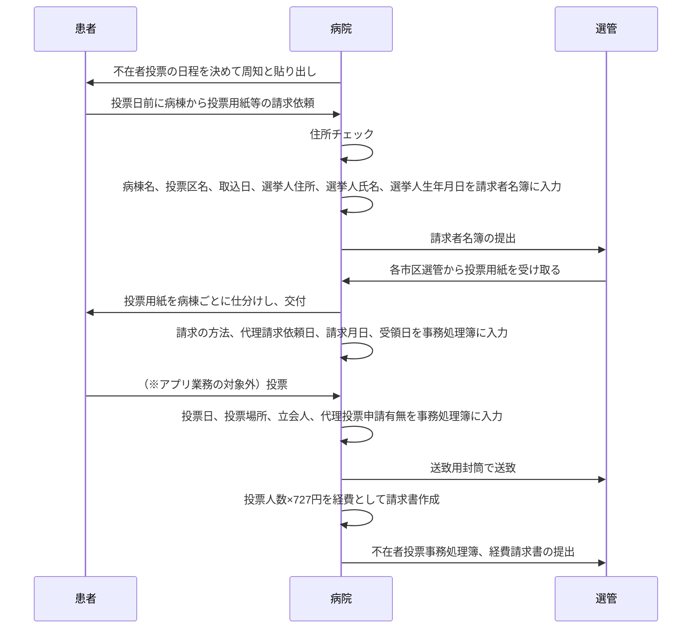

# Portfolio


## ライブラリをインストールする

```console
pip install -r requirements.txt

-- ※開発時 現在のライブラリの状態でrequirementsを書き出す
pip freeze > requirements.txt
```

## すべてのテーブルをカラにする

```
python manage.py flush --noinput
```

## Clean up

```
python manage.py monthly_cleanup_linebot_engine
```

## Migrate

- サーバで実行するときは `python3` にしてバッククォートを `/` に置換する
- サーバで実行するときは makemigrations は基本的に必要ない（migrationファイルがgithubで焼き付けてあるから）

```
python manage.py makemigrations vietnam_research gmarker shopping linebot_engine rental_shop taxonomy soil_analysis securities hospital llm_chat ai_agent jp_stocks
python manage.py migrate

python manage.py createsuperuser
```

## fixture

CSV ファイルを Django フィクスチャ JSON 形式に変換します。
このコマンドは「`convert_csv_to_fixture.py` スクリプトが配置されているディレクトリ内のすべての CSV ファイルを処理」します。
そしてそれらを Django 用の JSON フィクスチャ ファイルに変換します。JSON の「model」フィールドは
CSV ファイル名によって決まります。ファイル名のアンダースコアはドットに置き換えられます。
CSVファイル名は2つのセクションに分ける必要があります。例えば「hospital_cityGroup.csv」のように。

```
python manage.py convert_csv_to_fixture
```

- createsuperuser を実行してください
    - createsuperuser をやって1のidを作らないと失敗するfixtureがあるよ(vietnam_research)
- `auth_user` の seeder は `(各アプリ)/fixtures/auth_user.json` にある
- `auth_user` の初期パスワードは `test#1234`
- サーバで実行するときはバッククォートを `/` に置換する
- バッチ `daily_industry_chart_and_uptrend` を動かすときは `industry` の seeder は14日ぶん用意しましょう
    - seederの日付はだんだん古くなっていくので、以下のSQLでメンテしてね（-7ヶ月から毎月2日分のデータがあるようにする）

```text
-- 何月のデータがあるの？の確認
SELECT x.recorded_date
FROM vietnam_research_industry x
GROUP BY x.recorded_date
ORDER BY x.recorded_date;

-- ある日付を別の日付に編集する
UPDATE portfolio_db.vietnam_research_industry
SET recorded_date = '2024-05-02'
WHERE recorded_date = '2023-01-17';
```

```
python manage.py createsuperuser
python manage.py loaddata .\vietnam_research\fixtures\group.json
python manage.py loaddata .\vietnam_research\fixtures\indClass.json
python manage.py loaddata .\vietnam_research\fixtures\market.json
python manage.py loaddata .\vietnam_research\fixtures\symbol.json
python manage.py loaddata .\vietnam_research\fixtures\sbi.json
python manage.py loaddata .\vietnam_research\fixtures\unit.json
python manage.py loaddata .\vietnam_research\fixtures\vnIndex.json
python manage.py loaddata .\vietnam_research\fixtures\articles.json
python manage.py loaddata .\vietnam_research\fixtures\basicInformation.json
python manage.py loaddata .\vietnam_research\fixtures\financialResultWatch.json
python manage.py loaddata .\vietnam_research\fixtures\watchlist.json
# ここで vietnam_research の バッチをひととおりまわす（具体的には1発industryバッチを回して新顔をマスタに取り入れる）
python manage.py loaddata .\gmarker\fixtures\place.json
python manage.py loaddata .\gmarker\fixtures\nearbyPlace.json
python manage.py loaddata .\shopping\fixtures\store.json
python manage.py loaddata .\shopping\fixtures\staff.json
python manage.py loaddata .\shopping\fixtures\product.json
python manage.py loaddata .\rental_shop\fixtures\warehouse.json
python manage.py loaddata .\rental_shop\fixtures\staff.json
python manage.py loaddata .\rental_shop\fixtures\rentalStatus.json
python manage.py loaddata .\rental_shop\fixtures\company.json
python manage.py loaddata .\rental_shop\fixtures\billingPerson.json
python manage.py loaddata .\rental_shop\fixtures\billingStatus.json
python manage.py loaddata .\rental_shop\fixtures\warehousestaff.json
python manage.py loaddata .\rental_shop\fixtures\item.json
python manage.py loaddata .\soil_analysis\fixtures\user.json
python manage.py loaddata .\soil_analysis\fixtures\companycategory.json
python manage.py loaddata .\soil_analysis\fixtures\company.json
python manage.py loaddata .\soil_analysis\fixtures\crop.json
python manage.py loaddata .\soil_analysis\fixtures\land_block.json
python manage.py loaddata .\soil_analysis\fixtures\land_period.json
python manage.py loaddata .\soil_analysis\fixtures\cultivationtype.json
# ここで soil analysis の master data バッチをまわす
python manage.py loaddata .\soil_analysis\fixtures\jma_weather_code.json
python manage.py loaddata .\soil_analysis\fixtures\land.json
# ここ以降で soil analysis の weather data バッチをまわす
python manage.py loaddata .\soil_analysis\fixtures\samplingmethod.json
python manage.py loaddata .\soil_analysis\fixtures\samplingorder.json
python manage.py loaddata .\soil_analysis\fixtures\land_ledger.json
python manage.py loaddata .\soil_analysis\fixtures\land_review.json
python manage.py loaddata .\soil_analysis\fixtures\land_score_chemical.json
python manage.py loaddata .\soil_analysis\fixtures\device.json
python manage.py loaddata .\taxonomy\fixtures\kingdom.json
python manage.py loaddata .\taxonomy\fixtures\phylum.json
python manage.py loaddata .\taxonomy\fixtures\classification.json
python manage.py loaddata .\taxonomy\fixtures\family.json
python manage.py loaddata .\taxonomy\fixtures\genus.json
python manage.py loaddata .\taxonomy\fixtures\species.json
python manage.py loaddata .\taxonomy\fixtures\naturalMonument.json
python manage.py loaddata .\taxonomy\fixtures\tag.json
python manage.py loaddata .\taxonomy\fixtures\breed.json
python manage.py loaddata .\taxonomy\fixtures\breedTags.json
python manage.py loaddata .\taxonomy\fixtures\feedGroup.json
python manage.py loaddata .\taxonomy\fixtures\henGroup.json
python manage.py loaddata .\taxonomy\fixtures\eggLedger.json
python manage.py loaddata .\hospital\fixtures\user.json
python manage.py loaddata .\hospital\fixtures\ward.json
python manage.py loaddata .\hospital\fixtures\city.json
python manage.py loaddata .\hospital\fixtures\election.json
python manage.py loaddata .\hospital\fixtures\userattribute.json
python manage.py loaddata .\hospital\fixtures\voteplace.json
python manage.py loaddata .\ai_agent\fixtures\entity.json
python manage.py loaddata .\ai_agent\fixtures\guardrail_config.json
python manage.py loaddata .\ai_agent\fixtures\rag_material.json

```

## サーバを動かす

```
python manage.py runserver
python manage.py import_soil_hardness /path/to/folder
```

## よくつかうメンテナンスコマンド

- 環境変数 `.env` が作ってありますか？
- migrate は最新ですか？

`-R` は recursive
`ubuntu:www-data` は ubuntuユーザ:apacheグループの所有者にする

```commandline
cd /var/www/html/portfolio
git branch --show-current
git fetch --prune origin
git reset --hard origin/master
git pull origin master
source /var/www/html/venv/bin/activate
python manage.py collectstatic --noinput 
python manage.py clearsessions
vi /var/log/apache2/error.log
sudo -s
chown -R ubuntu:www-data /var/www/html
systemctl restart apache2
```

主に securities がzipを保存するために必要な設定
exists メソッドは file or directory
が存在するか確認するがこれには該当のファイルまたはディレクトリへのアクセス権限（実行権限 (x) ）が必要

```commandline
chmod -R 774 /var/www/html/portfolio/media
chmod 774 /var/www
```

## vietnam_research

`daily_industry_chart_and_uptrend` は 各期間（14日、7日、3日）を遡り、 すべての期間の株価が上昇傾向（斜度が正）であれば passed
がインクリメントされる。つまり時系列データがないと画像は保存されない

- ベトナムの株価を分析する
    - `python manage.py daily_import_from_bloomberg` のバッチをまわす
    - `python manage.py daily_import_from_sbi` のバッチをまわす
    - `python manage.py daily_import_from_vietkabu` のバッチをまわす
    - `python manage.py daily_industry_chart_and_uptrend` のバッチをまわす
    - `python manage.py daily_industry_stacked_bar_chart` のバッチをまわす
- FAOから水産物供給量の推移グラフ
    - `python manage.py monthly_fao_food_balance_chart` のバッチをまわす
- ベトナムの統計局から経済指標を取得
    - `python manage.py monthly_vietnam_statistics` のバッチをまわす

## gmarker

- google map api を使って、マーカーを操作できる

## shopping

- 在庫を登録し、値段・コメントなどの管理ができる

## linebot_engine

https://qiita.com/YoshitakaOkada/items/f51f52a8041439a1dbc9#line

- [仕様書](docs/linebot_engine/specification.md)
- 当時ヘルスチェックを作りたかったらしい
    - LINE: （朝8時ごろに）元気？
    - User: 元気です
    - LINE: 朝ご飯食べた？
    - User: 食べた

Userが「食べた」と答えた回数を集計して、最近「食べた」と答えなかったらアラート、みたいな

## warehouse

- 倉庫とレンタル業務をイメージしたアプリ
- 何段目の何列目にあるかも登録できる
- 請求書をつくることもできる

## taxonomy

- [仕様書](docs/taxonomy/specification.md)
- 興味のある動物の分類を関係図に表示
- タグ付けをして分析のサポートができる

## soil analysis

### master data

- `python manage.py import_weather_const_master` のバッチをまわす
- `python manage.py generate_weather_code_fixture` のバッチをまわす（fixtureが変更されたときのみ実行）
- `python manage.py download_weather_code_icon` のバッチをまわす（svgが変更されたときのみ実行）

### weather data

- `python manage.py fetch_weather_forecast` のバッチをまわす
- `python manage.py fetch_weather_warning` のバッチをまわす

## securities

- edinet data を zip でダウンロードする
    - `python manage.py daily_download_edinet` のバッチをまわす

## hospital

### 処理概要



## jp_stocks

日本株に関するポータル

### 板シミュレータ 処理概要

- **モデル概要**  
  本システムでは `Order` モデルを利用して取引注文（売買注文）を管理します。  
  各注文は以下の属性を持ちます：
    - `side`：取引区分（buy または sell）
        - `price`：注文価格
        - `quantity`：注文数量
        - `created_at`：注文作成日時

- **「板情報」の計算**  
  現在の「板情報」は動的に計算され、以下のようにして求められます：
    - 「売り注文」と「買い注文」を価格ごとにグループ化し、それぞれの注文の合計数量を集計。
    - 同じ価格の売りと買いが存在する場合、以下の処理ルールに基づいて注文を相殺：
        - 売り数量と買い数量が一致すれば完全にマッチし、双方がゼロになる。
        - 売り数量が多ければ、買い数量を引いた残りの売り数量は引き続き有効。
        - 買い数量が多ければ、売り数量を引いた残りの買い数量が有効。
    - 売りと買いの価格がマッチしない場合、各注文は現在残存している数量として板に残ります。
    - 「売り注文」「買い注文」はそれぞれ価格順（昇順）に並び替えて結果を出力します。

- **主要機能**
    - 注文の作成機能  
      ユーザーは新しい取引注文（売買）を入力し登録することができます。
    - 板情報の表示機能  
      現在の板情報（売り注文・買い注文の残存状態）を動的に計算し、わかりやすい形式で表示します。
