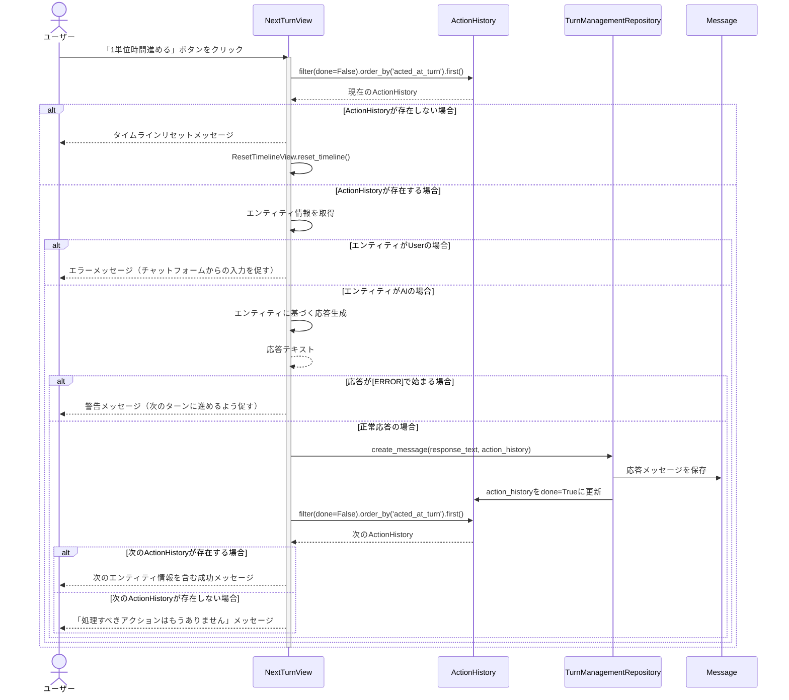
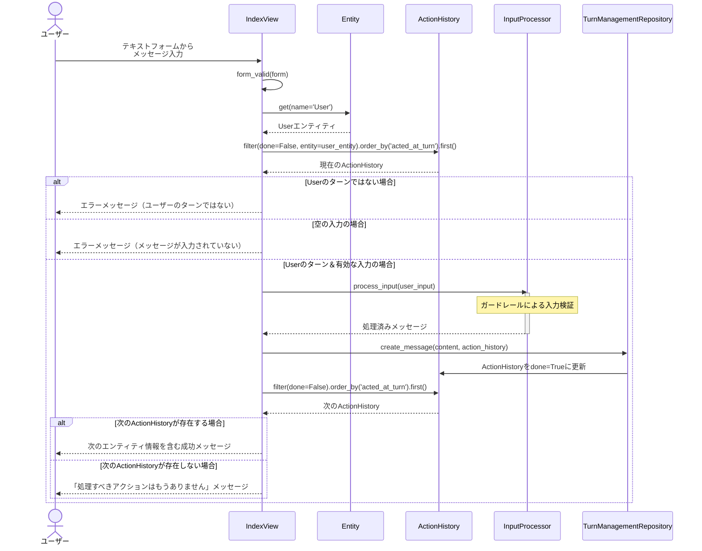

# AI Agent プロジェクト


## 概要

このプロジェクトはDjangoフレームワークを使用した会話型AIエージェントシステムです。複数のAIエージェント（エンティティ）による対話型のコミュニケーションを実現し、ユーザー入力の安全性を確保しながら、様々な情報源に基づいた応答生成を行います。

AI
Agentとは、複数の業務機能（ツール）を連携させながら、統一されたインターフェースで対話を行うシステムです。クライアントの視点から見た「複数の業務機能を横断するAIシステム」として設計されています。個々のエージェント（エンティティ）が特定の思考エンジンを持ち、それぞれの専門分野（Googleマップレビュー分析、RAG検索、コンテンツ安全性など）に特化した対応を行うマルチエージェントシステムとなっています。

### ✨ 特徴

- **プラグアンドプレイ方式**: Django上で多様なAI対話機能をモジュラーに提供
- **複数エージェント管理**: ターン制管理によるエージェント間の自然な会話の実現
- **高度なガードレール**: 不適切な入力や出力の検出と処理
- **多様なRAGソース対応**: GoogleマップレビューやPDFなど様々な情報源からの知識拡張
- **堅牢なテスト**: 厳密なユニットテストによる品質保証

## 主要コンポーネント

### 1. ターン管理システム (TurnManagementService)

`domain/service/turn_management.py`
にあるTurnManagementServiceは、エージェント間の会話の流れとターン制御を担当します。「どのエージェントが次に発言するか」を速度パラメータに基づいて数学的に管理します。

主な機能：

- エンティティの速度に基づいた次の発言順序の決定（数学的に公平なターン制御）
- タイムラインの初期化と更新（ActionHistoryによる状態管理）
- 次のアクションのシミュレーション（未来の会話展開の予測）

処理フロー：

1. タイムラインの初期化（initialize_timeline）
2. 未完了のActionHistoryから現在のエンティティを取得
3. 次のターンの計算と更新（calculate_next_turn_increment）

実装の特徴：

- 数学的に正確な速度計算（1/speed）により、公平なターン制御を実現
- 同じnext_turnを持つエンティティの場合はIDの昇順で選択（決定論的）
- 将来の行動シーケンスをシミュレーションする機能

### 2. 入力処理システム (InputProcessor)

`domain/service/input_processor.py`の入力処理システムは、ユーザー入力の安全性確保と処理を担当します。多層的なガードレールによって入力の健全性を維持します。

主な機能：

- 多層ガードレール機能による入力検証
    - 静的ガードレール（禁止ワード、文字数制限、スパム検出）
    - 動的ガードレール（OpenAI Moderation API連携）
    - カスタムガードレール（エンティティごとの設定）
- セキュリティ対策（XSS対策、サニタイズ機能）
- ユニコード対応と国際化対応

特徴：

- エンティティごとにカスタマイズ可能なガードレール設定
- リスクレベルに基づいた処理分岐
- 堅牢なエラーハンドリングとフォールバック処理
- OpenAI APIの障害に対する耐性

### 4. コンテキスト分析システム (ContextAnalyzer)

`domain/service/context_analyzer.py`のコンテキスト分析システムは、会話の文脈をエンティティの専門性に合わせて最適化します。

主な機能：

- チャット履歴のエンティティ専門領域へのリフレーミング
- RAG素材からの重要キーワード抽出
- 専門分野視点でのコンテキスト解釈

特徴：

- LLMを活用した高度なコンテキスト変換
- エンティティごとの専門的視点の反映
- RAG素材との連携による関連キーワードの強調
- 専門知識に基づく会話解釈の深化

## 処理の流れ

典型的なチャットのライフサイクル：

1. ユーザーがテキスト入力を送信（IndexView経由）
2. InputProcessorがガードレールチェックを実行
3. ActionHistoryから現在のターンのエンティティを取得
4. ResponseGeneratorを使用して応答を生成
    - エンティティの`thinking_type`に基づいた専門分野の知識を活用
    - ContextAnalyzerServiceで会話文脈をエンティティの専門領域に最適化
5. TurnManagementRepositoryを通じてメッセージを保存し、ActionHistoryを更新
6. 次のエンティティのターンを準備

## 会話フローのシーケンス図

以下のシーケンス図で処理の流れを説明します。

### 1. ターン管理プロセスのフロー



### 2. テキスト入力処理のフロー



## 開発者向け情報

### テスト実行

```console
# 全テストを実行
python manage.py test ai_agent

# 特定のテストクラスを実行
python manage.py test ai_agent.tests.test_input_processor.InputProcessorTest
```

### ドキュメント

各クラスとメソッドには詳細なドキュメントコメントが含まれています。特に以下の点に注目してください：

- GuardrailResultとInputProcessorConfigの実装例
- TurnManagementServiceのターン計算ロジック
- ContextAnalyzerServiceのRAGメタデータ活用方法

### 拡張方法

エンティティの専門性を拡張するには：

1. Entityモデルに新しい`thinking_type`を追加
2. ContextAnalyzerServiceの`_thinking_type_map`に対応するプロンプトを追加
3. 必要に応じてRAGメタデータクラスを実装（RagMetadataBase継承）
