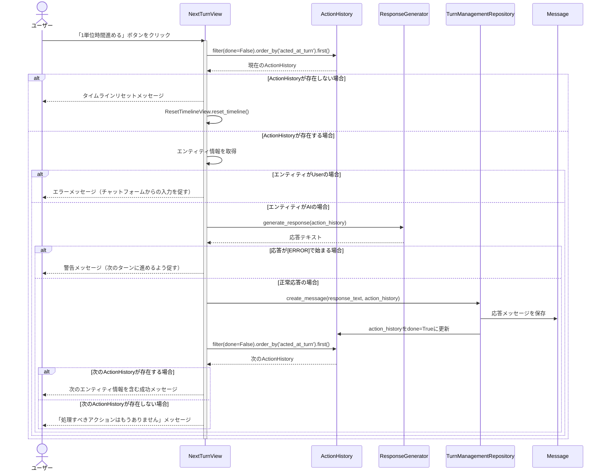
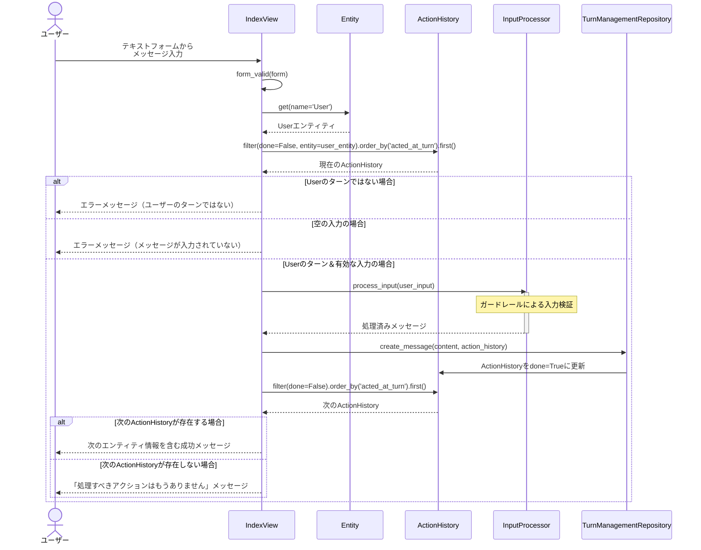

# AI Agent プロジェクト

## 概要

このプロジェクトはDjangoフレームワークを使用した会話型AIエージェントシステムです。複数のAIエージェント（エンティティ）による対話型のコミュニケーションを実現し、ユーザー入力の安全性を確保しながら、様々な情報源に基づいた応答生成を行います。

AI
Agentとは、複数の業務機能（ツール）を連携させながら、統一されたインターフェースで対話を行うシステムです。クライアントの視点から見た「複数の業務機能を横断するAIシステム」として設計されています。個々のエージェント（エンティティ）が特定の思考エンジンを持ち、それぞれの専門分野（Googleマップレビュー分析、RAG検索、コンテンツ安全性など）に特化した対応を行うマルチエージェントシステムとなっています。

## プロジェクト構造

```
ai_agent/
├── domain/                # ドメイン層（DDD設計）
│   ├── repository/        # データアクセス層
│   │   ├── turn_management.py  # ターン管理リポジトリ
│   │   └── response_generator.py  # 応答生成リポジトリ
│   ├── service/           # ビジネスロジックサービス
│   │   ├── input_processor.py  # 入力処理・ガードレール
│   │   ├── turn_management.py  # ターン管理サービス
│   │   ├── response_generator.py  # 応答生成サービス
│   │   └── context_analyzer.py  # コンテキスト分析サービス
│   └── valueobject/       # 値オブジェクト
│       ├── input_processor.py  # 入力処理の値オブジェクト
│       └── turn_management.py  # ターン管理の値オブジェクト
├── tests/                 # テスト
│   ├── test_input_processor.py  # 入力処理テスト
│   ├── test_turn_management.py  # 会話管理テスト
│   └── domain/              # ドメインテスト
│       └── service/         # サービスレイヤーテスト
│           └── test_turn_management.py  # 会話管理サービステスト
├── fixtures/              # フィクスチャーデータ
│   ├── entity.json        # エンティティデータ
│   ├── guardrail_config.json  # ガードレール設定データ
│   └── rag_material.json  # RAG素材データ
├── static/                # 静的ファイル
├── templates/             # テンプレート
├── migrations/            # DBマイグレーション
├── apps.py                # アプリケーション設定
├── models.py              # データモデル
├── views.py               # ビュー
├── urls.py                # URL設定
├── forms.py               # フォーム
├── admin.py               # 管理画面設定
└── __init__.py            # 初期化ファイル
```

## 主要コンポーネント

### 1. ターン管理システム (TurnManagementService)

`domain/service/turn_management.py`にあるTurnManagementServiceは、エージェント間の会話の流れとターン制御を担当します。

主な機能：

- エンティティの速度に基づいた次の発言順序の決定
- タイムラインの初期化と更新
- 次のアクションのシミュレーション

処理フロー：

1. タイムラインの初期化（initialize_timeline）
2. 未完了のActionHistoryから現在のエンティティを取得
3. 次のターンの計算と更新（calculate_next_turn_increment）

実装の特徴：

- 数学的に正確な速度計算（1/speed）により、公平なターン制御を実現
- 同じnext_turnを持つエンティティの場合はIDの昇順で選択（決定論的）
- 将来の行動シーケンスをシミュレーションする機能

### 2. 入力処理システム (InputProcessor)

`domain/service/input_processor.py`の入力処理システムは、ユーザー入力の安全性確保と処理を担当します。

主な機能：

- ガードレール機能による入力検証
    - 静的ガードレール（禁止ワード、文字数制限、スパム検出）
    - 動的ガードレール（OpenAI Moderation API）
- セキュリティ対策（XSS対策）

特徴：

- エンティティごとにカスタマイズ可能なガードレール設定
- リスクレベルに基づいた処理分岐
- 堅牢なエラーハンドリングとフォールバック処理
- OpenAI APIの障害に対する耐性

### 3. 応答生成システム (ResponseGenerator)

`domain/service/response_generator.py`の応答生成システムは、AIエージェントの応答生成を担当します。

主な機能：

- RAG（検索拡張生成）を活用した専門的な応答生成
- エンティティの特性に合わせた回答のカスタマイズ
- コンテキスト分析に基づく適切な応答の選択
- 応答履歴の管理と保存

特徴：

- 専門分野に特化した高品質な応答生成
- 柔軟なRAG素材の管理（`domain/repository/response_generator.py`）
- エンティティごとに異なる応答特性の実現
- コンテキスト分析サービスとの連携による適切な応答

### 4. コンテキスト分析システム (ContextAnalyzer)

`domain/service/context_analyzer.py`のコンテキスト分析システムは、会話の文脈をエンティティの専門性に合わせて最適化します。

主な機能：

- チャット履歴のエンティティ専門領域へのリフレーミング
- RAG素材からの重要キーワード抽出
- 専門分野視点でのコンテキスト解釈

特徴：

- LLMを活用した高度なコンテキスト変換
- エンティティごとの専門的視点の反映
- RAG素材との連携による関連キーワードの強調
- 専門知識に基づく会話解釈の深化

## 処理の流れ

典型的なチャットのライフサイクル：

1. ユーザーがテキスト入力を送信（IndexView経由）
2. InputProcessorがガードレールチェックを実行
3. ActionHistoryから現在のターンのエンティティを取得
4. ResponseGeneratorを使用して応答を生成
    - エンティティの`thinking_type`に基づいた専門分野の知識を活用
    - ContextAnalyzerServiceで会話文脈をエンティティの専門領域に最適化
5. TurnManagementRepositoryを通じてメッセージを保存し、ActionHistoryを更新
6. 次のエンティティのターンを準備

## 会話フローのシーケンス図

以下のシーケンス図で処理の流れを説明します。

### 1. ターン管理プロセスのフロー



### 2. テキスト入力処理のフロー


