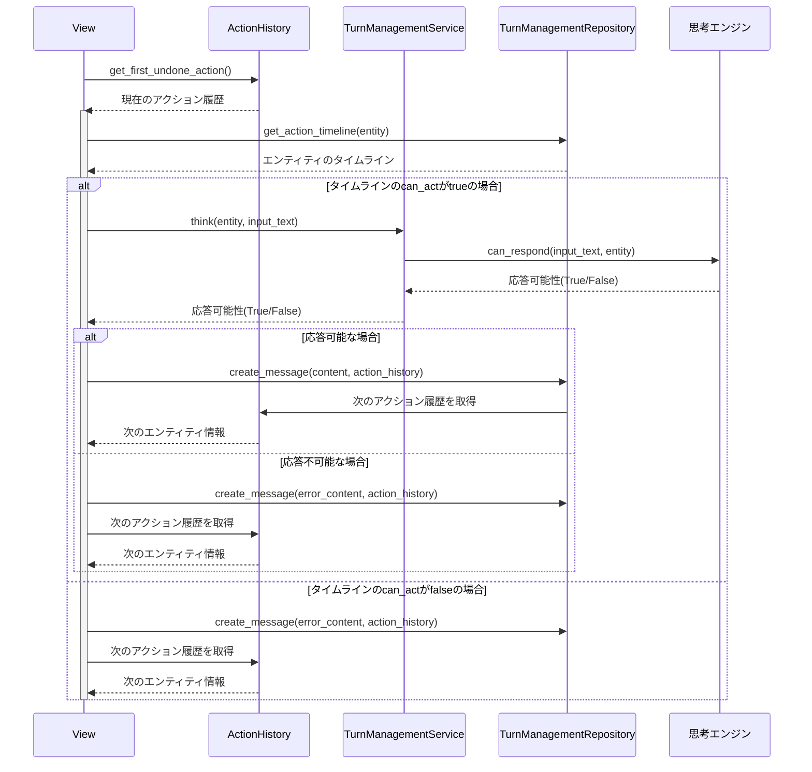
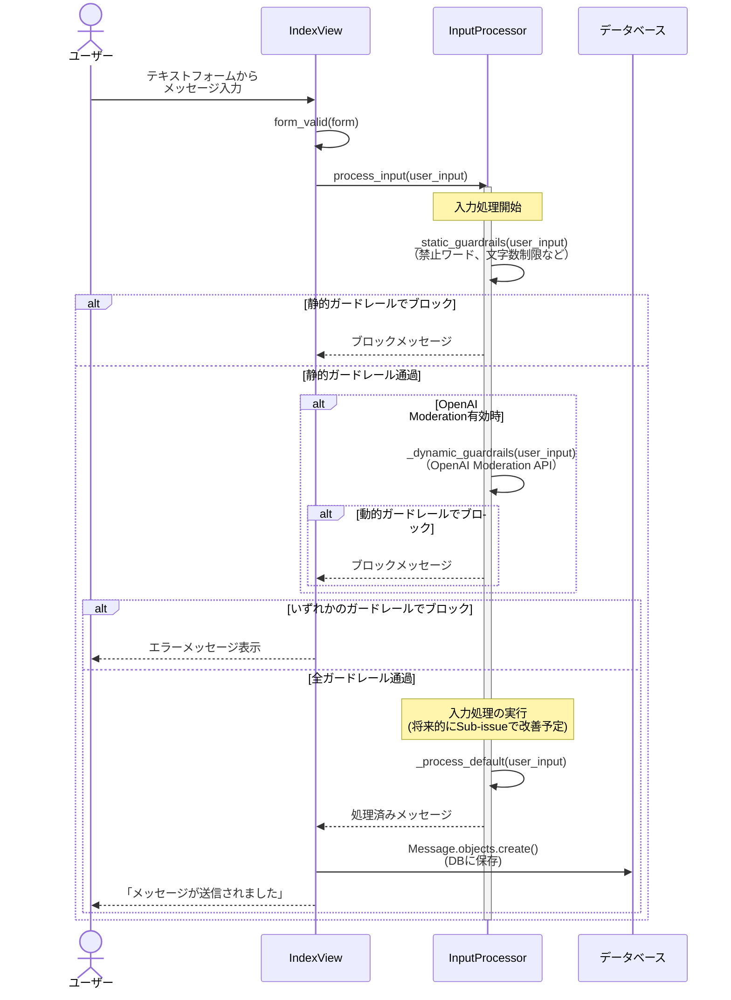

# AI Agent プロジェクト

## 概要

このプロジェクトはDjangoフレームワークを使用した会話型AIエージェントシステムです。複数のAIエージェント（エンティティ）による対話型のコミュニケーションを実現し、ユーザー入力の安全性を確保しながら、様々な情報源に基づいた応答生成を行います。

AI Agentとは、複数の業務機能（ツール）を連携させながら、統一されたインターフェースで対話を行うシステムです。OpenAIのAssistants
APIのような高度なツール連鎖機能ではなく、クライアントの視点から見た「複数の業務機能を横断するAIシステム」として設計されています。個々のエージェント（エンティティ）が特定の思考エンジンを持ち、それぞれの専門分野（Googleマップレビュー分析、RAG検索、コンテンツ安全性など）に特化した対応を行うマルチエージェントシステムとなっています。

AI Agentとは、複数の業務機能（ツール）を連携させながら、統一されたインターフェースで対話を行うシステムです。OpenAIのAssistants
APIのような高度なツール連鎖機能ではなく、クライアントの視点から見た「複数の業務機能を横断するAIシステム」として設計されています。個々のエージェント（エンティティ）が特定の思考エンジンを持ち、それぞれの専門分野（Googleマップレビュー分析、RAG検索、コンテンツ安全性など）に特化した対応を行うマルチエージェントシステムとなっています。

## プロジェクト構造

```
ai_agent/
├── domain/                # ドメイン層（DDD設計）
│   ├── repository/        # データアクセス層
│   │   ├── turn_management.py  # ターン管理リポジトリ
│   │   └── response_generator.py  # 応答生成リポジトリ
│   ├── service/           # ビジネスロジックサービス
│   │   ├── input_processor.py  # 入力処理・ガードレール
│   │   ├── turn_management.py  # ターン管理サービス
│   │   ├── response_generator.py  # 応答生成サービス
│   │   └── context_analyzer.py  # コンテキスト分析サービス
│   └── valueobject/       # 値オブジェクト
│       ├── input_processor.py  # 入力処理の値オブジェクト
│       └── turn_management.py  # ターン管理の値オブジェクト
├── tests/                 # テスト
│   ├── test_input_processor.py  # 入力処理テスト
│   └── test_turn_management.py  # 会話管理テスト
├── fixtures/              # フィクスチャーデータ
│   └── entity.json        # エンティティデータ
├── static/                # 静的ファイル
├── templates/             # テンプレート
├── migrations/            # DBマイグレーション
├── apps.py                # アプリケーション設定
├── models.py              # データモデル
├── views.py               # ビュー
├── urls.py                # URL設定
├── forms.py               # フォーム
├── admin.py               # 管理画面設定
└── __init__.py            # 初期化ファイル
```

## 主要コンポーネント

### 1. ターン管理システム (TurnManagementService)

`domain/service/turn_management.py`にあるTurnManagementServiceは、エージェント間の会話の流れとターン制御を担当します。

主な機能：

- エンティティの速度に基づいた次の発言順序の決定
- タイムラインの初期化と更新
- エンティティの思考ロジック（think）による応答可否の判断
- 次のアクションのシミュレーション

処理フロー：

1. タイムラインの初期化（initialize_timeline）
2. 未完了のActionHistoryから現在のエンティティを取得
3. 各エンティティのthinking_typeに基づいた応答可否の判断（think）
4. 次のターンの計算と更新（calculate_next_turn_increment）

実装の特徴：

- 数学的に正確な速度計算（1/speed）により、公平なターン制御を実現
- 同じnext_turnを持つエンティティの場合はIDの昇順で選択（決定論的）
- 行動できないエンティティは自動的にスキップされる柔軟な設計
- 将来の行動シーケンスをシミュレーションする機能

### 2. 入力処理システム (InputProcessor)

`domain/service/input_processor.py`の入力処理システムは、ユーザー入力の安全性確保と処理を担当します。

主な機能：

- ガードレール機能による入力検証
    - 静的ガードレール（禁止ワード、文字数制限、スパム検出）
    - 動的ガードレール（OpenAI Moderation API）
- セキュリティ対策（XSS対策）

特徴：

- エンティティごとにカスタマイズ可能なガードレール設定
- リスクレベルに基づいた処理分岐
- 堅牢なエラーハンドリングとフォールバック処理
- OpenAI APIの障害に対する耐性

### 3. 思考エンジン

複数の思考エンジンにより、様々なコンテキストでの対話が可能です：

- **GoogleMapsReviewService** (`domain/service/thinking_engines/googlemaps_review.py`)
    - Googleマップのレビューデータに基づいた応答生成
    - 場所や店舗に関する質問に特化

- **RagService** (`domain/service/thinking_engines/rag.py`)
    - RAG（検索拡張生成）を用いた高度な応答生成
    - 特定のナレッジベースを活用した情報提供
    - 最新の情報や専門知識を要する質問に対応

- **NGWordService** (`domain/service/thinking_engines/ng_word.py`)
    - 禁止ワードに基づいた応答制御
    - コンテンツの安全性確保
    - センシティブなトピックの検出と制御

各思考エンジンは独立したモジュールとして実装されており、新しい思考タイプの追加が容易です。すべての思考エンジンは統一されたインターフェース
`can_respond(input_text, entity)`メソッドを実装しており、入力テキストに対して応答可能かどうかを判断します。この統一インターフェースにより、システム全体の一貫性が保たれています。

### 4. データアクセス層

`domain/repository`にあるリポジトリクラスは、データベースとのやり取りを抽象化します：

- **TurnManagementRepository**
    - エンティティの取得（get_entities_ordered）
    - タイムラインの管理と更新（update_or_create_action_timeline）
    - 次のターン値の計算と設定（update_next_turn）
    - メッセージの作成と保存（create_message）

リポジトリパターンにより、ドメインロジックとデータアクセスが明確に分離され、テスト容易性と保守性が向上しています。

## 処理の流れ

典型的なチャットのライフサイクル：

1. ユーザーがテキスト入力を送信
2. ActionHistoryから現在のターンのエンティティを取得
3. エンティティの`thinking_type`に基づいて応答可能性を判断
    - GoogleMapsReviewService、RagService、NGWordServiceなどを利用
4. 応答可能な場合、エンティティが応答を生成
5. タイムラインが更新され、次のターンの増分が計算され準備

## モデル

主要なデータモデル：

- **Entity**: AIエージェントエンティティ
    - name: エンティティの名前
    - thinking_type: 思考タイプ（google_maps_based, rag_based, ng_word_based等）
    - speed: 応答速度（数値が大きいほど高速）
    - その他の属性

- **GuardrailConfig**: ガードレール設定
    - entity: 関連するエンティティ
    - forbidden_words: 禁止ワードのリスト
    - max_input_length: 入力の最大文字数
    - use_openai_moderation: OpenAI Moderation APIを使用するかどうか
    - strict_mode: 厳格モードを使用するかどうか

- **ActionTimeline**: エンティティの行動タイミング管理
    - entity: 関連するエンティティ
    - next_turn: 次の行動ターン値
    - can_act: 現在行動可能かどうか

- **ActionHistory**: 過去の行動履歴
    - entity: 関連するエンティティ
    - acted_at_turn: 行動したターン
    - done: 完了状態
    - created_at: 作成日時

- **Message**: 会話メッセージ
    - entity: メッセージを送信したエンティティ
    - content: メッセージ内容
    - created_at: 作成日時

- **GooglemapsReview**: Googleマップのレビューデータ
    - place_id: 場所ID
    - review_text: レビューテキスト
    - rating: 評価（星の数）
    - date: 投稿日

## 拡張と貢献

このプロジェクトは、新しい応答生成メカニズムやエンティティタイプの追加によって拡張できます：

1. 新しい`thinking_type`を定義
2. 対応するサービスクラスを実装
3. `TurnManagementService.think`メソッドに新しいタイプの処理を追加

## テスト

本プロジェクトでは、ドメイン駆動設計（DDD）の原則に従い、各ドメインサービスに対して包括的なテストを実装しています。テストは単体テストから統合テストまで様々なレベルをカバーし、システムの堅牢性を確保しています。

### 1. InputProcessorTest (`tests/test_input_processor.py`)

入力処理とガードレール機能のテスト：

- **基本的な入力処理テスト**: 正常な入力に対する処理の検証
- **空入力や空白のみの入力処理**: エッジケースの適切な処理の確認
- **文字数制限超過テスト**: 長文入力に対する制限機能の検証
- **静的ガードレール（禁止ワード）テスト**: 事前定義された禁止ワードの検出機能
- **動的ガードレール（OpenAI Moderation API）テスト**: 外部APIを使用した不適切コンテンツ検出
- **APIエラーハンドリングテスト**: 外部サービス障害時の回復性検証
- **複数ガードレールの同時適用テスト**: 複数のフィルタの連携動作確認
- **リスクレベル分類テスト**: 入力の危険度に応じた処理分岐の検証
- **処理時間測定テスト**: パフォーマンスの検証（5秒以内での処理完了）

各テストは実際のユースケースを想定し、実際のデータベースとの統合や外部APIとの連携も含めた統合テストとして実装されています。テストはDjangoのTestCaseクラスを継承し、トランザクション管理により独立性を確保しています。

### 2. TurnManagementServiceTest (`tests/test_turn_management.py`)

会話管理システムのテスト：

- **タイムライン初期化テスト**: システム起動時の正確な初期化確認
- **エンティティ速度に基づく行動順序テスト**: 数学的に正確な順序決定の検証
- **メッセージ作成時のタイムライン更新テスト**: データベース状態変更の整合性確認
- **未来アクションのシミュレーションテスト**: 予測機能の正確性検証
- **エンティティ行動可否判断とスキップ機能テスト**: 応答不可時の適切なスキップ処理

このテストスイートでは、速度比10:1（Entity1:100、Entity2:
10）の2つのエンティティを使用して、複雑なターン管理ロジックを検証しています。モックを使用して外部依存性を制御し、決定論的なテスト結果を確保しています。

### 3. TurnManagementServiceTest 統合テスト

TurnManagementServiceテストには、以下のようなエンドツーエンドテスト要素も含まれています：

- **複数エンティティでの連続的な会話進行テスト**: 実際のユーザーシナリオを模倣
- **複数ターンにわたるシステム状態変化テスト**: 長期的な会話の一貫性確認
- **エンティティの速度値に基づく次のターン計算テスト**: 数学的正確性の検証
- **同じnext_turnを持つエンティティの選択ロジックテスト**: 優先順位ロジックの検証
- **エンティティの応答可否判断ロジックテスト**: 思考エンジンとの連携確認
- **タイムラインの初期化と更新テスト**: データベース操作の整合性確認
- **将来アクションのシミュレーションテスト**: 予測アルゴリズムの検証

これらのテストはViewレイヤーとの統合も含む、包括的なエンドツーエンドテストとして実装されており、実際のユーザーインタラクションをシミュレートしています。

各テストはコード内に詳細なドキュメントを含み、テストの目的、シナリオ、期待される動作、技術的な詳細が明確に記述されています。これにより、コードの理解とメンテナンスが容易になっています。

## 会話フローのシーケンス図

以下のシーケンス図で処理の流れを説明します。

### 1. ターン管理プロセスのフロー



### 2. テキスト入力処理のフロー



## システムの特徴

このシステムは以下の特徴を持っています：

1. **安全性重視の設計**
    - 多層的なガードレール機能により、危険な入力や不適切なコンテンツをブロック
    - 静的チェック（禁止ワード、文字数制限）と動的チェック（OpenAI Moderation API）の組み合わせ
    - セキュリティ対策（XSS対策）の実装
    - HTML特殊文字のエスケープ処理によるインジェクション攻撃対策

2. **エンティティごとのカスタマイズ**
    - エンティティごとに異なるガードレール設定（GuardrailConfig）
    - 速度パラメータによる応答頻度の調整（high frequency vs. high quality）
    - 思考タイプによる特化型AIの実現（地域情報特化、安全性特化など）
    - カスタマイズ可能なOpenAI Agent設定（温度、トークン数など）

3. **堅牢なエラーハンドリング**
    - 外部API障害時のフォールバック処理
    - 例外発生時のユーザーフレンドリーなエラーメッセージ
    - ログサービスによる詳細なエラー記録
    - APIリトライメカニズム（将来的な拡張予定）

4. **拡張性と保守性の高い設計**
    - ドメイン駆動設計（DDD）による明確な責務分離
    - リポジトリパターンによるデータアクセス抽象化
    - 詳細なドキュメント付きのコード（docstring、テストドキュメント）
    - 新しい思考エンジンの追加が容易な設計

5. **性能最適化**
    - 効率的なデータベースクエリ（インデックス活用）
    - 必要最小限のAPIコール
    - 適切なキャッシュ戦略（将来的な拡張予定）
    - パフォーマンステストによる継続的な監視

現在のシステムでは、テキスト入力処理とターン管理は連携して動作し、次のフローで処理されます：

1. ユーザーのテキスト入力はInputProcessorによってガードレールチェック
2. 安全と判断された入力は保存され、TurnManagementServiceが次のエンティティを決定
3. 選ばれたエンティティの思考エンジンが応答を生成
4. タイムラインが更新され、次のターンの準備が完了
5. 応答がユーザーに表示され、会話が継続
