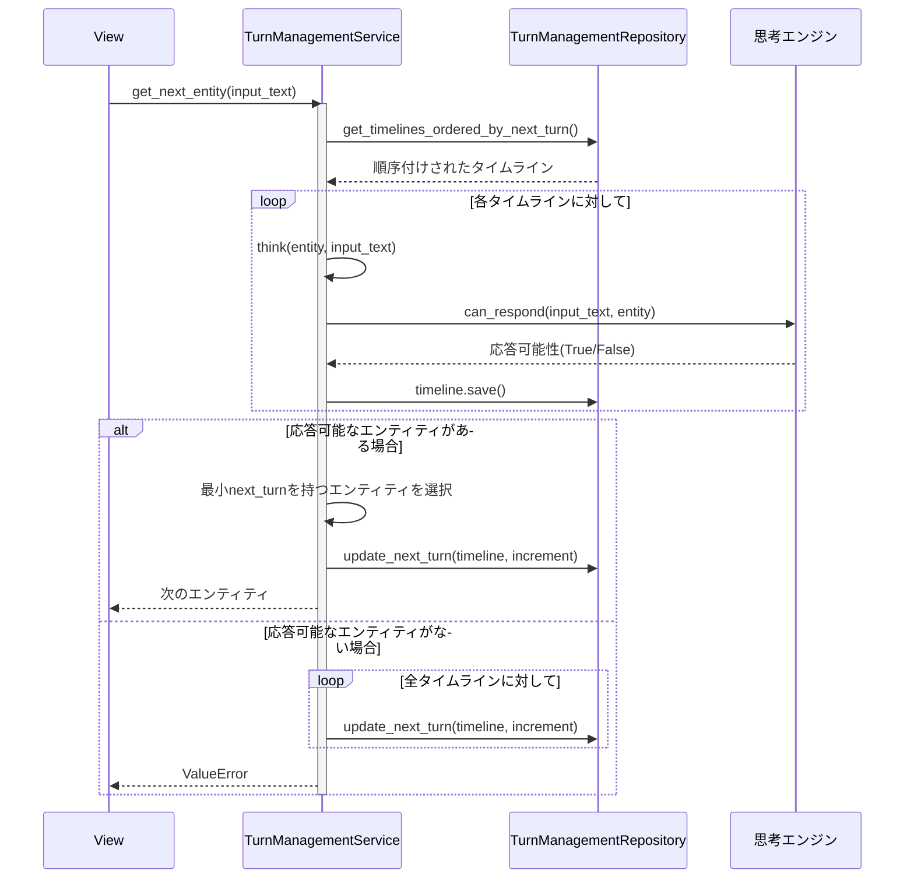
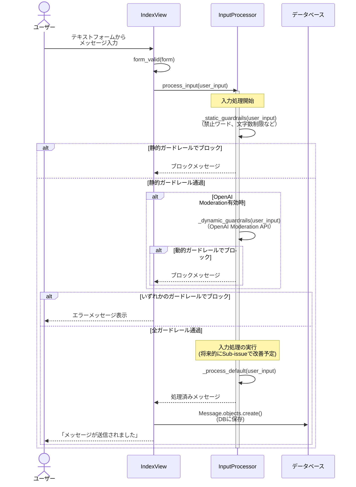

# AI Agent プロジェクト

## 概要

このプロジェクトはDjangoフレームワークを使用した会話型AIエージェントシステムです。複数のAIエージェント（エンティティ）による対話型のコミュニケーションを実現し、ユーザー入力の安全性を確保しながら、様々な情報源に基づいた応答生成を行います。

## プロジェクト構造

```
ai_agent/
├── domain/                # ドメイン層（DDD設計）
│   ├── repository/        # データアクセス層
│   │   └── turn_management.py  # ターン管理リポジトリ
│   ├── service/           # ビジネスロジックサービス
│   │   ├── input_processor.py  # 入力処理・ガードレール
│   │   ├── thinking_engines/   # 思考エンジン
│   │       ├── googlemaps_review.py  # Googleマップレビュー分析
│   │       ├── ng_word.py      # 禁止ワード処理
│   │       └── rag.py          # RAG（検索拡張生成）処理
│   │   └── turn_management.py  # ターン管理サービス
│   └── valueobject/       # 値オブジェクト
│       ├── input_processor.py  # 入力処理の値オブジェクト
│       └── turn_management.py  # ターン管理の値オブジェクト
├── tests/                 # テスト
│   ├── test_input_processor.py  # 入力処理テスト
│   ├── test_conversation.py     # 会話管理テスト
│   └── test_next_turn_logic.py  # ターン管理テスト
├── fixtures/              # フィクスチャーデータ
│   └── entity.json        # エンティティデータ
├── migrations/            # DBマイグレーション
└── 各種Djangoファイル
    ├── models.py          # データモデル
    ├── views.py           # ビュー
    ├── urls.py            # URL設定
    ├── forms.py           # フォーム
    └── admin.py           # 管理画面設定
```

## 主要コンポーネント

### 1. ターン管理システム (TurnManagementService)

`domain/service/turn_management.py`にあるTurnManagementServiceは、エージェント間の会話の流れとターン制御を担当します。

主な機能：

- エンティティの速度に基づいた次の発言順序の決定
- タイムラインの初期化と更新
- エンティティの思考ロジック（think）による応答可否の判断
- 次のアクションのシミュレーション

処理フロー：

1. タイムラインの初期化（initialize_timeline）
2. 入力テキストに対する次のエンティティの決定（get_next_entity）
3. 各エンティティのthinking_typeに基づいた応答可否の判断（think）
4. 次のターンの計算と更新（calculate_next_turn_increment）

### 2. 入力処理システム (InputProcessor)

`domain/service/input_processor.py`の入力処理システムは、ユーザー入力の安全性確保と処理を担当します。

主な機能：

- ガードレール機能による入力検証
    - 静的ガードレール（禁止ワード、文字数制限、スパム検出）
    - 動的ガードレール（OpenAI Moderation API）
- セキュリティ対策（XSS対策、入力サニタイゼーション）
- OpenAI Agents SDKを使用した応答生成
- Unicode文字や多言語処理のサポート

特徴：

- エンティティごとにカスタマイズ可能なガードレール設定
- リスクレベルに基づいた処理分岐
- 堅牢なエラーハンドリングとフォールバック処理

### 2. 思考エンジン

複数の思考エンジンにより、様々なコンテキストでの対話が可能です：

- **GoogleMapsReviewService** (`domain/service/thinking_engines/googlemaps_review.py`)
    - Googleマップのレビューデータに基づいた応答生成
    - `can_respond`メソッドで応答可否を判断

- **RagService** (`domain/service/thinking_engines/rag.py`)
    - RAG（検索拡張生成）を用いた高度な応答生成
    - 特定のナレッジベースを活用した情報提供

- **NGWordService** (`domain/service/thinking_engines/ng_word.py`)
    - 禁止ワードに基づいた応答制御
    - コンテンツの安全性確保

### 3. データアクセス層

`domain/repository`にあるリポジトリクラスは、データベースとのやり取りを抽象化します：

- **TurnManagementRepository**
    - エンティティの取得
    - タイムラインの管理と更新

## 処理の流れ

典型的なチャットのライフサイクル：

1. ユーザーがテキスト入力を送信
2. `TurnManagementService.get_next_entity`が次の応答エンティティを決定
3. エンティティの`thinking_type`に基づいて応答可能性を判断
    - GoogleMapsReviewService、RagService、NGWordServiceなどを利用
4. 応答可能な場合、エンティティが応答を生成
5. タイムラインが更新され、次のターンの増分が計算され準備

## モデル

主要なデータモデル：

- **Entity**: AIエージェントエンティティ
    - name, thinking_type, speed等の属性

- **GuardrailConfig**: ガードレール設定
    - 禁止ワード、文字数制限等の安全性設定

- **ActionTimeline**: エンティティの行動タイミング管理
    - next_turn, can_act等の属性

- **ActionHistory**: 過去の行動履歴
    - acted_at_turn, done等の属性

- **Message**: 会話メッセージ

- **GooglemapsReview**: Googleマップのレビューデータ

## 拡張と貢献

このプロジェクトは、新しい応答生成メカニズムやエンティティタイプの追加によって拡張できます：

1. 新しい`thinking_type`を定義
2. 対応するサービスクラスを実装
3. `ConversationService.think`メソッドに新しいタイプの処理を追加

## テスト

本プロジェクトでは以下の主要なテストが実装されています：

### 1. InputProcessorTest (`tests/test_input_processor.py`)

入力処理とガードレール機能のテスト：

- 基本的な入力処理テスト
- 空入力や空白のみの入力処理
- 文字数制限超過テスト
- 静的ガードレール（禁止ワード）テスト
- 動的ガードレール（OpenAI Moderation API）テスト
- APIエラーハンドリングテスト
- 複数ガードレールの同時適用テスト
- リスクレベル分類テスト
- 処理時間測定テスト
- 入力サニタイゼーションテスト
- Unicode文字処理テスト

### 2. ConversationServiceTest (`tests/test_conversation.py`)

会話管理システムのテスト：

- エンティティのターン管理テスト
- タイムライン初期化テスト
- 応答可否判断テスト

### 3. NextTurnLogicTestCase (`tests/test_next_turn_logic.py`)

ターン管理ロジックのテスト：

- 複数エンティティでの連続的な会話進行テスト
- 複数ターンにわたるシステム状態変化テスト
- エンティティの速度値に基づく次のターン計算テスト
- 同じnext_turnを持つエンティティの選択ロジックテスト
- エンティティの応答可否判断ロジックテスト
- タイムラインの初期化と更新テスト
- 将来アクションのシミュレーションテスト

## 会話フローのシーケンス図

以下のシーケンス図で処理の流れを説明します。

### 1. ターン管理プロセスのフロー



### 2. テキスト入力処理のフロー



## システムの特徴

このシステムは以下の特徴を持っています：

1. **安全性重視の設計**
    - 多層的なガードレール機能により、危険な入力や不適切なコンテンツをブロック
    - 静的チェックと動的チェックの組み合わせによる効率的な処理
    - セキュリティ対策（XSS対策、入力サニタイゼーション）の実装

2. **エンティティごとのカスタマイズ**
    - エンティティごとに異なるガードレール設定が可能
    - 特性に合わせた応答生成メカニズム

3. **堅牢なエラーハンドリング**
    - 外部API障害時のフォールバック処理
    - 例外発生時のグレースフルな対応

4. **多言語・Unicode対応**
    - 日本語を含む多言語テキスト処理
    - 絵文字や特殊文字のサポート

現在のシステムでは、テキスト入力処理とターン管理は連携して動作します：

- ユーザーのテキスト入力はInputProcessorによってガードレールチェックされます
- 安全と判断された入力は保存され、TurnManagementServiceが次のエンティティを決定します
- 選ばれたエンティティの思考エンジンが応答を生成します
- タイムラインが更新され、次のターンの準備が行われます

## ライセンス

[ライセンス情報をここに記載]
