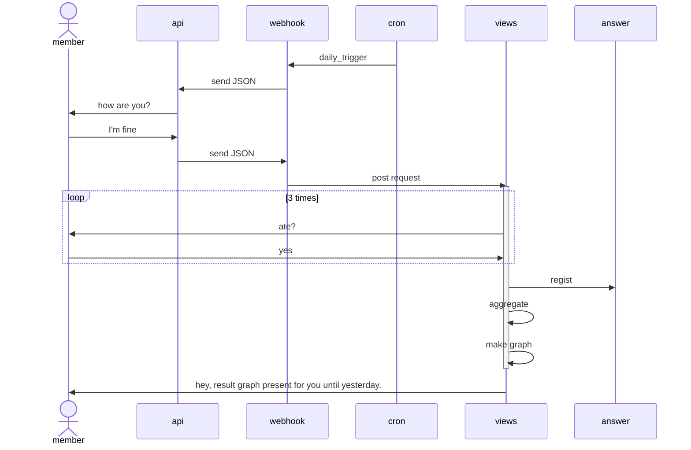

box rgb(33,66,99) LINE Platform
participant api
participant webhook
end

participant api
participant webhook as h
end box

control cron as c
boundary urls.py as u
control views.py as v
database answer as a
c -> h : daily send
h --> api : send JSON
api -> m : how are you?
m -> api : I'm fine
api --> h : send JSON
h --> u : post reqest
activate v
u -> v
loop 3 times
v -> m : ate breakfast?
m -> v : yes
end
v -> a : regist
v -> v : aggregate
v -> v : make graph
deactivate v
v -> m : hey, result graph present for you until yesterday.
