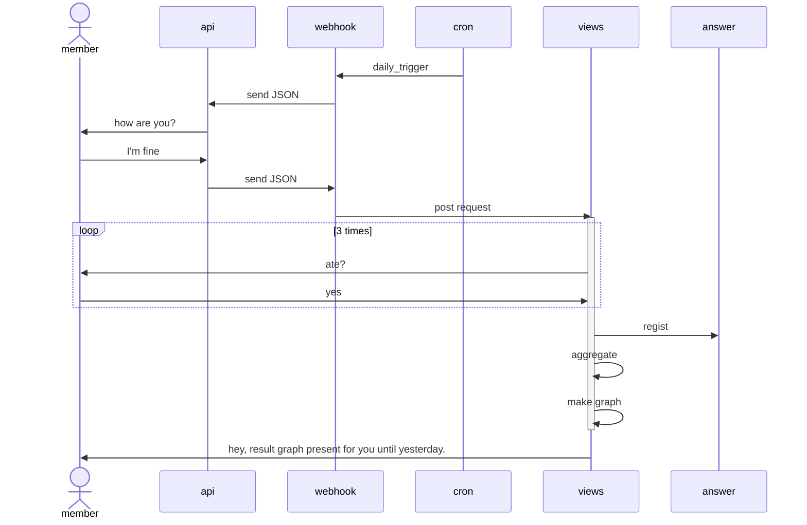

```mermaid
sequenceDiagram
    actor member
    participant api
    participant webhook
    participant cron
    participant views
    participant answer
    cron->>webhook: daily_trigger
    webhook->>api: send JSON
    api->>member: how are you?
    member->>api: I'm fine
    api->>webhook: send JSON
    webhook->>views: post request
    activate views
        loop 3 times
            views ->> member : ate?
            member ->> views : yes
        end
    views ->> answer : regist
    views ->> views : aggregate
    views ->> views : make graph
    deactivate views
    views ->> member : hey, result graph present for you until yesterday.
```
