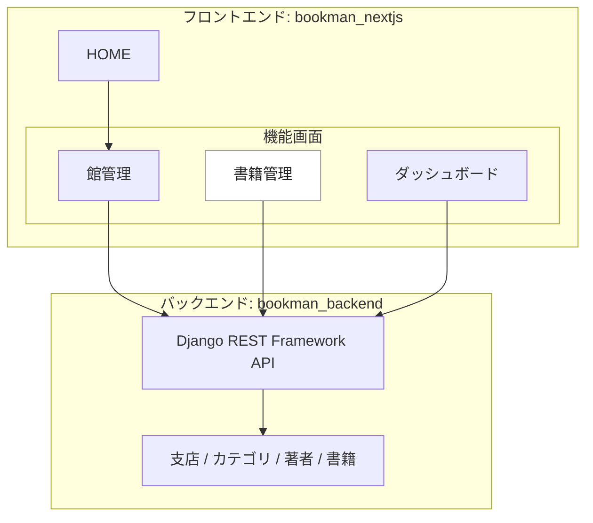
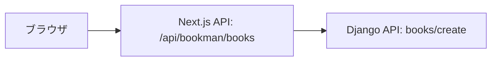

# Django-rest-frameworkとNextJSで図書管理システムを作ってみる

## はじめに
いままで作ってきたDjangoアプリケーションは、そのプロジェクトのなかにフロントエンドが含まれていた。今回はフロントエンドを Next.js（React）で作り、Django 側は Django REST Framework で API を提供する構成にする。

この記事は、最初に作った Bookman を、現在の Next.js / React / MUI の環境へ追随させた作業ログとして書き直したものだ。前半は `bookman_nextjs` のフロントエンド、後半はその API を支える `bookman_backend` のバックエンド、という順番にする。

実装リポジトリは、同じ親フォルダにある `bookman_nextjs` と `bookman_backend` という前提で進める。


:::note warn
基本に忠実にするためにすっぴんの React を使おうかとも思ったけど、ルーティングや画面単位の整理を考えると Next.js のほうが追いやすかった。仕事で触っている技術でもあり、App Router で画面を増やしていく流れが直感的だった。
:::

## 参考サイト
- https://www.django-rest-framework.org/
- https://nextjs.org/docs
- https://react.dev/
- https://mui.com/material-ui/
- https://jestjs.io/

## GitHub で記事ごと管理する
今回の最新化では、[duri0214/bookman_nextjs#1](https://github.com/duri0214/bookman_nextjs/issues/1) を起点にしてフロントエンド更新を進めた。機能内容は基本的に変えず、依存関係、実行環境、画面構成、記事管理の流れを現在の状態に合わせて整理している。

記事の管理原稿も GitHub に置き、実装の作業履歴と記事更新の履歴を追えるようにする。Qiita に直接書き足していくと、時間が空いたときに「どの実装変更を受けて、どこを書き換えたのか」が分からなくなる。だから、記事もコードと同じように Issue、branch、PR の流れに乗せる。

- 記事管理原稿: https://github.com/duri0214/portfolio/blob/master/docs/qiita/bookman_drf_nextjs.md

この記事では、現在のフロントエンド構成を上段にまとめ、後段に `bookman_backend` の更新後の状態をまとめる。



フロントエンドは App Router 前提で整理し、バックエンド未起動時の表示確認には開発用モックデータも使えるようにした。

## Frontend part
### リポジトリ構成
`bookman_nextjs` は `bookman_backend` と同じ親フォルダに置く。

```text
dev/
  portfolio/
  bookman_backend/
  bookman_nextjs/
```

`bookman_nextjs` からは、同じ親フォルダにある `portfolio/.codex` を Codex 運用ルールとスキルの管理元として参照する。フロントエンド固有の Next.js ルールは `bookman_nextjs` 側に置き、共通運用は `portfolio` に寄せる。

- 実装: https://github.com/duri0214/bookman_nextjs

### create app
GitHub に `bookman_nextjs` リポジトリを作って clone し、Next.js アプリを作る。

```console:console
npx create-next-app@latest .
```

選択は、TypeScript / ESLint / `src/` directory / App Router を使う。Tailwind CSS は使わない。import alias は `@/*` のままにする。

```text
Would you like to use TypeScript? Yes
Would you like to use ESLint? Yes
Would you like to use Tailwind CSS? No
Would you like to use `src/` directory? Yes
Would you like to use App Router? Yes
Would you like to customize the default import alias (@/*)? No
```

### Node.js と npm
Next.js 16 を使うため、Node.js は `20.9.0` 以上が必要になる。この記事ではコマンドを npm に統一する。

```console:console
node --version
npm --version
```

Windows で Node.js を1種類だけ使うなら LTS 版を入れる。通常はこちらで十分だ。

```console:console
winget install OpenJS.NodeJS.LTS
```

プロジェクトごとに Node.js を切り替えたい場合だけ `nvm-windows` を使う。

```console:console
winget install CoreyButler.NVMforWindows
nvm install 24.18.0
nvm use 24.18.0
node --version
npm --version
```

:::note
`nvm-windows` は Python でいう `pyenv` に近い。npm は Python でいう `pip` に近い。Node.js 本体のバージョンを切り替えるのが `nvm-windows`、パッケージを入れるのが npm、という整理で考える。
:::

### package.json
`package.json` は全文をそのまま上書きするのではなく、`create-next-app` が生成した内容をベースに差分を確認しながら更新する。Node.js のバージョン指定、format/test 系の scripts、Jest・Prettier・MUI・axios などの依存関係を追加し、Next.js 16 に合わせて関連パッケージのバージョンを更新した。

下は最終形の要点だけを抜粋している。実際に反映するときは、既存の `package.json` と見比べて、必要なキーを追加・更新する。ここに出していない MUI 関連、Testing Library、型定義などの devDependencies もあるので、実際の全体は `bookman_nextjs` の `package.json` を見る。

- https://github.com/duri0214/bookman_nextjs/blob/main/package.json

```json:package.json
{
  "name": "bookman_nextjs",
  "version": "0.1.0",
  "private": true,
  "engines": {
    "node": ">=20.9.0",
    "npm": ">=10"
  },
  "scripts": {
    "dev": "next dev",
    "build": "next build",
    "start": "next start",
    "lint": "eslint .",
    "format": "prettier --write .",
    "test": "jest",
    "test:watch": "jest --watch"
  },
  "dependencies": {
    "axios": "1.18.1",
    "next": "16.2.10",
    "react": "19.2.7",
    "react-dom": "19.2.7"
  },
  "devDependencies": {
    "@mui/material": "9.2.0",
    "@mui/x-data-grid": "9.9.0",
    "eslint": "9.39.5",
    "eslint-config-next": "16.2.10",
    "jest": "30.4.2",
    "prettier": "3.9.5",
    "typescript": "5.9.3"
  },
  "overrides": {
    "nanoid": "3.3.11",
    "postcss": "8.5.10"
  }
}
```

Next.js 16 では `next lint` がなくなっているので、lint は ESLint CLI を直接呼ぶ。設定ファイルの `eslint.config.mjs` は、`bookman_nextjs` のプロジェクトルート、つまり `package.json` と同じ階層に置く。

```js:eslint.config.mjs
import { defineConfig, globalIgnores } from 'eslint/config'
import nextVitals from 'eslint-config-next/core-web-vitals'
import nextTs from 'eslint-config-next/typescript'

const eslintConfig = defineConfig([
  nextVitals,
  nextTs,
  globalIgnores(['.next/**', 'out/**', 'build/**', 'next-env.d.ts']),
])

export default eslintConfig
```

### Jest
Next.js の設定を読み込むために `next/jest` を使う。設定ファイルの `jest.config.ts` は、`bookman_nextjs` のプロジェクトルート、つまり `package.json` と同じ階層に置く。App Router の route group へ移したあとも `@/app/book/...` のような import を維持するため、Jest 側にも alias を足した。

```ts:jest.config.ts
import type { Config } from 'jest'
import nextJest from 'next/jest.js'

const createJestConfig = nextJest({
  dir: './',
})

const config: Config = {
  coverageProvider: 'v8',
  moduleNameMapper: {
    '^@/app/book/(.*)$': '<rootDir>/src/app/(bookman)/book/$1',
    '^@/app/branch/(.*)$': '<rootDir>/src/app/(bookman)/branch/$1',
    '^@/app/dashboard/(.*)$': '<rootDir>/src/app/(bookman)/dashboard/$1',
    '^@/(.*)$': '<rootDir>/src/$1',
  },
  testEnvironment: 'jsdom',
}

export default createJestConfig(config)
```

テストには「入力 / 処理 / 期待値」のシナリオを残す。期間が空いたとき、何を守るテストなのかを読み返しやすくするためだ。

### HOMEページ
Bookman はもともと3年ほど前に手作りで作り、Qiita にまとめたものだ。当時の HOME は Next.js のデフォルトページを少し直してリンクを置いた程度で、図書館システムの入口としては弱かった。そこで [HOMEページのデザインを刷新](https://github.com/duri0214/bookman_nextjs/issues/16#issue-4911954164) では、HOME に絞って AI を使い、Bookman らしい見た目へ作り直した。


このとき AI に「いい感じにして」だけを渡すと、汎用的な SaaS のランディングページに寄りやすい。今回は昔の図書貸出カードをモチーフにし、少し揺れるアニメーションでノスタルジーを出す方向にした。実装済みの「図書館を管理」は `/branch` へ進める導線にし、未実装の「本をかりる」はクリックできるリンクではなく disabled 表示にする。

AI に任せる範囲は「デザインの方向づけと実装のたたき台」に限定し、実装済み機能、未実装機能、今後使い回したい部品を人間側で指定する。そうしないと、見た目は整っていても、現在のアプリの状態と合わない導線が混ざりやすい。

- 図書カード風の `LibraryCard` コンポーネントを作る
- 図書カードの表面は8行、将来の裏面は11行として定数化する
- 「図書館を管理」は `/branch` へリンクする
- 「本をかりる」は未実装なので disabled にする
- Next.js の開発用インジケーターは開発時だけのものとして扱う

```tsx:src/app/page.tsx
import Link from 'next/link'
import LibraryCard from '@/components/LibraryCard'
import styles from './page.module.css'

export default function Home() {
  return (
    <main className={styles.main}>
      <section className={styles.hero} aria-labelledby='home-title'>
        <div className={styles.cardStage} aria-hidden='true'>
          <LibraryCard animated />
        </div>

        <div className={styles.content}>
          <p className={styles.kicker}>Bookman</p>
          <h1 id='home-title'>図書館業務を、すっきり管理。</h1>
          <p className={styles.lead}>
            蔵書、館、貸出の導線をひとつにまとめた図書館管理システムです。
          </p>

          <div className={styles.actions} aria-label='主要機能'>
            <Link className={styles.primaryAction} href='/branch'>
              図書館を管理
            </Link>
            <button className={styles.secondaryAction} type='button' disabled>
              本をかりる
              <span>未実装</span>
            </button>
          </div>
        </div>
      </section>
    </main>
  )
}
```

ソースコード:

- https://github.com/duri0214/bookman_nextjs/blob/main/src/app/page.tsx
- https://github.com/duri0214/bookman_nextjs/blob/main/src/app/page.module.css

### MUI と Bootstrap の使い分け
普段メインで触っている `portfolio` は Django 標準の画面が中心なので、Bootstrap を使うことが多い。フォーム、一覧、ボタン、グリッドを素早く整えるなら Bootstrap で十分に進められる。

ただ、Next.js と Django REST Framework の組み合わせは、`portfolio` の Django テンプレートへ組み込めるものではない。だから Bookman はリポジトリを分けて、フロントエンドを `bookman_nextjs`、バックエンドを `bookman_backend` として作っている。

Bookman 側では、ダッシュボード、DataGrid、Dialog、Alert、Drawer のような操作画面を React コンポーネントとして組み立てるために MUI を使った。仕事で触っていた経験があり、テンプレートから状態付き UI へ進めやすかったのも理由だ。ただし、単純な Django 画面なら Bootstrap へ寄せる判断も普通にありだと思う。

当時レイアウトの参考にしたビジュアル:

- https://mui.com/material-ui/getting-started/templates/dashboard/

:::note
上のリンクは見た目の参考として残している。現在の `bookman_nextjs` では MUI `9.2.0` 系に更新しているので、依存関係は現在の `package.json` に合わせる。
:::

### App Router のレイアウト
`/dashboard`、`/branch`、`/book` は URL を変えずに、route group の `src/app/(bookman)` 配下へ移した。App Router では、フォルダ名を `()` で囲むと URL には出ないグルーピング用フォルダとして扱える。つまりファイル上は `src/app/(bookman)/branch/page.tsx` に置いていても、プログラムのルーティング上は `/branch` として扱われる。これで各画面の `layout.tsx` 重複をやめて、共通レイアウトを1か所で持てる。

```text
src/app/
  page.tsx
  (bookman)/
    layout.tsx
    dashboard/page.tsx
    branch/page.tsx
    book/page.tsx
```

`(bookman)/layout.tsx` には、`/dashboard`、`/branch`、`/book` に共通するナビゲーションと画面枠だけを置いた。個別画面ごとに同じレイアウトを持たせるのではなく、同じ層の画面を route group の layout でまとめる。

ナビゲーションは `a href` ではなく Next.js の `Link` を使う。アプリ内の画面遷移なら、ページ全体を読み直す通常リンクではなく、Next.js のクライアントサイド遷移やプリフェッチに乗せたほうが App Router の作法に合う。

```tsx:src/components/nav/listItems.tsx
import Link from 'next/link'

<ListItemButton component={Link} href='/branch'>
  <ListItemText primary='館管理' />
</ListItemButton>

<ListItemButton component={Link} href='/book'>
  <ListItemText primary='書籍管理' />
</ListItemButton>
```

ソースコード:

- https://github.com/duri0214/bookman_nextjs/tree/main/src/app/%28bookman%29

### API クライアントと環境変数
フロントエンドとバックエンドは別サーバーで動くので、フロントエンド側から見たバックエンド API の接続先を明示する必要がある。バックエンド API の base URL は `BOOKMAN_API_BASE_URL` で切り替える。未指定ならローカルの Django API を使う。

```env:.env.example
BOOKMAN_API_BASE_URL=http://example.com:8000/bookman/api
USE_MOCK_DATA=false
```

たとえば、環境変数を読むだけならこういう形になる。

```ts:環境変数を読む最小例
const DEFAULT_BOOKMAN_API_BASE_URL = 'http://127.0.0.1:8000/bookman/api'

const bookmanApiBaseUrl = process.env.BOOKMAN_API_BASE_URL || DEFAULT_BOOKMAN_API_BASE_URL

console.log(bookmanApiBaseUrl)
```

実際のコードでは、この base URL と endpoint 名を組み合わせて Django API の URL を作っている。登録処理のようにブラウザ、Next.js API、Django API の2段階になるところは、後ろの「Route Handler で登録を中継する」で整理する。

ブラウザで動くコードは、サーバー側の環境変数を実行時に直接読めない。だから Next.js には、ブラウザへ渡してよい値だけを明示的に公開する仕組みがある。ブラウザ側のコードから参照できる環境変数にする場合、変数名に `NEXT_PUBLIC_` を付ける。公式ドキュメントでは、`NEXT_PUBLIC_` を付けた値は build 時にブラウザへ送られる JavaScript bundle へ埋め込まれる、と説明されている。

- https://nextjs.org/docs/pages/guides/environment-variables#bundling-environment-variables-for-the-browser

このプロジェクトでは、`NEXT_PUBLIC_` は原則として使わない方針にしている。これは Next.js の一般的なしきたりというより、このプロジェクトでの運用ルールだ。ブラウザへ渡してよい値なら、フロントエンド側の設定やコードに書けばよい。環境変数はもともと外へ出したくない値を扱うためのものなので、バックエンドにもフロントエンドにも公開用の環境変数が散らかる状態を避けたい。`BOOKMAN_API_BASE_URL` は Server Component や Route Handler 側だけで読む値なので、ブラウザへ公開する必要がない。

### 一覧取得は Server Component 側に寄せる
`/branch` と `/book` の初期データ取得は Server Component 側へ寄せた。`NEXT_PUBLIC_` の扱いもそうだが、使ってみた感想として Next.js はフロントドリブンに見える。ただ、今回はバックエンドに Django REST Framework を使っているし、Next.js、React、Django REST Framework とフレームワークが渋滞しやすいので、全体を Next.js の都合へ寄せすぎないようにした。

方針としては、いままで堅牢とされてきたWebの作りを踏襲し、バックエンド側で必要なデータを用意してフロント、つまり HTML に渡す形に近づける。Bookman ではフロントエンド部分に Next.js を使うが、初期表示に必要なデータは Server Component 側で取るほうが、その考え方に近い。

クライアント側の `useEffect` で初回ロードするより、ページ単位でデータ、エラー、モック利用状態をまとめて渡せるのも扱いやすい。

`/branch` のコードでやっていることは3つだけだ。

- `loadBranchList` で Django API から支店一覧を取得する
- `convertBranchData` で画面表示用の `Branch[]` に変換する
- `catch` で失敗時の分岐を扱い、開発用モックデータか画面に出すエラーメッセージを返す

```ts:src/app/(bookman)/branch/_components/listData.ts
import { Branch, IBranchRaw } from '@/resource/branch'
import { getBookmanApiUrl } from '@/helpers/apiClient'

const USE_MOCK_DATA = process.env.USE_MOCK_DATA === 'true'

interface BranchListData {
  branches: Branch[]
  errorMessage: string | null
  isMockData: boolean
}

const loadBranchList = async (apiUrl: string): Promise<IBranchRaw[]> => {
  const response = await fetch(apiUrl, { method: 'GET', cache: 'no-store' })
  if (!response.ok) {
    throw new Error(`Failed to fetch data: ${response.statusText}`)
  }
  return response.json()
}

export const getBranchListData = async (): Promise<BranchListData> => {
  try {
    // 通常は Django API から実データを取得する。
    const responseData = await loadBranchList(getBookmanApiUrl('branches'))
    return {
      branches: convertBranchData(responseData),
      errorMessage: null,
      isMockData: false,
    }
  } catch (e) {
    if (USE_MOCK_DATA) {
      // フロントエンドだけ確認したいときは開発用モックデータへ切り替える。
      return {
        branches: convertBranchData(MOCK_BRANCHES),
        errorMessage: null,
        isMockData: true,
      }
    }

    return {
      branches: [],
      errorMessage:
        '支店データの取得に失敗しました。バックエンドを起動してから再読み込みしてください。',
      isMockData: false,
    }
  }
}
```

`/book` は少し複雑で、`books`、`categories`、`authors` を並列で取得する。Django API から返る書籍データは、カテゴリや著者をIDで持っているので、画面表示用に名前へ変換する必要がある。

```ts:src/app/(bookman)/book/_components/listData.ts
const convertBookData = (
  books: IBookRaw[],
  categories: ICategory[],
  authors: IAuthor[],
): Book[] => {
  const categoriesById = new Map(categories.map((category) => [category.id, category]))
  const authorsById = new Map(authors.map((author) => [author.id, author]))

  return books.map((result: IBookRaw) => ({
    id: result.id,
    category: categoriesById.get(result.category) ?? null,
    name: result.name,
    authors: result.authors
      .map((authorId) => authorsById.get(authorId)?.name ?? `#${authorId}`)
      .join(', '),
    leadText: result.lead_text,
    publicationDate: result.publication_date,
  }))
}

export const getBookListData = async (): Promise<BookListData> => {
  try {
    // 書籍一覧、カテゴリ、著者をまとめて取得してから表示用データへ変換する。
    const [books, categories, authors] = await Promise.all([
      loadBookmanData<IBookRaw[]>(getBookmanApiUrl('books')),
      loadBookmanData<ICategory[]>(getBookmanApiUrl('categories')),
      loadBookmanData<IAuthor[]>(getBookmanApiUrl('authors')),
    ])

    return {
      books: convertBookData(books, categories, authors),
      errorMessage: null,
      isMockData: false,
    }
  } catch (e) {
    // error または mock の表示へ落とす
  }
}
```

ソースコード:

- https://github.com/duri0214/bookman_nextjs/blob/main/src/app/%28bookman%29/branch/_components/listData.ts
- https://github.com/duri0214/bookman_nextjs/blob/main/src/app/%28bookman%29/book/_components/listData.ts

### モックデータとエラー表示
バックエンドが起動していない状態で `/branch` や `/book` を見ると、通常は画面上にデータ取得エラーを表示する。

フロントエンド単体で一覧画面を確認したい場合は、開発用のモックデータへ切り替える。

```console:console
copy .env.example .env.local
```

```env:.env.local
BOOKMAN_API_BASE_URL=http://127.0.0.1:8000/bookman/api
USE_MOCK_DATA=true
```

この状態では `/branch` と `/book` の一覧表示はモックデータで確認できる。ただし登録処理は Next.js の `/api/bookman/branches` と `/api/bookman/books` 経由でバックエンド API に POST するため、バックエンド未起動時は登録失敗になる。

画面側では、取得失敗は warning Alert、モック表示は info Alert として分ける。

### 支店管理
支店管理は、一覧表示と登録ダイアログを持つ。登録処理は最初 `console.log` 止まりだったが、現在は Next.js の Route Handler 経由で Django API に POST する。

支店データの型は、API から返る形と画面で扱う形を分けている。

- `IBranchRaw` は Django API から返ってくる支店データ
- `Branch` は React コンポーネントで表示に使う支店データ
- `IBranchRequest` は登録時に Django API へ送るデータ

これは DDD でいう [Value Object](https://martinfowler.com/eaaCatalog/valueObject.html) の考え方でもあり、[DTO(Data Transfer Object)](https://martinfowler.com/eaaCatalog/dataTransferObject.html) の考え方でもある。支店の場合は `IBranchRaw` と `Branch` の中身がまだ同じなので、分ける意味が薄く見える。ただ、送信用、受信用、画面表示用の型を分けておくと、中身が同じでも「何のためのデータか」という目的を型名に持たせられる。

書籍管理では API の `category` や `authors` が ID で返り、画面では名前つきのオブジェクトとして扱う。支店管理でも同じ置き方にしておくと、API の返却形と画面表示用の形を混ぜずに済む。

```ts:src/resource/branch.ts
export interface IBranchRaw {
  id: number
  name: string
  address: string
  phone: string
  remark: string
}

export interface Branch {
  id: number
  name: string
  address: string
  phone: string
  remark: string
}

export interface IBranchRequest {
  name: string
  address: string
  phone: string
  remark: string
}
```

```ts:src/app/(bookman)/branch/_components/useCreateDialog.ts
const CREATE_BRANCH_API_PATH = '/api/bookman/branches'

const onCreate = async () => {
  // 登録中フラグを立て、ダイアログ側の入力欄とボタンを disabled にする。
  setIsCreating(true)
  // 前回の登録エラーが残らないように、送信前に消しておく。
  setCreateErrorMessage(null)

  try {
    const response = await fetch(CREATE_BRANCH_API_PATH, {
      method: 'POST',
      headers: {
        'Content-Type': 'application/json',
      },
      body: JSON.stringify(formValues),
    })

    if (!response.ok) {
      throw new Error('Failed to create branch')
    }

    onCloseDialog()
    // Server Component 側で一覧を取り直し、登録後の支店一覧を表示する。
    router.refresh()
  } catch {
    // このメッセージをダイアログ上の Alert に表示する。
    setCreateErrorMessage(
      '支店データの登録に失敗しました。入力内容とバックエンドの状態を確認してください。',
    )
  } finally {
    // 成功しても失敗しても、処理が終わったら再操作できる状態に戻す。
    setIsCreating(false)
  }
}
```

登録中は入力とボタンを無効化し、失敗時はダイアログ上にエラーを出す。成功したら `router.refresh()` で Server Component 側の一覧を再取得する。

ソースコード:

- https://github.com/duri0214/bookman_nextjs/tree/main/src/app/%28bookman%29/branch

### 書籍管理
書籍管理も、一覧表示と登録ダイアログを持つ。バックエンドの `BookSerializer` は `category` と `authors` をIDで受けるので、フロントエンドも登録時には文字列入力を数値へ変換して payload を作る。

```ts:src/resource/book.ts
export interface IBookRaw {
  id: number
  name: string
  thumbnail: string | null
  category: number
  authors: number[]
  lead_text: string
  amount: number
  isbn: string
  publication_date: string
}

export interface IBookRequest {
  category: number
  name: string
  authors: number[]
  lead_text: string
  amount: number
  isbn: string
  publication_date: string
}
```

```ts:src/app/(bookman)/book/_components/useCreateDialog.ts
const CREATE_BOOK_API_PATH = '/api/bookman/books'

const toNumber = (value: string | undefined): number => Number(value ?? 0)

// 著者IDは "1,2,3" のような入力を想定し、DRF が受け取る number[] に変換する。
const toAuthorIds = (value: string | undefined): number[] =>
  (value ?? '')
    .split(',')
    .map((authorId) => Number(authorId.trim()))
    .filter((authorId) => Number.isInteger(authorId) && authorId > 0)

// フォーム上の文字列を、BookSerializer が受け取る登録用 payload に詰め替える。
const buildBookRequest = (formValues: Partial<IBookFormValues>): IBookRequest => ({
  category: toNumber(formValues.category),
  name: formValues.name ?? '',
  authors: toAuthorIds(formValues.authors),
  lead_text: formValues.lead_text ?? '',
  amount: toNumber(formValues.amount),
  isbn: formValues.isbn ?? '',
  publication_date: formValues.publication_date ?? '',
})

const onCreate = async () => {
  // 登録中フラグを立て、ダイアログ側の入力欄とボタンを disabled にする。
  setIsCreating(true)
  // 前回の登録エラーが残らないように、送信前に消しておく。
  setCreateErrorMessage(null)

  try {
    const response = await fetch(CREATE_BOOK_API_PATH, {
      method: 'POST',
      headers: {
        'Content-Type': 'application/json',
      },
      body: JSON.stringify(buildBookRequest(formValues)),
    })

    if (!response.ok) {
      throw new Error('Failed to create book')
    }

    onCloseDialog()
    // Server Component 側で一覧を取り直し、登録後の書籍一覧を表示する。
    router.refresh()
  } catch {
    // このメッセージをダイアログ上の Alert に表示する。
    setCreateErrorMessage(
      '書籍データの登録に失敗しました。入力内容とバックエンドの状態を確認してください。',
    )
  } finally {
    // 成功しても失敗しても、処理が終わったら再操作できる状態に戻す。
    setIsCreating(false)
  }
}
```

ソースコード:

- https://github.com/duri0214/bookman_nextjs/tree/main/src/app/%28bookman%29/book

### Route Handler で登録を中継する
登録処理はブラウザから直接 Django API に POST せず、Next.js の Route Handler を挟む。

ここは2段階になっているので、最初は少し分かりにくい。



関連するソースは以下。

- ブラウザ側:
  - [branch/_components/useCreateDialog.ts](https://github.com/duri0214/bookman_nextjs/blob/main/src/app/%28bookman%29/branch/_components/useCreateDialog.ts)
  - [book/_components/useCreateDialog.ts](https://github.com/duri0214/bookman_nextjs/blob/main/src/app/%28bookman%29/book/_components/useCreateDialog.ts)
- Route Handler 側:
  - [api/bookman/branches/route.ts](https://github.com/duri0214/bookman_nextjs/blob/main/src/app/api/bookman/branches/route.ts)
  - [api/bookman/books/route.ts](https://github.com/duri0214/bookman_nextjs/blob/main/src/app/api/bookman/books/route.ts)

この `useCreateDialog` は登録ダイアログから呼ばれるブラウザ側の処理で、まず Next.js の `/api/bookman/books` や `/api/bookman/branches` にリクエストを投げる。Route Handler 側では `getBookmanApiUrl('booksCreate')` のように `BOOKMAN_API_ENDPOINTS` から endpoint を選び、`BOOKMAN_API_BASE_URL` と組み合わせて Django REST Framework の API へ中継する。

このように、フロントエンド専用のバックエンド層を挟む構成は BFF（Backend for Frontend）と呼ばれる。今回は大げさなBFFを作っているわけではないが、ブラウザから直接バックエンドAPIへ書き込みに行かせず、Next.js 側で中継する小さなBFFとして扱っている。

```ts:src/app/api/bookman/books/route.ts
export async function POST(request: Request) {
  try {
    const requestBody = (await request.json()) as Partial<IBookRequest>
    const response = await fetch(getBookmanApiUrl('booksCreate'), {
      method: 'POST',
      headers: {
        'Content-Type': 'application/json',
      },
      body: JSON.stringify(requestBody),
      cache: 'no-store',
    })

    const responseText = await response.text()
    const responseBody = parseResponseBody(responseText)

    return Response.json(responseBody, { status: response.status })
  } catch {
    return Response.json({ message: '書籍データの登録に失敗しました。' }, { status: 500 })
  }
}
```

支店登録も同じ考え方で `/api/bookman/branches` からバックエンドの `branches/` へ POST する。

ソースコード:

- https://github.com/duri0214/bookman_nextjs/tree/main/src/app/api/bookman

### 起動手順
Bookman はフロントエンドとバックエンドを別ターミナルで起動して動かす。

```console:console（ターミナル1: Django側サーバー起動）
cd ../bookman_backend
.\venv\Scripts\Activate.ps1
python manage.py runserver 127.0.0.1:8000
```

```console:console（ターミナル2: Next.js側サーバー起動）
cd ../bookman_nextjs
npm run dev
```

`npm run dev` は開発用サーバーなので、開発中だけ表示される UI や挙動がある。本番相当で確認したい場合は、ビルドしてから起動する。

```console:console
npm run build
npm run start
```

コードを変更した後は、もう一度 `npm run build` してから `npm run start` する。

### 検証コマンド
フロントエンド側は、変更後に以下を確認する。

```console:console
npm test
npm run lint
npm run build
```

依存関係の脆弱性も見る場合は `npm audit` を実行する。

```console:console
npm audit
```

バックエンド側のテストは `bookman_backend` で実行する。

```console:console
cd ../bookman_backend
.\venv\Scripts\Activate.ps1
python manage.py test
```

## Backend part
バックエンド側は、Django REST Framework で図書館業務のデータを API として返す構成にする。Django model で支店、カテゴリ、著者、書籍などのデータ構造を定義し、serializer で JSON の形へ詰め替え、view と URL でフロントエンドから呼び出せる入口を作る。作業の単位や履歴は「GitHub で記事ごと管理する」に書いた流れと同じように Issue と PR で追える。

### リポジトリ構成
`bookman_backend` は、前段の `bookman_nextjs` と同じ親フォルダに置く。

```text
dev/
  portfolio/
  bookman_backend/
  bookman_nextjs/
```

この前提にしておくと、フロントエンド側では `cd ../bookman_backend`、バックエンド側では `cd ../bookman_nextjs` のように移動できる。Bookman の2リポジトリで使う Codex 運用ルールは、同じ親フォルダの `portfolio/.codex` を一元管理元として参照する。

- バックエンド実装: https://github.com/duri0214/bookman_backend
- README: https://github.com/duri0214/bookman_backend/blob/main/README.md
- Codex 運用参照: https://github.com/duri0214/bookman_backend/blob/main/AGENTS.md

### Python と依存関係
バックエンドは Python 3.12 以上を前提にした。仮想環境名は `venv` にしている。

```console:console
cd ../bookman_backend
python --version
python -m venv venv
.\venv\Scripts\Activate.ps1
python -m pip install --upgrade pip
python -m pip install -r requirements.txt
```

`requirements.txt` は、Django / DRF / CORS / MySQL / 画像フィールド / フォーマッターを固定している。ここも記事に全文を貼り続けるより、GitHub のファイルを正本にする。

- https://github.com/duri0214/bookman_backend/blob/main/requirements.txt

要点だけ抜くとこうなる。

```text:requirements.txt
Django==6.0.7
djangorestframework==3.17.1
django-cors-headers==4.9.0
python-dotenv==1.2.1
mysqlclient==2.2.8
Pillow==12.3.0
black==26.5.1
```

### Django 設定と .env
設定ファイルは、portfolio 側の運用に寄せて `python-dotenv` の `load_dotenv(BASE_DIR / ".env")` と `os.getenv("DJANGO_...")` で読む形にした。`django-environ` や `DB_ENGINE` は使わないことにした。

```env:bookman_backend/.env
DJANGO_DEBUG_MODE=True
DJANGO_SECRET_KEY=django-insecure-...
DJANGO_DB_HOST=127.0.0.1
DJANGO_DB_USER=python
DJANGO_DB_PASSWORD=...
DJANGO_DB_NAME=bookman_db
DJANGO_DB_PORT=3306
```

`.env` は Git 管理しない。これはローカルの秘密情報をリポジトリに入れないためのセオリーだ。共有するのは `.env.example` だけにして、DB 名、ユーザー名、パスワードはローカル MySQL に合わせる。

- 設定ファイル: https://github.com/duri0214/bookman_backend/blob/main/config/settings.py
- 環境変数サンプル: https://github.com/duri0214/bookman_backend/blob/main/.env.example

CORS は `CORS_ALLOWED_ORIGINS` を使う。Next.js の開発サーバーから参照するため、少なくとも `http://localhost:3000` と `http://127.0.0.1:3000` を許可する。

```py:config/settings.py
CORS_ALLOWED_ORIGINS = [
    "http://localhost:3000",
    "http://127.0.0.1:3000",
    "http://153.126.200.229:3000",
]
```

### MySQL と migration
DB は MySQL の `bookman_db` を使う。ユーザーや権限の作り方はローカル環境によるが、Django 側の接続情報は `.env` に寄せる。

```console:console
mysql -u root -p
```

```sql:MySQL
CREATE DATABASE bookman_db DEFAULT CHARACTER SET utf8mb4;
```

`bookman_db` がすでにあるなら、database 作成は飛ばしてよい。

```sql:MySQL
CREATE USER 'python'@'localhost' IDENTIFIED BY '任意のパスワード';
grant CREATE, DROP, SELECT, UPDATE, INSERT, DELETE, ALTER, REFERENCES, INDEX on bookman_db.* to python@localhost;
```

`python` ユーザーがまだないときは、上の `CREATE USER` と `grant` を実行する。MySQL では `'python'@'localhost'` と `'python'@'127.0.0.1'` は別ユーザーとして扱われる。Django の `.env` で `DJANGO_DB_HOST=127.0.0.1` を指定している場合、`localhost` のユーザーだけを作っても認証できないことがある。

:::note
ローカルで `python` ユーザーのパスワードが通らなかったときは、MySQL 側のユーザーが `localhost` で作られているか、`127.0.0.1` で作られているかを確認する。Django から `127.0.0.1` へ接続するなら、必要に応じて `CREATE USER 'python'@'127.0.0.1' ...` と `grant ... to 'python'@'127.0.0.1';` を追加する。
:::

migration は Git 管理対象に戻した。モデルを変更したときだけ `makemigrations bookman` を実行し、通常のセットアップでは migration を適用する。

```console:console
python manage.py migrate
python manage.py makemigrations --check --dry-run
```

migration ファイルは以下にまとまっている。

- https://github.com/duri0214/bookman_backend/tree/main/bookman/migrations

### モデル
Bookman の backend は、支店、カテゴリ、著者、書籍、所蔵、貸出を Django model として持つ。

- `Branch`: 図書館支店マスタ
- `Category`: 書籍カテゴリ
- `Author`: 著者
- `Book`: 自治体全体で扱う書籍マスタ
- `Assignment`: 支店ごとの所蔵数
- `Lending`: 貸出状態

モデル全文は記事に貼らず、現行ソースを見る。

- https://github.com/duri0214/bookman_backend/blob/main/bookman/models.py

著者は複数人になることがあるので、`Book.authors` は `ManyToManyField` にしている。Django はこの関連を `bookman_book_authors` という中間テーブルで管理する。書籍 ID と著者 ID の組み合わせを持つテーブルだ。

```py:bookman/models.py
class Book(models.Model):
    name = models.CharField("タイトル", max_length=255, unique=True)
    thumbnail = models.ImageField("サムネイル", blank=True, null=True)
    category = models.ForeignKey(Category, on_delete=models.PROTECT, verbose_name="カテゴリ")
    authors = models.ManyToManyField(Author, verbose_name="著者")
    lead_text = models.TextField("紹介文")
    amount = models.PositiveSmallIntegerField("数量")
```

### fixture
初期データは fixture で投入する。fixture 本文は長いので、記事には読み込み順だけ残す。

```console:console
python manage.py loaddata bookman/fixtures/m_branch-data.json
python manage.py loaddata bookman/fixtures/m_category-data.json
python manage.py loaddata bookman/fixtures/author-data.json
python manage.py loaddata bookman/fixtures/book-data.json
```

fixture の中身は GitHub の `fixtures` フォルダを見る。

- https://github.com/duri0214/bookman_backend/tree/main/bookman/fixtures

書籍 fixture は `authors` に著者 ID 配列を持つので、カテゴリと著者を先に投入してから書籍を投入する。

### API
API の URL は `/bookman/api/` 配下になる。フロントエンドの `BOOKMAN_API_BASE_URL` が既定で `http://127.0.0.1:8000/bookman/api` を向くので、backend 側もこのパスを維持する。

| 用途 | URL | view |
| --- | --- | --- |
| 支店一覧/登録 | `/bookman/api/branches/` | `BranchList` |
| 支店登録（旧互換） | `/bookman/api/branches/create/` | `BranchCreate` |
| 書籍一覧 | `/bookman/api/books/` | `BookList` |
| 書籍登録 | `/bookman/api/books/create/` | `BookCreate` |
| 書籍詳細 | `/bookman/api/books/<id>/` | `BookDetail` |
| 著者一覧 | `/bookman/api/authors/` | `AuthorList` |
| カテゴリ一覧 | `/bookman/api/categories/` | `CategoryList` |

- URL 定義: https://github.com/duri0214/bookman_backend/blob/main/bookman/urls.py
- view: https://github.com/duri0214/bookman_backend/blob/main/bookman/views.py
- serializer: https://github.com/duri0214/bookman_backend/blob/main/bookman/serializers.py

`BranchList` は `ListCreateAPIView` という型にして、`/bookman/api/branches/` で GET と POST を受ける。`BranchList` のような view class は、どの URL でどの model を読み書きするかを決める入口だ。`/bookman/api/branches/create/` も残しているが、フロントエンド側は一覧 URL と同じ `/branches/` へ登録できる。

```py:bookman/views.py
class BranchList(generics.ListCreateAPIView):
    serializer_class = BranchSerializer

    def get_queryset(self):
        return Branch.objects.order_by("id")
```

serializer は、Django model と API の JSON を詰め替える DTO のような役割を持つ。`BookSerializer` は、`category` と `authors` を ID で受け渡しする。フロントエンドはカテゴリ名や著者名を別 API から取得し、画面表示用に ID から名前へ変換する。

```py:bookman/serializers.py
class BookSerializer(serializers.ModelSerializer):
    category = serializers.PrimaryKeyRelatedField(
        queryset=Category.objects.order_by("id")
    )
    authors = serializers.PrimaryKeyRelatedField(
        many=True,
        queryset=Author.objects.order_by("id"),
    )
```

### 起動手順
Bookman はバックエンドとフロントエンドを別ターミナルで起動する。

```console:console（ターミナル1: Django側サーバー起動）
cd ../bookman_backend
.\venv\Scripts\Activate.ps1
python manage.py runserver 127.0.0.1:8000
```

```console:console（ターミナル2: Next.js側サーバー起動）
cd ../bookman_nextjs
npm run dev
```

ブラウザでは `http://localhost:3000` を開く。Next.js から Django API へつながらない場合は、まず backend 側の API を直接確認する。

```console:console
curl http://127.0.0.1:8000/bookman/api/branches/
curl http://127.0.0.1:8000/bookman/api/books/
```

### テストと検証
backend 側で最低限見るのは、Django 設定、migration 差分、API テストだ。

```console:console
python manage.py check
python manage.py makemigrations --check --dry-run
python manage.py test bookman --noinput
```

DB 接続まで含めるなら、MySQL の `.env` が合っている状態で migration も確認する。

```console:console
python manage.py migrate --noinput
```

通信テストは `bookman/tests.py` で点検した。支店一覧/登録、書籍一覧/登録/詳細、著者一覧、カテゴリ一覧で返すフィールドを確認している。

- https://github.com/duri0214/bookman_backend/blob/main/bookman/tests.py

`bookman_backend#7` の確認では、fixture ロード後に `branches` と `books` の代表 API レスポンスも確認している。記事のコマンドを更新したときは、README とこの記事の手順がずれないように見る。

## 図書館業務をイメージしまくれ！
ここから先は、バックエンド基盤の現行化とは別の業務実装メモとして残す。今回の `bookman_backend#1` 配下では、依存関係、設定、migration、fixture、通信テスト、検証手順を現在の状態へ戻すところまでを扱った。貸出ルールや支店間移動、休館日、検索条件保存のような業務実装は、次の設計チケットで分けて考える。


### 要件メモ
- 図書館の業務だって考え始めると試験に出るぐらいに難しいんだよ
  - https://www.fe-siken.com/kakomon/01_aki/pm03.html

- ひとりのユーザが同じ本を2冊以上借りることはできない
  - https://detail.chiebukuro.yahoo.co.jp/qa/question_detail/q1377006708

- 図書館の支店マスタで取り扱う情報はとりあえず4つ（休館日とかは機能が大きいから気が向いたら）
  - https://www.lib.city.shibuya.tokyo.jp/?page_id=166
    - 名称: 笹塚図書館
    - 所在地: 〒151-0073 渋谷区笹塚1-47-1 メルクマール京王笹塚4階
    - 電話: 03-3460-6784
    - 備考: 鉄筋コンクリート造 地上21階地下2階の4階部分 440㎡ 57席

### 次回以降 TODO
- [ ] 書籍管理（自治体∋支店）
  - （全支店）の（書籍名称）の合計を算出（自治体としての本の所蔵数）
  - （支店名）に（書籍名称）が（支店図書館の所蔵数）冊ある
  - （支店名）から（支店名）に本を移動する（支店図書館の所蔵数増減）
- [ ] 利用者への貸出
  - ひとりのユーザが同じ本を2冊以上借りることはできない
  - 貸出中の本を別の利用者へ貸し出せない
  - 利用者ごとの貸出上限冊数を超えたら貸し出せない
  - （支店名）の（書籍名称）を利用者に貸し出す
  - （支店名）が（書籍名称）の返却を受け付ける
- [ ] 予約
  - 貸出中の本に予約を入れる
  - 返却された本を予約順に取り置きする
  - 取り置き期限を過ぎた予約を取り消す
- [ ] 利用者管理
  - 利用者を登録する
  - 利用者の貸出履歴を確認する
  - 延滞中の利用者を確認する
- [ ] 開館日・休館日
  - 支店ごとの休館日を登録する
  - 休館日には貸出期限日をずらす
- [ ] 設定
  - 検索条件を保存、読み込みできる
  - 権限によって表示されるレコードが変化
  - JSONで読み書き
