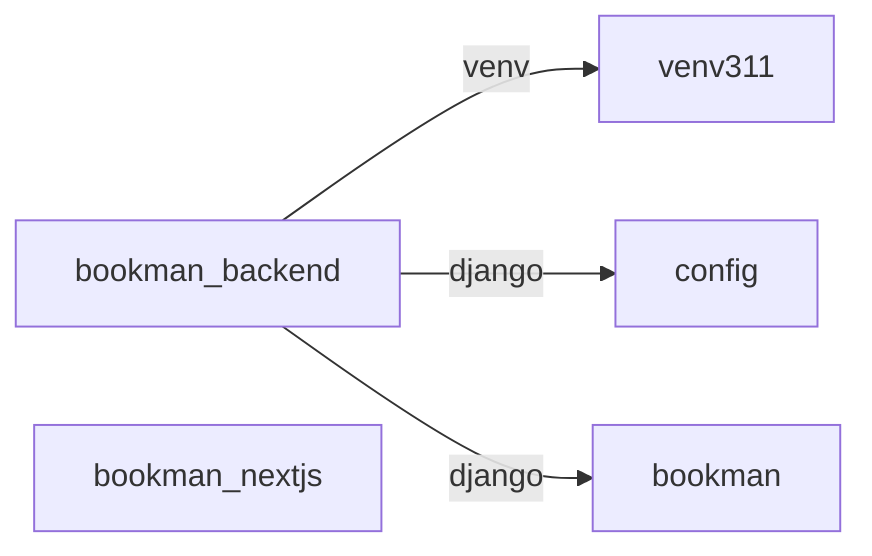

# Django-rest-frameworkとNextJSで図書管理システムを作ってみる

元記事: https://qiita.com/YoshitakaOkada/items/570c025cf235062649c8

## はじめに
いままで作ってきたDjangoアプリケーションは、そのプロジェクトのなかにフロントエンドが含まれていた。今回フロントエンドはNext.js（＝React）でやるので、Django側はサーバーサイドの機能だけを提供する。まぁ内蔵だけになる、みたいな感じやな


:::note warn
基本に忠実にするためにすっぴんの React を使おうかとも思ったけどルーティングがなくて癖が強かったので Next.js にした。仕事で使ってもいるし（しかしバックエンドもNext.jsでやっているためにつくりが複雑）、ルーティングが直感的だ
:::

## 参考サイト
https://www.django-rest-framework.org/

https://nextjs.org/docs

## Overview
- バックエンド のプロジェクト名は `bookman_backend` にする
  - 実際には `config` というプロジェクトを作成してプロジェクトフォルダ名を `bookman_backend` に変更する
  - アプリケーション名は `bookman` にする
  - venv名は `venv311` にする
- フロントエンド のプロジェクト名は `bookman_nextjs` にする


## Django part
### create root directory
```console:console
mkdir bookman_backend
cd bookman_backend
```

### venv
```console:console
python -m venv venv311
```

### create project
- 公式の `Requirements` をもとにインストール
```console:console
pip install django
pip install djangorestframework
pip install django-filter
pip install markdown
pip install pillow

django-admin startproject config .
```

### create app
:::note warn
ケバブケースで startapp はできない　←めっちゃハマった
e.g. bookman-api
:::
```console:console
python manage.py startapp bookman
```
```diff_python:bookman_backend/config/settings.py
INSTALLED_APPS = [
    'django.contrib.admin',
    'django.contrib.auth',
    'django.contrib.contenttypes',
    'django.contrib.sessions',
    'django.contrib.messages',
    'django.contrib.staticfiles',
+   'rest_framework',
+   'bookman',
]
+REST_FRAMEWORK = {
+   'DEFAULT_PERMISSION_CLASSES': [
+       'rest_framework.permissions.AllowAny',
+   ]
+}
    :
-LANGUAGE_CODE = 'en-us'
+LANGUAGE_CODE = 'ja'
-TIME_ZONE = 'UTC'
+TIME_ZONE = 'Asia/Tokyo'
    :
```
:::note
`DEFAULT_PERMISSION_CLASSES` は「誰にアクセスを許可するか」を指定する。
- 今回は `get` しかない、かつ、取り回しの良さで `AllowAny` だが、これだと誰でも追加したり削除したりできるので `post` リクエストなどがある場合は `IsAuthenticatedOrReadOnly` に変えるとよい。すると、`get, head, options` リクエストは誰にでも許可されるが、それ以外の `post, delete` などのリクエストは認証済みのユーザにしか許可されなくなる。

- https://www.django-rest-framework.org/api-guide/permissions/
:::

### 確認
```console:console
python manage.py runserver
```


### 非公開情報を.envに移す（GitGuardian対策）
<details><summary>old</summary>


```diff_python:bookman_backend/config/settings.py
from pathlib import Path
+ import environ

# Build paths inside the project like this: BASE_DIR / 'subdir'.
BASE_DIR = Path(__file__).resolve(strict=True).parent.parent

+ # read at .env
+ env = environ.Env(DEBUG=(bool, False))
+ environ.Env.read_env(Path(BASE_DIR, '.env'))
+ DEBUG = env('DEBUG')  # read DEBUG at .env
+ SECRET_KEY = env('SECRET_KEY')  # read SECRET_KEY at .env

# Quick-start development settings - unsuitable for production
# See https://docs.djangoproject.com/en/3.1/howto/deployment/checklist/

- # SECURITY WARNING: keep the secret key used in production secret!
- SECRET_KEY = 'djaXXXXX'

- # SECURITY WARNING: don't run with debug turned on in production!
- DEBUG = True
    :
```
</details>

`.env` ファイルに `api_key` を移すためには、環境変数を読み込む設定が必要です。一般的には、Pythonの `dotenv` パッケージを使うことで `.env` ファイルから簡単に環境変数を読み込むことができます。

以下に、`.env` ファイルの設定と、コードの変更手順を示します。

#### 1. `.env` ファイルの作成
プロジェクトのルートに `.env` ファイルを作成し、次のように環境変数を設定します。

```env:bookman_backend/.env
SECRET_KEY=djaXXXXX
DEBUG=True
DB_ENGINE=django.db.backends.mysql
DB_NAME=bookman_db
DB_USER=python
DB_PASSWORD=python123
```

#### 2. dotenv パッケージのインストール
dotenv パッケージが必要です。以下のコマンドでインストールします。

```console:console
pip install python-dotenv
```

#### 3. コードの変更
コード内で dotenv をインポートして、.env ファイルから環境変数を読み込むようにします。

:::note warn
load_dotenv()がデフォルトで検索するパスは現在の作業ディレクトリなの？

ChatGPT:
はい、load_dotenv() はデフォルトで現在の作業ディレクトリ（カレントディレクトリ）にある .env ファイルを検索します。

もし現在の作業ディレクトリ以外の場所にある .env ファイルを読み込みたい場合は、load_dotenv() にファイルのパスを指定できます。

Djangoの場合は `load_dotenv(BASE_DIR / ".env")` になる

- [hotfix: load_dotenv()がデフォルトで検索するパスは現在の作業ディレクトリだった！？](https://github.com/duri0214/portfolio/pull/187/files)
:::


```py:estate.py の変更
import os
from dotenv import load_dotenv

# .env ファイルを読み込む
load_dotenv(BASE_DIR / ".env")

@dataclass
class EstateService:
    url: str
    api_key: str = os.getenv("API_KEY")  # 環境変数からAPIキーを読み込み

    def post_estate_info(self, latitude: float, longitude: float):
            :
        return response.json()

# 使用例
if __name__ == "__main__":
    service = EstateService(
        url="https://ty66xxxxate-info"
    )

```
:::note
load_dotenv()がないとos.getenvって使えないの？

os.getenv() は load_dotenv() がなくとも動作しますが、Pythonはデフォルトでは.envファイルを対象にしません。代わりに環境変数を使用します。ですので、.envファイルから環境変数を読み込むためには、load_dotenv()を呼び出す必要があります。
つまり、os.getenv()はシステム環境変数から値を取得します。一方、load_dotenv()は.envファイルの中の環境変数をロードしてシステム環境変数に追加します。したがって、os.getenv()を使用して.envファイルから環境変数を読み込む際には、先にload_dotenv()を呼び出す必要があります。
:::
:::note alert
ここでいったん pycharm を再起動したり、コンソールの再起動をしないと引きずってえんえんとハマることになる
:::

## MySQL
```console:console
pip install mysqlclient
```
```diff_python:bookman_backend/config/settings.py
DATABASES = {
    'default': {
-       'ENGINE': 'django.db.backends.sqlite3',
-       'NAME': BASE_DIR / 'db.sqlite3',
+       'ENGINE': env('DB_ENGINE'),
+       'NAME': env('DB_NAME'),
+       'USER': env('DB_USER'),
+       'PASSWORD': env('DB_PASSWORD'),
    }
}
    :
```

### mysqlにrootで入る
```console:console
mysql -u root -p
```
### create database
```console:console
mysql> CREATE DATABASE bookman_db DEFAULT CHARACTER SET utf8mb4;
       Query OK, 1 row affected (0.01 sec)
```
### create user
```console:console
mysql> CREATE USER 'python'@'localhost' IDENTIFIED BY 'python123';
```
### create grant
```console:console
mysql> grant CREATE, DROP, SELECT, UPDATE, INSERT, DELETE, ALTER, REFERENCES, INDEX on bookman_db.* to python@localhost;
```

### mysqlを出る
```console:console
mysql> exit
```
```console:console（作ったユーザで入れるか確認）
mysql -u python -p
```
```console:console
mysql> exit
```

```python:bookman_backend/bookman/views.py
from django.http import HttpResponse


def index(request):
    return HttpResponse("Hello, world.")
```
```python:bookman_backend/bookman/urls.py（新規）
from django.urls import path
from . import views

urlpatterns = [
    path('', views.index, name='index'),
]
```
```diff_python:bookman_backend/config/urls.py
"""config URL Configuration

The `urlpatterns` list routes URLs to views. For more information please see:
    https://docs.djangoproject.com/en/4.1/topics/http/urls/
Examples:
Function views
    1. Add an import:  from my_app import views
    2. Add a URL to urlpatterns:  path('', views.home, name='home')
Class-based views
    1. Add an import:  from other_app.views import Home
    2. Add a URL to urlpatterns:  path('', Home.as_view(), name='home')
Including another URLconf
    1. Import the include() function: from django.urls import include, path
    2. Add a URL to urlpatterns:  path('blog/', include('blog.urls'))
"""
from django.contrib import admin
-from django.urls import path
+from django.urls import path, include

urlpatterns = [
    path('admin/', admin.site.urls),
+   path('bookman/', include('bookman.urls')),
]
```
```console:console
python manage.py runserver
```

※http://127.0.0.1:8000/ は `404` になっていることを確認する
※サーバーは `ctrl + c` で落としておく

## .gitignore
- gitignoreは、gitignore.ioのdjango用のものと migrationsフォルダを指定する

https://www.toptal.com/developers/gitignore/api/django

```bookman_backend/.gitignore
/bookman/migrations/
    :
（最下行に追加: gitignore.ioのdjango用のもの）
```

## DBeaver
### インストール方法
[（初心者向け）DBeaverのインストール方法](https://masafumi-blog.com/dbeaver-install)

## 図書館業務をイメージしまくれ！


### 要件メモ
- 図書館の業務だって考え始めると試験に出るぐらいに難しいんだよ
https://www.fe-siken.com/kakomon/01_aki/pm03.html

- ひとりのユーザが同じ本を2冊以上借りることはできない
https://detail.chiebukuro.yahoo.co.jp/qa/question_detail/q1377006708

- 図書館の支店マスタで取り扱う情報はとりあえず4つ（休館日とかは機能が大きいから気が向いたら）
https://www.lib.city.shibuya.tokyo.jp/?page_id=166
    - 名称:	笹塚図書館
    - 所在地:	〒151-0073 渋谷区笹塚1-47-1 メルクマール京王笹塚4階
    - 電話:	03-3460-6784
    - 備考:	鉄筋コンクリート造 地上21階地下2階の4階部分 440㎡ 57席


### 業務フロー
- 書籍管理
    - （全支店）の（書籍名称）を合計すると（本の所蔵数）冊ある
    - （支店名）に（書籍名称）が（本の所蔵数）冊ある
    - （支店名）から（支店名）に本を移動する
- 利用者への貸出業務
    - （支店名）の（書籍名称）を利用者に貸し出す
    - （支店名）が（書籍名称）の返却を受け付ける

### 機能メモ
- 設定
    - 仕様
        - 検索条件を保存、読み込みできる
        - 権限によって表示されるレコードが変化
        - JSONで読み書き
    - ボタン
        - 保存
        - 読み込み

## Django part
### django-cors-headers
```console:console
pip install django-cors-headers
```
```diff_python:bookman_backend/config/settings.py
INSTALLED_APPS = [
      :
+   'corsheaders',
]
  :
MIDDLEWARE = [
+   'corsheaders.middleware.CorsMiddleware',
+   'django.middleware.common.CommonMiddleware',
    'django.middleware.security.SecurityMiddleware',
    'django.contrib.sessions.middleware.SessionMiddleware',
    'django.middleware.common.CommonMiddleware',
    'django.middleware.csrf.CsrfViewMiddleware',
    'django.contrib.auth.middleware.AuthenticationMiddleware',
    'django.contrib.messages.middleware.MessageMiddleware',
    'django.middleware.clickjacking.XFrameOptionsMiddleware',
]
+CORS_ORIGIN_WHITELIST = (
+   'http://localhost:3000',
+)
```

### model.py
```python:bookman_backend/bookman/models.py
from django.contrib.auth.models import User
from django.db import models


class Branch(models.Model):
    """
    図書館支店マスタ
    """
    name = models.CharField(max_length=255, unique=True)
    address = models.CharField(max_length=255)
    phone = models.CharField(max_length=20)
    remark = models.CharField(max_length=255)
    created_at = models.DateField(auto_now_add=True)
    updated_at = models.DateField(auto_now=True, null=True)

    class Meta:
        db_table = 'bookman_m_branch'

    def __str__(self):
        return self.name


class Category(models.Model):
    name = models.CharField('カテゴリ名', max_length=100, unique=True)
    color = models.CharField('色(16進数)', max_length=7, default='#000000')

    class Meta:
        db_table = 'bookman_m_category'

    def __str__(self):
        return self.name


class Author(models.Model):
    name = models.CharField('著者名', max_length=255, unique=True)

    def __str__(self):
        return self.name


class Book(models.Model):
    """
    書籍マスタ
    システムを使用するひとつの自治体が束ねる、n個の支店図書館すべてが所蔵する本
    """
    name = models.CharField('タイトル', max_length=255, unique=True)
    thumbnail = models.ImageField('サムネイル', blank=True, null=True)
    category = models.ForeignKey(Category, on_delete=models.PROTECT, verbose_name='カテゴリ')
    authors = models.ManyToManyField(Author, verbose_name='著者')
    lead_text = models.TextField('紹介文')
    amount = models.PositiveSmallIntegerField('数量')
    isbn = models.CharField('ISBNコード', max_length=20)
    publication_date = models.DateField('出版年月日')
    created_at = models.DateField('登録日', auto_now_add=True)
    updated_at = models.DateField('更新日', auto_now=True, null=True)

    def __str__(self):
        return self.name


class Assignment(models.Model):
    """
    システムを使用するひとつの自治体が束ねる、n個の支店図書館がそれぞれどの本をいくつ所蔵するか
    ある支店図書館にある本の数量合計が、Bookテーブルの amount と一致する
    """
    branch = models.ForeignKey('Branch', on_delete=models.CASCADE)
    book = models.ForeignKey('Book', on_delete=models.CASCADE)
    amount = models.PositiveSmallIntegerField()
    created_at = models.DateField(auto_now_add=True)
    updated_at = models.DateField(auto_now=True, null=True)

    def __str__(self):
        return f"{self.book.name}({self.amount}) {self.branch.name}"


class Lending(models.Model):
    """
    貸出日と created_at は同じになる
    返却が終わると active が 0 になる
    """
    return_date = models.DateField()
    book = models.ForeignKey('Book', on_delete=models.CASCADE)
    active = models.BooleanField(default=1)
    customer_user = models.ForeignKey(User, related_name='customer', on_delete=models.CASCADE)
    contact_user = models.ForeignKey(User, related_name='contact', on_delete=models.CASCADE)
    created_at = models.DateField(auto_now_add=True)
    updated_at = models.DateField(auto_now=True, null=True)
```

```console:console
python manage.py makemigrations bookman
python manage.py migrate
```

### superuserの作成
```console:console
python manage.py createsuperuser
  ユーザー名 (leave blank to use 'yoshi'):
  メールアドレス: yoshiXXXX@gmail.com
  Password:
  Password (again):
  このパスワードは ユーザー名 と似すぎています。
  Bypass password validation and create user anyway? [y/N]: y
  Superuser created successfully.
```

### データの投下
#### 図書館支店マスタ
https://www.lib.city.shibuya.tokyo.jp/?page_id=132
```json:bookman_backend/bookman/fixtures/m_branch-data.json
[
  {
    "model": "bookman.branch",
    "fields": {
      "name": "中央図書館",
      "address": "東京都渋谷区神宮前1-4-1",
      "phone": "03-3403-2591",
      "remark": "鉄筋コンクリート造 地下1階地上5階 4,450㎡（294席）",
      "created_at": "2022-12-03"
    }
  },
  {
    "model": "bookman.branch",
    "fields": {
      "name": "西原図書館",
      "address": "東京都渋谷区西原2-28-9",
      "phone": "03-3460-8535",
      "remark": "鉄筋コンクリート造 地下1階地上3階の2・3階部分 631㎡（61席）",
      "created_at": "2022-12-03"
    }
  },
  {
    "model": "bookman.branch",
    "fields": {
      "name": "白根図書 サービススポット",
      "address": "東京都渋谷区東4-9-1",
      "phone": "03-3486-2820",
      "remark": "鉄筋コンクリート造 地下2階地上2階 1,731㎡（0席）",
      "created_at": "2022-12-03"
    }
  },
  {
    "model": "bookman.branch",
    "fields": {
      "name": "富ヶ谷図書館",
      "address": "東京都渋谷区上原1-46-2",
      "phone": "03-3468-9020",
      "remark": "鉄筋コンクリート造 地上2階建ての1階の一部 510㎡（43席）",
      "created_at": "2022-12-03"
    }
  },
  {
    "model": "bookman.branch",
    "fields": {
      "name": "笹塚図書館",
      "address": "東京都渋谷区笹塚1-47-1　メルクマール京王笹塚4階",
      "phone": "03-3460-6784",
      "remark": "鉄筋コンクリート造 地上21階地下2階の4階部分 440㎡（57席）",
      "created_at": "2022-12-03"
    }
  },
  {
    "model": "bookman.branch",
    "fields": {
      "name": "本町図書館",
      "address": "東京都渋谷区本町1-33-5",
      "phone": "03-5371-4833",
      "remark": "鉄筋コンクリート造 地下1階地上3階 1,400㎡（97席）",
      "created_at": "2022-12-03"
    }
  },
  {
    "model": "bookman.branch",
    "fields": {
      "name": "こもれび大和田図書館",
      "address": "東京都渋谷区桜丘町23-21 文化総合ｾﾝﾀｰ大和田2階",
      "phone": "03-3464-4780",
      "remark": "鉄筋コンクリート造 地上12階地下1階の2階部分 608㎡（64席）",
      "created_at": "2022-12-03"
    }
  },
  {
    "model": "bookman.branch",
    "fields": {
      "name": "臨川みんなの図書館",
      "address": "東京都渋谷区広尾1-9-17",
      "phone": "03-5793-9500",
      "remark": "鉄筋コンクリート造 地上3階建ての1・2階部分 688㎡（29席）",
      "created_at": "2022-12-03"
    }
  },
  {
    "model": "bookman.branch",
    "fields": {
      "name": "代々木図書館",
      "address": "東京都渋谷区代々木3-51-8",
      "phone": "03-3370-7566",
      "remark": "鉄筋コンクリート造 地上4階建て区民施設の4階 320㎡（24席）",
      "created_at": "2022-12-03"
    }
  },
  {
    "model": "bookman.branch",
    "fields": {
      "name": "笹塚こども図書館",
      "address": "東京都渋谷区笹塚3-3-1",
      "phone": "03-3378-1983",
      "remark": "鉄筋コンクリート造 地上4階の2階部分 361㎡（28席）",
      "created_at": "2022-12-03"
    }
  }
]
```
#### 本カテゴリーマスタ
```json:bookman_backend/bookman/fixtures/m_category-data.json
[
  {
    "model": "bookman.category",
    "fields": {
      "name": "ひと",
      "color": "#ff7f7f"
    }
  },
  {
    "model": "bookman.category",
    "fields": {
      "name": "地名",
      "color": "#ff7fbf"
    }
  },
  {
    "model": "bookman.category",
    "fields": {
      "name": "行事",
      "color": "#ff7fff"
    }
  },
  {
    "model": "bookman.category",
    "fields": {
      "name": "食べ物",
      "color": "#bf7fff"
    }
  },
  {
    "model": "bookman.category",
    "fields": {
      "name": "その他",
      "color": "#c0c0c0"
    }
  }
]
```
#### 著者データ
```json:bookman_backend/bookman/fixtures/author-data.json
[
  {
    "model": "bookman.author",
    "fields": {
      "name": "国松俊英"
    }
  },
  {
    "model": "bookman.author",
    "fields": {
      "name": "熊谷聡"
    }
  }
]
```
#### 本データ
https://www.iwasakishoten.co.jp/search/s12761.html

[many to many field の fixture の作り方](https://qiita.com/shun198/items/29b5c253be6f802403cd#many-to-many-field%E3%81%AE%E6%99%82)

::: note
pk 必須（pk書かないと中間テーブルのほうで勝手に、存在しない番号で採番される）
:::

```json:bookman_backend/bookman/fixtures/book-data.json
[
  {
    "model": "bookman.book",
    "pk": 1,
    "fields": {
      "name": "地名のひみつパート2",
      "category": 2,
      "authors": [1, 2],
      "lead_text": "海外、国内の地名の由来をゆかいなイラストとともに、歴史的背景をまじえて解説。短いお話とコラムで構成しています。",
      "amount": "100",
      "isbn": "9784265039500",
      "publication_date": "2002-04-10",
      "created_at": "2022-12-03"
    }
  },
  {
    "model": "bookman.book",
    "pk": 2,
    "fields": {
      "name": "人名のひみつパート2",
      "category": 1,
      "authors": [1, 2],
      "lead_text": "「名字はこうしてできた」「家紋ってなに？」などのお話と１００以上の名字の由来をゆかいなイラストとともに紹介しています。",
      "amount": "100",
      "isbn": "9784265039494",
      "publication_date": "2002-03-11",
      "created_at": "2022-12-03"
    }
  },
  {
    "model": "bookman.book",
    "pk": 3,
    "fields": {
      "name": "行事の名前のひみつ",
      "category": 3,
      "authors": [1, 2],
      "lead_text": "お正月、節分、バレンタインデー、七夕やクリスマスなど、身近な年中行事の由来を、短いお話とコラムで紹介します。",
      "amount": "100",
      "isbn": "9784265039487",
      "publication_date": "2002-02-11",
      "created_at": "2022-12-03"
    }
  },
  {
    "model": "bookman.book",
    "pk": 4,
    "fields": {
      "name": "たべものの名前のひみつ",
      "category": 4,
      "authors": [1, 2],
      "lead_text": "たべものの名前の由来や歴史などを楽しく紹介。短いお話の中に、約１００の食べ物が登場。この１冊できみも食べ物の名前博士。",
      "amount": "100",
      "isbn": "9784265039470",
      "publication_date": "2001-12-10",
      "created_at": "2022-12-03"
    }
  },
  {
    "model": "bookman.book",
    "pk": 5,
    "fields": {
      "name": "のりものの名前のひみつ",
      "category": 5,
      "authors": [1, 2],
      "lead_text": "車はどのように発明されたか？「ジャンボジェット機」の意味は？など、のりものの歴史と名前の由来がよくわかる本。",
      "amount": "100",
      "isbn": "9784265039463",
      "publication_date": "2001-10-10",
      "created_at": "2022-12-03"
    }
  },
  {
    "model": "bookman.book",
    "pk": 6,
    "fields": {
      "name": "道具の名前のなぞ",
      "category": 5,
      "authors": [1, 2],
      "lead_text": "文房具や学校で使う道具，家の中での器具類など，ふだん身近に接している道具の誕生の歴史と名前のいわれをわかりやすく紹介。",
      "amount": "100",
      "isbn": "9784265039456",
      "publication_date": "2000-03-30",
      "created_at": "2022-12-03"
    }
  },
  {
    "model": "bookman.book",
    "pk": 7,
    "fields": {
      "name": "スポーツの名前のなぞ",
      "category": 5,
      "authors": [1, 2],
      "lead_text": "野球，サッカーなど，いろいろなスポーツの起源と名前のいわれをイラスト入りでやさしく解説。これできみはスポーツの名前博士！",
      "amount": "100",
      "isbn": "9784265039449",
      "publication_date": "2000-03-10",
      "created_at": "2022-12-03"
    }
  },
  {
    "model": "bookman.book",
    "pk": 8,
    "fields": {
      "name": "生きものの名前のなぞ",
      "category": 5,
      "authors": [1, 2],
      "lead_text": "身近な動物や植物の名前の由来をわかりやすく紹介。ねこやねずみ，カエルなどの名前がどこからきたのかを楽しいイラストで説明。",
      "amount": "100",
      "isbn": "9784265039432",
      "publication_date": "2000-02-10",
      "created_at": "2022-12-03"
    }
  },
  {
    "model": "bookman.book",
    "pk": 9,
    "fields": {
      "name": "地名のひみつ",
      "category": 2,
      "authors": [1, 2],
      "lead_text": "日本の代表的な地名，町村合併によってできたユニークな地名，都道府県名，山や川の名前の由来などを豊富なイラストで解説。",
      "amount": "100",
      "isbn": "9784265039425",
      "publication_date": "1999-12-30",
      "created_at": "2022-12-03"
    }
  },
  {
    "model": "bookman.book",
    "pk": 10,
    "fields": {
      "name": "人名のひみつ",
      "category": 1,
      "authors": [1, 2],
      "lead_text": "日本で一番多い名字は？人の名字約２００の由来をゆかいなイラストでわかりやすく解説。歴史上の人物や珍しい名前の由来も紹介。",
      "amount": "100",
      "isbn": "9784265039418",
      "publication_date": "1999-11-11",
      "created_at": "2022-12-03"
    }
  }
]
```

```console:console
python manage.py loaddata bookman/fixtures/book-data.json
python manage.py loaddata bookman/fixtures/m_branch-data.json
python manage.py loaddata bookman/fixtures/m_category-data.json
python manage.py loaddata bookman/fixtures/author-data.json
```

### serializers.py
```python:bookman_backend/bookman/serializers.py（新規）
from rest_framework import serializers
from bookman.models import Branch, Book, Category, Author


class CategorySerializer(serializers.ModelSerializer):
    class Meta:
        model = Category
        fields = ['id', 'name', 'color']


class AuthorSerializer(serializers.ModelSerializer):
    class Meta:
        model = Author
        fields = ['id', 'name']


class BranchSerializer(serializers.ModelSerializer):
    class Meta:
        model = Branch
        fields = ['id', 'name', 'address', 'phone', 'remark']


class BookSerializer(serializers.ModelSerializer):
    category = serializers.PrimaryKeyRelatedField(queryset=Category.objects.all())
    authors = serializers.PrimaryKeyRelatedField(queryset=Author.objects.all(), many=True)

    class Meta:
        model = Book
        fields = ['id',
                  'name',
                  'category',
                  'thumbnail',
                  'authors',
                  'lead_text',
                  'amount',
                  'isbn',
                  'publication_date'
                  ]
```
```python:bookman_backend/bookman/views.py（全消しして上書き）
from rest_framework import generics
from .models import Book, Category, Branch, Author
from .serializers import CategorySerializer, BookSerializer, BranchSerializer, AuthorSerializer


class BranchList(generics.ListAPIView):
    queryset = Branch.objects.all().order_by('id')
    serializer_class = BranchSerializer


class BranchCreate(generics.CreateAPIView):
    serializer_class = BranchSerializer


class AuthorList(generics.ListAPIView):
    queryset = Author.objects.all()
    serializer_class = AuthorSerializer


class CategoryList(generics.ListAPIView):
    queryset = Category.objects.all()
    serializer_class = CategorySerializer


class BookList(generics.ListAPIView):
    queryset = Book.objects.all().order_by('category')
    serializer_class = BookSerializer


class BookCreate(generics.CreateAPIView):
    serializer_class = BookSerializer


class BookDetail(generics.RetrieveAPIView):
    queryset = Book.objects.all()
    serializer_class = BookSerializer
```
```python:bookman_backend/bookman/urls.py（全消しして上書き）
from django.urls import path, include
from . import views

urlpatterns = [
   path('api-auth/', include('rest_framework.urls')),
   path('api/branches/', views.BranchList.as_view(), name='branch_list'),
   path('api/branches/create/', views.BranchCreate.as_view(), name='branch_create'),
   path('api/books/', views.BookList.as_view(), name='book_list'),
   path('api/books/create/', views.BookCreate.as_view(), name='book_create'),
   path('api/books/<int:pk>/', views.BookDetail.as_view(), name='book_detail'),
   path('api/authors/', views.AuthorList.as_view(), name='author_list'),
   path('api/categories/', views.CategoryList.as_view(), name='category_list'),
]
```

#### 入れ子のシリアライザについて
https://www.django-rest-framework.org/api-guide/relations/#nested-relationships

こういうのを出したいときがあるだろう。レコードの内側に入れ子にモデルがくっついてくるやつ

```python:TrackSerializerが子だ。AlbumSerializerがtracksで受けている
class TrackSerializer(serializers.ModelSerializer):
    class Meta:
        model = Track
        fields = ['order', 'title', 'duration']

class AlbumSerializer(serializers.ModelSerializer):
    tracks = TrackSerializer(many=True, read_only=True)

    class Meta:
        model = Album
        fields = ['album_name', 'artist', 'tracks']
```
```python:tracksでループ回せるようになったね！
>>> album = Album.objects.create(album_name="The Grey Album", artist='Danger Mouse')
>>> Track.objects.create(album=album, order=1, title='Public Service Announcement', duration=245)
<Track: Track object>
>>> Track.objects.create(album=album, order=2, title='What More Can I Say', duration=264)
<Track: Track object>
>>> Track.objects.create(album=album, order=3, title='Encore', duration=159)
<Track: Track object>
>>> serializer = AlbumSerializer(instance=album)
>>> serializer.data
{
    'album_name': 'The Grey Album',
    'artist': 'Danger Mouse',
    'tracks': [
        {'order': 1, 'title': 'Public Service Announcement', 'duration': 245},
        {'order': 2, 'title': 'What More Can I Say', 'duration': 264},
        {'order': 3, 'title': 'Encore', 'duration': 159},
        ...
    ],
}
```

### djangoのrest-clientで確認
https://www.django-rest-framework.org/api-guide/relations/#primarykeyrelatedfield
FK項目（カテゴリー、著者）が日本語の状態で選べることを確認する


:::note
PrimaryKeyRelatedField は、Django REST Framework のフィールドの一つで、特に ForeignKey または ManyToManyField などのリレーションフィールドに対して便利なフィールドです。
また、このフィールドはモデルの作成や更新操作を行うAPIで非常に便利です。たとえば、上記の BookSerializer の例では、ユーザーが新しいBookオブジェクトを作成する際に、category と authors フィールドのIDを用いて指定することができます。これにより、関連エンティティの詳細を直接提供することなく、あるいは新しくエンティティを作ることなく、既存の関連エンティティを関連付けることが可能となります。
以下に、PrimaryKeyRelatedField の基本的な使用例を示します
```
class BookSerializer(serializers.ModelSerializer):
    category = serializers.PrimaryKeyRelatedField(queryset=Category.objects.all())
    authors = serializers.PrimaryKeyRelatedField(queryset=Author.objects.all(), many=True)
    class Meta:
        model = Book
        fields = ['name', 'category', 'authors', 'lead_text', 'amount', 'isbn', 'publication_date']
```
:::

## Nextjs part
### create root directory
```console:console
mkdir bookman_nextjs
cd bookman_nextjs
```

### create app
- githubにリポジトリを作ってcloneした
```console:console
npx create-next-app@latest .
  √ Would you like to use TypeScript? ... No / [Yes]
  √ Would you like to use ESLint? ... No / [Yes]
  √ Would you like to use Tailwind CSS? ... [No] / Yes
  √ Would you like to use `src/` directory? ... No / [Yes]
  √ Would you like to use App Router? (recommended) ... No / [Yes]
  √ Would you like to customize the default import alias (@/*)? ... [No] / Yes

npm run dev
```


### Testing
まずミニマムにテスト環境を整えることを忘れるな
#### setup jest and formatter
```diff_json:package.json
{
  "name": "bookman_nextjs",
  "version": "0.1.0",
  "private": true,
  "scripts": {
    "dev": "next dev",
    "build": "next build",
    "start": "next start",
    "lint": "next lint",
+   "format": "prettier --write .",
+   "test": "jest",
+   "test:watch": "jest --watch"
  },
  "dependencies": {
    "react": "^18",
    "react-dom": "^18",
    "next": "14.1.0"
  },
  "devDependencies": {
+   "@jest/globals": "^29.7.0",
+   "@testing-library/jest-dom": "^6.4.2",
+   "@testing-library/react": "^14.2.1",
+   "@types/jest": "^29.5.12",
    "@types/node": "^20",
    "@types/react": "^18",
    "@types/react-dom": "^18",
    "eslint": "^8",
    "eslint-config-next": "14.1.0",
+   "jest": "^29.7.0",
+   "jest-environment-jsdom": "^29.7.0",
+   "prettier": "^3.2.4",
+   "typescript": "^5.3.3",
+   "ts-node": "^10.9.2",
  }
}

```
```console:console
npm install
```

```js:prettier.config.js
/** @type {import('prettier').Config} */
module.exports = {
  semi: false,
  singleQuote: true,
  printWidth: 100,
  useTabs: false,
  tabWidth: 2,
  endOfLine: 'lf',
  jsxSingleQuote: true,
}
```

#### pycharmのオートフォーマッタ設定


そのあと、一回このガターコマンドで動かすと、その次からは `ctrl + s` でフォーマッタが走るっぽい


#### 関数系のテストを組む
```diff_javascript:jest.config.ts
import type { Config } from 'jest'
import nextJest from 'next/jest.js'

const createJestConfig = nextJest({
  // Provide the path to your Next.js app to load next.config.js and .env files in your test environment
  dir: './',
})

// Add any custom config to be passed to Jest
const config: Config = {
  coverageProvider: 'v8',
  testEnvironment: 'jsdom',
  // Add more setup options before each test is run
  // setupFilesAfterEnv: ['<rootDir>/jest.setup.ts'],
}

// createJestConfig is exported this way to ensure that next/jest can load the Next.js config which is async
export default createJestConfig(config)
```
```js:src/services/sum.js
export default function sum(a, b) {
  return a + b
}
```
```js:src/__tests__/services/sum.spec.js
import { expect, it } from '@jest/globals'
import sum from '../../services/sum'

it('adds 1 + 2 to equal 3', () => {
  expect(sum(1, 2)).toBe(3)
})

it('dataから!nullの値を取得できる条件文のテスト', () => {
  const data = {
    test1: 'a',
    test2: [],
    test3: ['1'],
    test4: '',
    test5: null,
  }
  const expected = {
    test1: 'a',
    test3: ['1'],
  }
  let actual = {}
  for (let [key, val] of Object.entries(data)) {
    if (val && val.length > 0) {
      actual[key] = val
    }
  }
  expect(actual).toEqual(expected)
})
```
#### テスト実行
```console:console
npm test

  > bookman_nextjs@0.1.0 test
  > jest

   PASS  src/__tests__/services/sum.spec.js
    √ adds 1 + 2 to equal 3 (1 ms)
    √ dataから!nullの値を取得できる条件文のテスト (1 ms)

  Test Suites: 1 passed, 1 total
  Tests:       2 passed, 2 total
  Snapshots:   0 total
  Time:        0.536 s, estimated 1 s
  Ran all test suites
```


#### package.json
:::note
私は package.json を `a-z` で並べているが、人によっては作るパーツごとにブロックで配置する人もいるだろうな
:::

```diff_json:package.json
{
    :
  "dependencies": {
+   "@emotion/react": "^11.11.3",
+   "@emotion/styled": "^11.11.0",
+   "@mui/material": "^5.15.7",
+   "@mui/x-data-grid": "^6.19.3",
        :
+   "react-router-dom": "^6.11.2",
        :
  },
    :
}
```
```console:console
npm install
```

#### テーブルにデータを表示する


```react:src/components/Page404.tsx（新規）
import React from 'react'
import { Link } from 'react-router-dom'

export default function Page404() {
  return (
    <>
      <h1>404 NOT FOUND</h1>
      <p>お探しのページが見つかりませんでした。</p>
      <Link to='/'>Topに戻る</Link>
    </>
  )
}
```
```react:src/resource/book.ts（新規）
export type Book = {
  id: number
  name: string
  leadText: string
}
```
```react:src/app/dashboard/_components/List.tsx（新規）
import React from 'react'
import { Box, Typography } from '@mui/material'
import { DataGrid, GridColDef, GridRowsProp } from '@mui/x-data-grid'
import { Book } from '@/resource/book'

interface Props {
  books: Book[]
}

export function List({ books }: Props) {
  if (!books || books.length === 0) {
    return <Typography variant='h5'>No data available.</Typography>
  }
  const rows: GridRowsProp = books.map((book) => ({
    id: book.id,
    name: book.name,
    leadText: book.leadText,
  }))
  const columns: GridColDef[] = [
    { field: 'id', headerName: '#' },
    { field: 'name', headerName: '名前', width: 200 },
    { field: 'leadText', headerName: 'あらすじ', width: 800 },
  ]
  return (
    <>
      <main>
        <Box width='100%'>
          <Typography variant='h4'>本の一覧</Typography>
          <DataGrid columns={columns} rows={rows} />
        </Box>
      </main>
    </>
  )
}
```
```react:src/app/dashboard/page.tsx（新規）
'use client'
import { useEffect, useState } from 'react'
import { List } from '@/app/dashboard/_components/List'
import { Book } from '@/resource/book'

export default function Page() {
  const [books, setBooks] = useState<Book[]>([])

  useEffect(() => {
    const fetchData = async (): Promise<Book[]> => {
      const apiUrl = 'http://127.0.0.1:8000/bookman/api/books/'

      try {
        const response = await fetch(apiUrl, {
          method: 'GET',
        })

        if (response.ok) {
          const responseData = await response.json()
          const formattedData: Book[] = responseData.map((result: any) => ({
            id: result.id,
            name: result.name,
            leadText: result.lead_text,
          }))
          setBooks(formattedData)
          return formattedData
        } else {
          console.error('Error fetching data:', response.statusText)
          return []
        }
      } catch (error) {
        console.error('Error fetching data:', error)
        return []
      }
    }
    fetchData()
  }, [])

  if (!books) {
    return <div>Loading...</div>
  }

  const props = {
    books,
  }
  return <List {...props} />
}

```

### 確認
```console:console（Next.js側サーバー起動）
cd ../bookman_nextjs
npm run dev
```
```console:console（Django側サーバー起動）
cd ../bookman_backend
python manage.py runserver
```


### デザインをMUIのダッシュボード風味にする
まずは再現することに注力する


#### playground

https://mui.com/material-ui/getting-started/templates/dashboard/

#### source code

:::note warn
下のgithubリンクのサンプルはレイアウトページにぐっちゃりサブルーチンが書いてあったり、レイアウトページファイル（＝page.tsx）に並列配置する感じでコンポーネントファイルがおいてあったりするので、下図のようにコンポーネントにバラしながら作っていきます（tsxでやるならば不要なjs版ファイルも混ぜた状態でおいてあるので初見につらいね）
:::

https://github.com/mui/material-ui/tree/v5.15.7/docs/data/material/getting-started/templates/dashboard


```diff_json:package.json
{
  "name": "bookman_nextjs",
  "version": "0.1.0",
  "private": true,
  "scripts": {
    "dev": "next dev",
    "build": "next build",
    "start": "next start",
    "lint": "next lint",
    "format": "prettier --write .",
    "test": "jest",
    "test:watch": "jest --watch"
  },
  "dependencies": {
    "react": "^18",
    "react-dom": "^18",
    "next": "14.1.0"
  },
  "devDependencies": {
    "@emotion/react": "^11.11.3",
    "@emotion/styled": "^11.11.0",
+   "@mui/icons-material": "^5.15.9",
    "@mui/material": "^5.15.7",
+   "@mui/x-charts": "^6.19.4",
    "@mui/x-data-grid": "^6.19.3",
    "@jest/globals": "^29.7.0",
    "@testing-library/jest-dom": "^6.4.2",
    "@testing-library/react": "^14.2.1",
    "@types/jest": "^29.5.12",
    "@types/node": "^20",
    "@types/react": "^18",
    "@types/react-dom": "^18",
    "eslint": "^8",
    "eslint-config-next": "14.1.0",
    "jest": "^29.7.0",
    "jest-environment-jsdom": "^29.7.0",
    "prettier": "^3.2.4",
    "react-router-dom": "^6.11.2",
+   "recharts": "^2.12.0",
    "typescript": "^5.3.3",
    "ts-node": "^10.9.2"
  }
}
```

```react:src/app/dashboard/_components/AppBar.tsx（新規）
import MuiAppBar, { AppBarProps as MuiAppBarProps } from '@mui/material/AppBar'
import { styled } from '@mui/material'

interface AppBarProps extends MuiAppBarProps {
  open?: boolean
}

// TODO: 共通化するか引数化して（Drawer.tsx）
const drawerWidth: number = 240

export const AppBar = styled(MuiAppBar, {
  shouldForwardProp: (prop) => prop !== 'open',
})<AppBarProps>(({ theme, open }) => ({
  zIndex: theme.zIndex.drawer + 1,
  transition: theme.transitions.create(['width', 'margin'], {
    easing: theme.transitions.easing.sharp,
    duration: theme.transitions.duration.leavingScreen,
  }),
  ...(open && {
    marginLeft: drawerWidth,
    width: `calc(100% - ${drawerWidth}px)`,
    transition: theme.transitions.create(['width', 'margin'], {
      easing: theme.transitions.easing.sharp,
      duration: theme.transitions.duration.enteringScreen,
    }),
  }),
}))
```
```react:src/app/dashboard/_components/Chart.tsx（新規）
import { useTheme } from '@mui/material/styles'
import { axisClasses, LineChart } from '@mui/x-charts'
import { ChartsTextStyle } from '@mui/x-charts/ChartsText'
import Title from './Title'

// Generate Sales Data
function createData(time: string, amount?: number): { time: string; amount: number | null } {
  return { time, amount: amount ?? null }
}

const data = [
  createData('00:00', 0),
  createData('03:00', 300),
  createData('06:00', 600),
  createData('09:00', 800),
  createData('12:00', 1500),
  createData('15:00', 2000),
  createData('18:00', 2400),
  createData('21:00', 2400),
  createData('24:00'),
]

export default function Chart() {
  const theme = useTheme()

  return (
    <>
      <Title>Today</Title>
      <div style={{ width: '100%', flexGrow: 1, overflow: 'hidden' }}>
        <LineChart
          dataset={data}
          margin={{
            top: 16,
            right: 20,
            left: 70,
            bottom: 30,
          }}
          xAxis={[
            {
              scaleType: 'point',
              dataKey: 'time',
              tickNumber: 2,
              tickLabelStyle: theme.typography.body2 as ChartsTextStyle,
            },
          ]}
          yAxis={[
            {
              label: 'Sales ($)',
              labelStyle: {
                ...(theme.typography.body1 as ChartsTextStyle),
                fill: theme.palette.text.primary,
              },
              tickLabelStyle: theme.typography.body2 as ChartsTextStyle,
              max: 2500,
              tickNumber: 3,
            },
          ]}
          series={[
            {
              dataKey: 'amount',
              showMark: false,
              color: theme.palette.primary.light,
            },
          ]}
          sx={{
            [`.${axisClasses.root} line`]: { stroke: theme.palette.text.secondary },
            [`.${axisClasses.root} text`]: { fill: theme.palette.text.secondary },
            [`& .${axisClasses.left} .${axisClasses.label}`]: {
              transform: 'translateX(-25px)',
            },
          }}
        />
      </div>
    </>
  )
}
```
```react:src/app/dashboard/_components/Copyright.tsx（新規）
import { Typography } from '@mui/material'
import Link from '@mui/material/Link'

export function Copyright(props: any) {
  return (
    <Typography variant='body2' color='text.secondary' align='center' {...props}>
      {'Copyright © '}
      <Link color='inherit' href='https://mui.com/'>
        Your Website
      </Link>{' '}
      {new Date().getFullYear()}
      {'.'}
    </Typography>
  )
}
```
```react:src/app/dashboard/_components/Deposits.tsx（新規）
import Link from '@mui/material/Link'
import Typography from '@mui/material/Typography'
import Title from './Title'

function preventDefault(event: React.MouseEvent) {
  event.preventDefault()
}

export default function Deposits() {
  return (
    <>
      <Title>Recent Deposits</Title>
      <Typography component='p' variant='h4'>
        $3,024.00
      </Typography>
      <Typography color='text.secondary' sx={{ flex: 1 }}>
        on 15 March, 2019
      </Typography>
      <div>
        <Link color='primary' href='#' onClick={preventDefault}>
          View balance
        </Link>
      </div>
    </>
  )
}
```
```react:src/app/dashboard/_components/Drawer.tsx（新規）
import MuiDrawer from '@mui/material/Drawer'
import { styled } from '@mui/material'

// TODO: 共通化するか引数化して（AppBar.tsx）
const drawerWidth: number = 240

export const Drawer = styled(MuiDrawer, { shouldForwardProp: (prop) => prop !== 'open' })(
  ({ theme, open }) => ({
    '& .MuiDrawer-paper': {
      position: 'relative',
      whiteSpace: 'nowrap',
      width: drawerWidth,
      transition: theme.transitions.create('width', {
        easing: theme.transitions.easing.sharp,
        duration: theme.transitions.duration.enteringScreen,
      }),
      boxSizing: 'border-box',
      ...(!open && {
        overflowX: 'hidden',
        transition: theme.transitions.create('width', {
          easing: theme.transitions.easing.sharp,
          duration: theme.transitions.duration.leavingScreen,
        }),
        width: theme.spacing(7),
        [theme.breakpoints.up('sm')]: {
          width: theme.spacing(9),
        },
      }),
    },
  }),
)
```
```react:src/app/dashboard/_components/listItems.tsx（新規）
import ListItemButton from '@mui/material/ListItemButton'
import ListItemIcon from '@mui/material/ListItemIcon'
import ListItemText from '@mui/material/ListItemText'
import ListSubheader from '@mui/material/ListSubheader'
import DashboardIcon from '@mui/icons-material/Dashboard'
import ShoppingCartIcon from '@mui/icons-material/ShoppingCart'
import PeopleIcon from '@mui/icons-material/People'
import BarChartIcon from '@mui/icons-material/BarChart'
import LayersIcon from '@mui/icons-material/Layers'
import AssignmentIcon from '@mui/icons-material/Assignment'

export const mainListItems = (
  <>
    <ListItemButton>
      <ListItemIcon>
        <DashboardIcon />
      </ListItemIcon>
      <ListItemText primary='Dashboard' />
    </ListItemButton>
    <ListItemButton>
      <ListItemIcon>
        <ShoppingCartIcon />
      </ListItemIcon>
      <ListItemText primary='Orders' />
    </ListItemButton>
    <ListItemButton>
      <ListItemIcon>
        <PeopleIcon />
      </ListItemIcon>
      <ListItemText primary='Customers' />
    </ListItemButton>
    <ListItemButton>
      <ListItemIcon>
        <BarChartIcon />
      </ListItemIcon>
      <ListItemText primary='Reports' />
    </ListItemButton>
    <ListItemButton>
      <ListItemIcon>
        <LayersIcon />
      </ListItemIcon>
      <ListItemText primary='Integrations' />
    </ListItemButton>
  </>
)

export const secondaryListItems = (
  <>
    <ListSubheader component='div' inset>
      Saved reports
    </ListSubheader>
    <ListItemButton>
      <ListItemIcon>
        <AssignmentIcon />
      </ListItemIcon>
      <ListItemText primary='Current month' />
    </ListItemButton>
    <ListItemButton>
      <ListItemIcon>
        <AssignmentIcon />
      </ListItemIcon>
      <ListItemText primary='Last quarter' />
    </ListItemButton>
    <ListItemButton>
      <ListItemIcon>
        <AssignmentIcon />
      </ListItemIcon>
      <ListItemText primary='Year-end sale' />
    </ListItemButton>
  </>
)
```
```react:src/app/dashboard/_components/Orders.tsx（新規）
import Link from '@mui/material/Link'
import Table from '@mui/material/Table'
import TableBody from '@mui/material/TableBody'
import TableCell from '@mui/material/TableCell'
import TableHead from '@mui/material/TableHead'
import TableRow from '@mui/material/TableRow'
import Title from './Title'

// Generate Order Data
function createData(
  id: number,
  date: string,
  name: string,
  shipTo: string,
  paymentMethod: string,
  amount: number,
) {
  return { id, date, name, shipTo, paymentMethod, amount }
}

const rows = [
  createData(0, '16 Mar, 2019', 'Elvis Presley', 'Tupelo, MS', 'VISA ⠀•••• 3719', 312.44),
  createData(1, '16 Mar, 2019', 'Paul McCartney', 'London, UK', 'VISA ⠀•••• 2574', 866.99),
  createData(2, '16 Mar, 2019', 'Tom Scholz', 'Boston, MA', 'MC ⠀•••• 1253', 100.81),
  createData(3, '16 Mar, 2019', 'Michael Jackson', 'Gary, IN', 'AMEX ⠀•••• 2000', 654.39),
  createData(4, '15 Mar, 2019', 'Bruce Springsteen', 'Long Branch, NJ', 'VISA ⠀•••• 5919', 212.79),
]

function preventDefault(event: React.MouseEvent) {
  event.preventDefault()
}

export default function Orders() {
  return (
    <>
      <Title>Recent Orders</Title>
      <Table size='small'>
        <TableHead>
          <TableRow>
            <TableCell>Date</TableCell>
            <TableCell>Name</TableCell>
            <TableCell>Ship To</TableCell>
            <TableCell>Payment Method</TableCell>
            <TableCell align='right'>Sale Amount</TableCell>
          </TableRow>
        </TableHead>
        <TableBody>
          {rows.map((row) => (
            <TableRow key={row.id}>
              <TableCell>{row.date}</TableCell>
              <TableCell>{row.name}</TableCell>
              <TableCell>{row.shipTo}</TableCell>
              <TableCell>{row.paymentMethod}</TableCell>
              <TableCell align='right'>{`$${row.amount}`}</TableCell>
            </TableRow>
          ))}
        </TableBody>
      </Table>
      <Link color='primary' href='#' onClick={preventDefault} sx={{ mt: 3 }}>
        See more orders
      </Link>
    </>
  )
}
```
```react:src/app/dashboard/_components/Title.tsx（新規）
import Typography from '@mui/material/Typography'
import { ReactNode } from 'react'

interface TitleProps {
  children?: ReactNode
}

export default function Title(props: TitleProps) {
  return (
    <Typography component='h2' variant='h6' color='primary' gutterBottom>
      {props.children}
    </Typography>
  )
}
```
```react:src/app/dashboard/page.tsx（編集）
'use client'
import { useEffect, useState } from 'react'
import { Book } from '@/resource/book'
import { createTheme, ThemeProvider } from '@mui/material'
import Box from '@mui/material/Box'
import CssBaseline from '@mui/material/CssBaseline'
import { AppBar } from '@/app/dashboard/_components/AppBar'
import Toolbar from '@mui/material/Toolbar'
import IconButton from '@mui/material/IconButton'
import MenuIcon from '@mui/icons-material/Menu'
import Typography from '@mui/material/Typography'
import Badge from '@mui/material/Badge'
import NotificationsIcon from '@mui/icons-material/Notifications'
import { Drawer } from './_components/Drawer'
import ChevronLeftIcon from '@mui/icons-material/ChevronLeft'
import Divider from '@mui/material/Divider'
import List from '@mui/material/List'
import Grid from '@mui/material/Grid'
import Paper from '@mui/material/Paper'
import Chart from '@/app/dashboard/_components/Chart'
import Deposits from '@/app/dashboard/_components/Deposits'
import Orders from '@/app/dashboard/_components/Orders'
import { Copyright } from '@/app/dashboard/_components/Copyright'
import Container from '@mui/material/Container'
import { mainListItems, secondaryListItems } from './_components/listItems'
import { List } from '@/app/dashboard/_components/List'

// TODO remove, this demo shouldn't need to reset the theme.
const defaultTheme = createTheme()
export default function Page() {
  const [books, setBooks] = useState<Book[]>([])
  const [open, setOpen] = useState(true)
  const toggleDrawer = () => {
    setOpen(!open)
  }

  // TODO: dbからのデータを取得します。別のところに移したい
  useEffect(() => {
    const fetchData = async (): Promise<Book[]> => {
      const apiUrl = 'http://127.0.0.1:8000/bookman/api/books/'

      try {
        const response = await fetch(apiUrl, {
          method: 'GET',
        })

        if (response.ok) {
          const responseData = await response.json()
          const formattedData: Book[] = responseData.map((result: any) => ({
            id: result.id,
            name: result.name,
            leadText: result.lead_text,
          }))
          setBooks(formattedData)
          return formattedData
        } else {
          console.error('Error fetching data:', response.statusText)
          return []
        }
      } catch (error) {
        console.error('Error fetching data:', error)
        return []
      }
    }
    fetchData()
  }, [])

  if (!books) {
    return <div>Loading...</div>
  }

  const props = {
    books,
  }

  return (
    <ThemeProvider theme={defaultTheme}>
      <Box sx={{ display: 'flex' }}>
        <CssBaseline />
        <AppBar position='absolute' open={open}>
          <Toolbar
            sx={{
              pr: '24px', // keep right padding when drawer closed
            }}
          >
            <IconButton
              edge='start'
              color='inherit'
              aria-label='open drawer'
              onClick={toggleDrawer}
              sx={{
                marginRight: '36px',
                ...(open && { display: 'none' }),
              }}
            >
              <MenuIcon />
            </IconButton>
            <Typography component='h1' variant='h6' color='inherit' noWrap sx={{ flexGrow: 1 }}>
              Dashboard
            </Typography>
            <IconButton color='inherit'>
              <Badge badgeContent={4} color='secondary'>
                <NotificationsIcon />
              </Badge>
            </IconButton>
          </Toolbar>
        </AppBar>
        <Drawer variant='permanent' open={open}>
          <Toolbar
            sx={{
              display: 'flex',
              alignItems: 'center',
              justifyContent: 'flex-end',
              px: [1],
            }}
          >
            <IconButton onClick={toggleDrawer}>
              <ChevronLeftIcon />
            </IconButton>
          </Toolbar>
          <Divider />

          {/* 左サイドメニューです */}
          <List component='nav'>
            {mainListItems}
            <Divider sx={{ my: 1 }} />
            {secondaryListItems}
          </List>
        </Drawer>
        <Box
          component='main'
          sx={{
            backgroundColor: (theme) =>
              theme.palette.mode === 'light' ? theme.palette.grey[100] : theme.palette.grey[900],
            flexGrow: 1,
            height: '100vh',
            overflow: 'auto',
          }}
        >
          <Toolbar />
          <Container maxWidth='lg' sx={{ mt: 4, mb: 4 }}>
            <Grid container spacing={2}>
              {/* Chart */}
              <Grid item xs={12} md={8} lg={9}>
                <Paper
                  sx={{
                    p: 2,
                    display: 'flex',
                    flexDirection: 'column',
                    height: 240,
                  }}
                >
                  <Chart />
                </Paper>
              </Grid>

              {/* Recent Deposits */}
              <Grid item xs={12} md={4} lg={3}>
                <Paper
                  sx={{
                    p: 2,
                    display: 'flex',
                    flexDirection: 'column',
                    height: 240,
                  }}
                >
                  <Deposits />
                </Paper>
              </Grid>

              {/* Recent Orders */}
              <Grid item xs={12}>
                <Paper sx={{ p: 2, display: 'flex', flexDirection: 'column' }}>
                  <Orders />
                </Paper>
              </Grid>
            </Grid>

            {/* ここに Django から持ってきたデータを表示するコンポーネントを統合します */}
            <List {...props} />

            <Copyright sx={{ pt: 4 }} />
          </Container>
        </Box>
      </Box>
    </ThemeProvider>
  )
}
```

#### 確認


### topページからダッシュボードに飛ぶようにする
最初のページからダッシュボードに飛べると便利だよね


```diff:src/app/page.tsx
    :
export default function Home() {
  return (
    <main className={styles.main}>
      <div className={styles.description}>
        <p>
-         Get started by editing&nbsp;
-         <code className={styles.code}>src/app/page.tsx</code>
+         <a href={'/dashboard'}>Lets go to the dashboard</a>
        </p>
    :
```


ついでにダッシュボードからHomeに戻るのもやろうか
```diff:src/app/dashboard/_components/listItems.tsx
import ListSubheader from '@mui/material/ListSubheader'
- import DashboardIcon from '@mui/icons-material/Dashboard'
+ import HomeIcon from '@mui/icons-material/Home'
import ShoppingCartIcon from '@mui/icons-material/ShoppingCart'

export const mainListItems = (
  <>
-   <ListItemButton>
+   <ListItemButton component='a' href='/'>
      <ListItemIcon>
-       <DashboardIcon />
+       <HomeIcon />
      </ListItemIcon>
-     <ListItemText primary='Dashboard' />
+     <ListItemText primary='Home' />
    </ListItemButton>
        :
```


### ダッシュボードになにを表示するか考える
斜線を引いたところを共通レイアウトとして外出し、斜線を引いていないところをコンテンツ領域としよう

- 貸出数の推移（全支店の集計を積み上げ棒グラフで？）
- 最近貸し出された本


### layout.tsx と page.tsx にわけて役割分担する
このあたりを見てな

https://qiita.com/YoshitakaOkada/items/ef7a64aab687cee6b5db#chapter-4-creating-layouts-and-pages

ダッシュボードに作ってしまったコンポーネントファイルを `src/components/nav` に移動。

さらに、`src/app/dashboard/page.tsx` にぐしゃっと書かれているコードを`layout.tsx` と `page.tsx` にわけてに分離するリファクタリングをする


ファイルの移動が済んだら、`src/app/dashboard/page.tsx` の `<Container>` のあたりからがダッシュボードのコンテンツ内容なので、その外側（下図、薄く白がかっているあたり）を `src/app/dashboard/layout.tsx` に移管する。


### layout.tsx の内容をさらにコンポーネント化する
`layout.tsx` はあくまでレイアウト用のファイルなので複雑なコードを置く訳にはいかない。`CommonLayout` というコンポーネントを作って移そう。
これで `layout.tsx` は、`title` を引数で受けて、シンプルにコンポーネントを呼び出すだけになった！


```react:src/app/dashboard/layout.tsx
'use client'
import { ReactNode } from 'react'
import { CommonLayout } from '@/components/CommonLayout'

export default function Layout({ children }: Readonly<{ children: ReactNode }>) {
  return <CommonLayout title='Dashboard'>{children}</CommonLayout>
}
```
```react:src/components/nav/CommonLayout.tsx（新規）
import { ReactNode, useState } from 'react'
import { Box, createTheme, ThemeProvider } from '@mui/material'
import CssBaseline from '@mui/material/CssBaseline'
import { AppBar } from '@/components/nav/AppBar'
import Toolbar from '@mui/material/Toolbar'
import IconButton from '@mui/material/IconButton'
import MenuIcon from '@mui/icons-material/Menu'
import Typography from '@mui/material/Typography'
import Badge from '@mui/material/Badge'
import NotificationsIcon from '@mui/icons-material/Notifications'
import { Drawer } from '@/components/nav/Drawer'
import ChevronLeftIcon from '@mui/icons-material/ChevronLeft'
import Divider from '@mui/material/Divider'
import List from '@mui/material/List'
import { mainListItems, secondaryListItems } from '@/components/nav/listItems'

// TODO remove, this demo shouldn't need to reset the theme.
const defaultTheme = createTheme()

interface Props {
  title: string
  children: ReactNode
}

export function CommonLayout({ title, children }: Props) {
  const [open, setOpen] = useState(true)
  const toggleDrawer = () => {
    setOpen(!open)
  }

  return (
    <>
      <ThemeProvider theme={defaultTheme}>
        <Box sx={{ display: 'flex' }}>
          <CssBaseline />
          <AppBar position='absolute' open={open}>
            <Toolbar
              sx={{
                pr: '24px', // keep right padding when drawer closed
              }}
            >
              <IconButton
                edge='start'
                color='inherit'
                aria-label='open drawer'
                onClick={toggleDrawer}
                sx={{
                  marginRight: '36px',
                  ...(open && { display: 'none' }),
                }}
              >
                <MenuIcon />
              </IconButton>
              <Typography component='h1' variant='h6' color='inherit' noWrap sx={{ flexGrow: 1 }}>
                {title}
              </Typography>
              <IconButton color='inherit'>
                <Badge badgeContent={4} color='secondary'>
                  <NotificationsIcon />
                </Badge>
              </IconButton>
            </Toolbar>
          </AppBar>
          <Drawer variant='permanent' open={open}>
            <Toolbar
              sx={{
                display: 'flex',
                alignItems: 'center',
                justifyContent: 'flex-end',
                px: [1],
              }}
            >
              <IconButton onClick={toggleDrawer}>
                <ChevronLeftIcon />
              </IconButton>
            </Toolbar>
            <Divider />

            {/* 左サイドメニューです */}
            <List component='nav'>
              {mainListItems}
              <Divider sx={{ my: 1 }} />
              {secondaryListItems}
            </List>
          </Drawer>
          <Box
            component='main'
            sx={{
              backgroundColor: (theme) =>
                theme.palette.mode === 'light' ? theme.palette.grey[100] : theme.palette.grey[900],
              flexGrow: 1,
              height: '100vh',
              overflow: 'auto',
            }}
          >
            {children}
          </Box>
        </Box>
      </ThemeProvider>
    </>
  )
}
```


### リファクタリング（定数の一箇所化）
```diff:src/components/nav/Drawer.tsx（定数はDrawerに寄せて...）
import MuiDrawer from '@mui/material/Drawer'
import { styled } from '@mui/material'

- // TODO: 共通化するか引数化して（AppBar.tsx）
- const drawerWidth: number = 240
+ export const drawerWidth: number = 240

export const Drawer = styled(MuiDrawer, { shouldForwardProp: (prop) => prop !== 'open' })(
  ({ theme, open }) => ({
        :
  }),
)
```
```diff:src/components/nav/AppBar.tsx（exportされた定数を参照する）
import MuiAppBar, { AppBarProps as MuiAppBarProps } from '@mui/material/AppBar'
import { styled } from '@mui/material'
+ import { drawerWidth } from '@/components/Drawer'

interface AppBarProps extends MuiAppBarProps {
  open?: boolean
}

- // TODO: 共通化するか引数化して（Drawer.tsx）
- const drawerWidth: number = 240

export const AppBar = styled(MuiAppBar, {
  shouldForwardProp: (prop) => prop !== 'open',
})<AppBarProps>(({ theme, open }) => ({
    :
}))
```

:::note alert
useList.tsx はすでにありません（helpersに移管）
### リファクタリング（ボイラープレートのHook化）
apiにアクセスしてデータを取得し、そしてエラーハンドリングをする、というものはほぼ決まったコードだ。だから `page.tsx` でだらっと書かずに分離する

https://qiita.com/pix_shimitomo/items/4b6d83febc91d0048f9d

```react:src/app/dashboard/_components/useList.tsx（新規）
import { useState } from 'react'
import { Book } from '@/resource/book'

const API_BOOK_URL = 'http://127.0.0.1:8000/bookman/api/books/'

interface IAuthor {
  name: string
}

interface ICategory {
  name: string
  color: string
}

/**
 * Djangoから返却される book data
 *
 * @interface IBookRaw
 */
interface IBookRaw {
  id: number
  name: string
  thumbnail: string | null
  category: ICategory
  authors: IAuthor[]
  lead_text: string
  publication_date: string
}

/**
 * IBookRawから、bookリソース に変換したもの
 *
 * @param {Array} data - The raw book data to be formatted.
 * @return {Array} - The formatted book data.
 */
const convertBookData = (data: IBookRaw[]): Book[] =>
  data.map((result: IBookRaw) => ({
    id: result.id,
    name: result.name,
    leadText: result.lead_text,
  }))

/**
 * API fetch とエラーハンドリング
 *
 * @param {string} apiUrl - The URL of the API to fetch the book list from.
 * @returns {Promise<any[]>} - A promise that resolves to an array of book data.
 * @throws {Error} - If the API request fails or returns an error status.
 */
const loadBookList = async (apiUrl: string): Promise<any[]> => {
  const response = await fetch(apiUrl, { method: 'GET' })
  if (!response.ok) {
    throw new Error(`Failed to fetch data: ${response.statusText}`)
  }
  return response.json()
}

/**
 * APIにアクセスし、そして book のリストを返します
 *
 * @returns {Object} An object containing the following functions and properties:
 *   - loading: A function that loads the book list from the API and updates the state with the formatted data.
 *   - books: An array of book objects.
 * @throws {Error} If the API request fails or the data is not in the expected format.
 * @example
 * const { loading, books } = useList();
 * loading()
 *   .then((formattedData) => {
 *     console.log(formattedData);
 *     console.log(books);
 *   })
 *   .catch((error) => {
 *     console.error(error);
 *   });
 */
export const useList = () => {
  const [books, setBooks] = useState<Book[]>([])

  const loading = async (): Promise<Book[]> => {
    const responseData = await loadBookList(API_BOOK_URL)
    const formattedData: Book[] = convertBookData(responseData)
    setBooks(formattedData)
    return formattedData
  }

  return { loading, books }
}
```
:::

```diff:src/app/dashboard/page.tsx
'use client'
- import { useEffect, useState } from 'react'
- import { Book } from '@/resource/book'
import Toolbar from '@mui/material/Toolbar'
    :
import Container from '@mui/material/Container'
- import { List } from '@/app/dashboard/_components/List'

export default function Page() {
- const [books, setBooks] = useState<Book[]>([])

- // TODO: dbからのデータを取得します。別のところに移したい
- useEffect(() => {
-   const fetchData = async (): Promise<Book[]> => {
-       :
-   }
-   fetchData()
- }, [])

+ // 共通のスタイリングを定義
+ const paperStyle = { p: 2, display: 'flex', flexDirection: 'column', height: 240 }

- if (!books) {
-   return <div>Loading...</div>
- }

- const props = {
-   books,
- }

  return (
    <>
      <Toolbar />
      <Container maxWidth='lg' sx={{ mt: 4, mb: 4 }}>
        <Grid container spacing={3}>
          {/* Chart */}
          <Grid item xs={12} md={8} lg={9}>
-           <Paper
-             sx={{
-               p: 2,
-               display: 'flex',
-               flexDirection: 'column',
-               height: 240,
-             }}
-           >
+           <Paper sx={paperStyle}>
              <Chart />
            </Paper>
          </Grid>

          {/* Recent Deposits */}
          <Grid item xs={12} md={4} lg={3}>
-           <Paper
-             sx={{
-               p: 2,
-               display: 'flex',
-               flexDirection: 'column',
-               height: 240,
-             }}
-           >
+           <Paper sx={paperStyle}>
              <Deposits />
            </Paper>
          </Grid>

          {/* Recent Orders */}
          <Grid item xs={12}>
-           <Paper
-             sx={{
-               p: 2,
-               display: 'flex',
-               flexDirection: 'column',
-               height: 240,
-             }}
-           >
+           <Paper sx={paperStyle}>
              <Orders />
            </Paper>
          </Grid>
        </Grid>

-       {/* ここに Django から持ってきたデータを表示するコンポーネントを統合します */}
-       <List {...props} />

        <Copyright sx={{ pt: 4 }} />
      </Container>
    </>
  )
}
```

### 各機能のページを作っていく
（支店とか書籍でも）まぁ基本はこんな構造になるだろうな...


### サイドメニューを変更
```diff:src/components/nav/listItems.tsx
    :
import HomeIcon from '@mui/icons-material/Home'
- import ShoppingCartIcon from '@mui/icons-material/ShoppingCart'
- import PeopleIcon from '@mui/icons-material/People'
- import BarChartIcon from '@mui/icons-material/BarChart'
+ import DashboardIcon from '@mui/icons-material/Dashboard'
+ import AddHomeIcon from '@mui/icons-material/AddHome'
+ import AutoStoriesIcon from '@mui/icons-material/AutoStories'
import LayersIcon from '@mui/icons-material/Layers'
    :

export const mainListItems = (
  <>
    <ListItemButton component='a' href='/'>
      <ListItemIcon>
        <HomeIcon />
      </ListItemIcon>
      <ListItemText primary='Home' />
    </ListItemButton>
-   <ListItemButton>
+   <ListItemButton component='a' href='/dashboard'>
      <ListItemIcon>
-       <ShoppingCartIcon />
+       <DashboardIcon />
      </ListItemIcon>
-     <ListItemText primary='Orders' />
+     <ListItemText primary='ダッシュボード' />
    </ListItemButton>
    <ListItemButton>
      <ListItemIcon>
-       <PeopleIcon />
+       <AddHomeIcon />
      </ListItemIcon>
-     <ListItemText primary='Customers' />
+     <ListItemText primary='館管理' />
    </ListItemButton>
    <ListItemButton>
      <ListItemIcon>
-       <BarChartIcon />
+       <AutoStoriesIcon />
      </ListItemIcon>
-     <ListItemText primary='Reports' />
+     <ListItemText primary='書籍管理' />
    </ListItemButton>
    :
```

### axios
```diff_json
    :
  "dependencies": {
+   "axios": "^1.6.7",
    "react": "^18",
    "react-dom": "^18",
    "next": "14.1.0"
  },
    :
```

### helpers: axios fetch
```ts:src/helpers/fetchData.ts
import axios, {AxiosResponse} from 'axios'

/**
 * フェッチデータリクエストのレスポンスを表します
 *
 * @interface IFetchDataResponse
 */
export interface IFetchDataResponse {
  data: unknown
  status: number
  statusText: string
}

/**
 * 指定されたURLからデータをフェッチします
 *
 * @param {string} url - データをフェッチするURL
 * @returns {Promise<IFetchDataResponse>} フェッチしたデータのレスポンス
 * @throws object エラーの詳細を含むオブジェクト
 */
export const fetchData = async (url: string): Promise<IFetchDataResponse> => {
  try {
    const response: AxiosResponse = await axios.get(url)
    return {
      data: response.data,
      status: response.status,
      statusText: response.statusText,
    }
  } catch (error) {
    throw { data: null, status: 'error', statusText: 'Error occurred.' }
  }
}
```
```ts:src/__tests__/helpers/fetchData.test.ts
import { fetchData } from '@/helpers/fetchData'
import axios from 'axios'

jest.mock('axios')

describe('fetchData function', () => {
  const testUrl = 'https://testurl.com'
  it('successfully fetches data from an API', async () => {
    const mockSuccessResponse = Promise.resolve({
      data: {
        id: 'xxx',
        name: 'Test data',
      },
      status: 200,
      statusText: 'OK',
    })

    jest.mocked(axios.get).mockResolvedValue(mockSuccessResponse)

    const result = await fetchData(testUrl)
    expect(result).toEqual(await mockSuccessResponse)
  })

  it('returns an error when the request fails', async () => {
    const errorMessage = { data: null, status: 'error', statusText: 'Error occurred.' }

    jest.mocked(axios.get).mockImplementationOnce(() => Promise.reject(errorMessage))

    await expect(fetchData(testUrl)).rejects.toEqual(errorMessage)
  })
})
```

### 館管理
#### サイドメニューでリンクを貼る
```diff:src/components/nav/listItems.tsx
        :
-   <ListItemButton>
+   <ListItemButton component='a' href='/branch'>
      <ListItemIcon>
        <AddHomeIcon />
      </ListItemIcon>
      <ListItemText primary='館管理' />
    </ListItemButton>
        :
```
#### 一覧
```react:src/resource/branch.ts
/**
 * Djangoから返却される branch data
 *
 * @interface IBranchRaw
 */
export interface IBranchRaw {
  id: number
  name: string
  address: string
  phone: string
  remark: string
}

export interface Branch {
  id: number
  name: string
  address: string
  phone: string
  remark: string
}
```
```react:src/app/branch/_components/List.tsx
import React from 'react'
import { Box, Typography } from '@mui/material'
import { DataGrid, GridColDef, GridRowsProp } from '@mui/x-data-grid'
import { Branch } from '@/resource/branch'

interface Props {
  branches: Branch[]
}

export function List({ branches }: Props) {
  if (!branches || branches.length === 0) {
    return <Typography variant='h5'>No data available.</Typography>
  }
  const rows: GridRowsProp = branches.map((branch) => ({
    id: branch.id,
    name: branch.name,
    address: branch.address,
    phone: branch.phone,
    remark: branch.remark,
  }))
  const columns: GridColDef[] = [
    { field: 'id', headerName: '#', width: 50 },
    { field: 'name', headerName: '名前', width: 200 },
    { field: 'address', headerName: '住所', width: 200 },
    { field: 'phone', headerName: '問い合わせ先', width: 150 },
    { field: 'remark', headerName: '備考', width: 300 },
  ]
  return (
    <>
      <main>
        <Box width='100%'>
          <DataGrid columns={columns} rows={rows} />
        </Box>
      </main>
    </>
  )
}
```
```react:src/app/branch/_components/useList.tsx
import { useState } from 'react'
import { Branch, IBranchRaw } from '@/resource/branch'

const API_BRANCH_URL = 'http://127.0.0.1:8000/bookman/api/branches/'

/**
 * IBranchRawから、branchリソース に変換したもの
 *
 * @param {Array} data - The raw branch data to be formatted.
 * @return {Array} - The formatted branch data.
 */
const convertBranchData = (data: IBranchRaw[]): Branch[] =>
  data.map((result: IBranchRaw) => ({
    id: result.id,
    name: result.name,
    address: result.address,
    phone: result.phone,
    remark: result.remark,
  }))

/**
 * API fetch とエラーハンドリング
 *
 * @param {string} apiUrl - The URL of the API to fetch the branch list from.
 * @returns {Promise<any[]>} - A promise that resolves to an array of branch data.
 * @throws {Error} - If the API request fails or returns an error status.
 */
const loadBranchList = async (apiUrl: string): Promise<any[]> => {
  const response = await fetch(apiUrl, { method: 'GET' })
  if (!response.ok) {
    throw new Error(`Failed to fetch data: ${response.statusText}`)
  }
  return response.json()
}

/**
 * APIにアクセスし、そして branch のリストを返します
 *
 * @returns {Object} An object containing the following functions and properties:
 *   - loading: A function that loads the branch list from the API and updates the state with the formatted data.
 *   - branches: An array of branch objects.
 * @throws {Error} If the API request fails or the data is not in the expected format.
 * @example
 * const { loading, branches } = useList();
 * loading()
 *   .then((formattedData) => {
 *     console.log(formattedData);
 *     console.log(branches);
 *   })
 *   .catch((error) => {
 *     console.error(error);
 *   });
 */
export const useList = () => {
  const [branches, setBranches] = useState<Branch[]>([])

  const loading = async (): Promise<Branch[]> => {
    const responseData = await loadBranchList(API_BRANCH_URL)
    const formattedData: Branch[] = convertBranchData(responseData)
    setBranches(formattedData)
    return formattedData
  }

  return { loading, branches }
}
```
```react:src/app/branch/layout.tsx
'use client'
import { ReactNode } from 'react'
import { CommonLayout } from '@/components/nav/CommonLayout'

export default function Layout({ children }: Readonly<{ children: ReactNode }>) {
  return <CommonLayout title='館管理'>{children}</CommonLayout>
}
```
```react:src/app/branch/page.tsx
'use client'
import { useEffect } from 'react'
import Toolbar from '@mui/material/Toolbar'
import { Copyright } from '@/components/Copyright'
import Container from '@mui/material/Container'
import { useList } from './_components/useList'
import Grid from '@mui/material/Grid'
import Paper from '@mui/material/Paper'
import { List } from './_components/List'

export default function Page() {
  const { loading, branches } = useList()
  useEffect(() => {
    loading().catch((e) => console.error('データの取得に失敗しました: ', e))
  }, [])

  if (!branches) {
    return <div>Loading...</div>
  }

  const branchListProps = {
    branches,
  }

  return (
    <>
      <Toolbar />
      <Container maxWidth='lg' sx={{ mt: 4, mb: 4 }}>
        <Grid container spacing={3}>
          <Grid item xs={12}>
            <Paper sx={{ p: 2, display: 'flex', flexDirection: 'column' }}>
              <List {...branchListProps} />
            </Paper>
          </Grid>
        </Grid>
        <Copyright sx={{ pt: 4 }} />
      </Container>
    </>
  )
}
```

#### 登録
```react:src/resource/branch.ts（追記）
    :
export interface IBranchRequest {
  name: string
  address: string
  phone: string
  remark: string
}
```
```diff_tsx:src/app/branch/page.tsx
'use client'
import { useEffect } from 'react'
+import { Button } from '@mui/material'
import Toolbar from '@mui/material/Toolbar'
import { Copyright } from '@/components/Copyright'
import Container from '@mui/material/Container'
import { useList } from './_components/useList'
import Grid from '@mui/material/Grid'
import Paper from '@mui/material/Paper'
import { List } from './_components/List'
+import { CreateDialog } from './_components/CreateDialog'
+import { useCreateDialog } from './_components/useCreateDialog'

export default function Page() {
  const { loading, branches } = useList()
+ const { isDialogOpen, openDialog, onCloseDialog, onInputChange, onCreate } = useCreateDialog()

  useEffect(() => {
    loading().catch((e) => console.error('データの取得に失敗しました: ', e))
  }, [])

  if (!branches) {
    return <div>Loading...</div>
  }

- const props = {
+ const branchListProps = {
    branches,
  }

+ const dialogProps = {
+   isDialogOpen,
+   onCloseDialog,
+   onInputChange,
+   onCreate,
+ }

  return (
    <>
      <Toolbar />
      <Container maxWidth='lg' sx={{ mt: 4, mb: 4 }}>
        <Grid container spacing={3}>
          <Grid item xs={12}>
            <Paper sx={{ p: 2, display: 'flex', flexDirection: 'column' }}>
-             <List {...props} />
+             <Button variant='contained' color='primary' onClick={openDialog} sx={{ mb: 5 }}>
+               新規登録
+             </Button>
+             <List {...branchListProps} />
+             <CreateDialog {...dialogProps} />
            </Paper>
          </Grid>
        </Grid>
        <Copyright sx={{ pt: 4 }} />
      </Container>
    </>
  )
}
```
```react:src/app/branch/_components/CreateDialog.tsx（新規）
import { Button, TextField } from '@mui/material'
import Dialog from '@mui/material/Dialog'
import DialogActions from '@mui/material/DialogActions'
import DialogContent from '@mui/material/DialogContent'
import DialogTitle from '@mui/material/DialogTitle'
import { ChangeEvent } from 'react'

interface CreateDialogProps {
  isDialogOpen: boolean
  onCloseDialog: () => void
  onInputChange: (event: ChangeEvent<HTMLInputElement>) => void
  onCreate: () => void
}

export const CreateDialog = ({
  isDialogOpen,
  onCloseDialog,
  onInputChange,
  onCreate,
}: CreateDialogProps) => {
  return (
    <Dialog open={isDialogOpen} onClose={onCloseDialog}>
      <DialogTitle>新規登録</DialogTitle>
      <DialogContent>
        <TextField
          autoFocus
          margin='dense'
          id='name'
          name='name'
          label='図書館の名前'
          fullWidth
          onChange={onInputChange}
        />
        <TextField
          margin='dense'
          id='address'
          name='address'
          label='図書館の住所'
          fullWidth
          onChange={onInputChange}
        />
        <TextField
          margin='dense'
          id='phone'
          name='phone'
          label='図書館の電話番号'
          fullWidth
          onChange={onInputChange}
        />
        <TextField
          margin='dense'
          id='remark'
          name='remark'
          label='備考'
          multiline
          fullWidth
          onChange={onInputChange}
        />
      </DialogContent>
      <DialogActions>
        <Button onClick={onCloseDialog} color='primary'>
          キャンセル
        </Button>
        <Button onClick={onCreate} color='primary'>
          登録
        </Button>
      </DialogActions>
    </Dialog>
  )
}
```
```react:src/app/branch/_components/useCreateDialog.ts（新規）
import { ChangeEvent, useState } from 'react'
import { IBranchRequest } from '@/resource/branch'

export function useCreateDialog() {
  const [isDialogOpen, setIsDialogOpen] = useState(false)
  const [formValues, setFormValues] = useState<Partial<IBranchRequest>>({})

  const openDialog = () => {
    setIsDialogOpen(true)
  }

  const onCloseDialog = () => {
    setIsDialogOpen(false)
    setFormValues({})
  }

  /**
   * Updates the values of the branch state based on the input change.
   *
   * @param {ChangeEvent<HTMLInputElement>} event - The input change event.
   * @returns {void}
   */
  const onInputChange = (event: ChangeEvent<HTMLInputElement>): void => {
    setFormValues((formValues) => ({
      ...formValues,
      [event.target.name]: event.target.value,
    }))
  }

  const onCreate = () => {
    // ... create branch logic
    console.log(formValues)
    onCloseDialog()
  }

  return { isDialogOpen, openDialog, onCloseDialog, formValues, onInputChange, onCreate }
}
```
```react:src/__tests__/app/branch/_components/useCreateDialog.ts（新規）
import { ChangeEvent } from 'react'
import { act, renderHook } from '@testing-library/react'
import { useCreateDialog } from '@/app/branch/_components/useCreateDialog'

describe('useCreateDialog', () => {
  test('openDialogが呼び出された時にダイアログが開くべき', () => {
    const { result } = renderHook(useCreateDialog)
    act(() => {
      result.current.openDialog()
    })
    expect(result.current.isDialogOpen).toBe(true)
  })

  test('closeDialogが呼び出された時にダイアログが閉じるべき', () => {
    const { result } = renderHook(useCreateDialog)
    act(() => {
      result.current.onCloseDialog()
    })
    expect(result.current.isDialogOpen).toBe(false)
  })

  test('handleInputChangeが呼び出された時にformValuesが更新されるべき', () => {
    const { result } = renderHook(useCreateDialog)
    const inputEvent = {
      target: { name: 'testName', value: 'testValue' },
    } as ChangeEvent<HTMLInputElement>
    act(() => {
      result.current.onInputChange(inputEvent)
    })
    expect(result.current.formValues).toEqual({ testName: 'testValue' })
  })

  test('handleInputChangeが複数回呼び出されたときにformValuesが複数回更新されるべき', () => {
    const { result } = renderHook(useCreateDialog)
    act(() => {
      result.current.onInputChange({
        target: { name: 'firstName', value: 'John' },
      } as ChangeEvent<HTMLInputElement>)
      result.current.onInputChange({
        target: { name: 'lastName', value: 'Doe' },
      } as ChangeEvent<HTMLInputElement>)
    })
    expect(result.current.formValues).toEqual({ firstName: 'John', lastName: 'Doe' })
  })
})
```

:::note warn
ここまで終わった
:::

#### 編集
#### 削除

### 書籍管理
#### サイドメニューでリンクを貼る
```diff:src/components/nav/listItems.tsx
        :
-   <ListItemButton>
+   <ListItemButton component='a' href='/book'>
      <ListItemIcon>
        <AutoStoriesIcon />
      </ListItemIcon>
      <ListItemText primary='書籍管理' />
    </ListItemButton>

        :
```

#### 一覧
:::note warn
ダッシュボードに表示していた「本の一覧」をここに移管する
:::

```diff:src/app/dashboard/page.tsx
    :
import Container from '@mui/material/Container'
- import { List } from '@/app/dashboard/_components/List'
import { useList } from '@/app/dashboard/_components/useList'

export default function Page() {
    :

- const bookListProps = {
-   books,
- }

  return (
    <>
      <Toolbar />
      <Container maxWidth='lg' sx={{ mt: 4, mb: 4 }}>
            :
-       {/* ここに Django から持ってきたデータを表示するコンポーネントを統合します */}
-       <List {...bookListProps} />

        <Copyright sx={{ pt: 4 }} />
      </Container>
    </>
  )
}
```
```react:src/resource/book.ts（全消しして上書き）
export interface IAuthor {
  name: string
}

export interface ICategory {
  name: string
  color: string
}

/**
 * Djangoから返却される book data
 *
 * @interface IBookRaw
 */
export interface IBookRaw {
  id: number
  name: string
  thumbnail: string | null
  category: ICategory
  authors: IAuthor[]
  lead_text: string
  publication_date: string
}

export interface Book {
  id: number
  category: ICategory
  name: string
  authors: string
  leadText: string
}
```
```react:src/app/book/_components/List.tsx（全消しして上書き）
import React from 'react'
import { Box, Typography } from '@mui/material'
import { DataGrid, GridColDef, GridRowsProp } from '@mui/x-data-grid'
import { Book } from '@/resource/book'

interface Props {
  books: Book[]
}

export function List({ books }: Props) {
  if (!books || books.length === 0) {
    return <Typography variant='h5'>No data available.</Typography>
  }
  const rows: GridRowsProp = books.map((book, index) => ({
    id: index + 1,
    name: book.name,
    authors: book.authors,
    category: book.category.name,
    leadText: book.leadText,
  }))
  const columns: GridColDef[] = [
    { field: 'id', headerName: '#', width: 50 },
    { field: 'category', headerName: 'カテゴリ', width: 100 },
    { field: 'name', headerName: '名前', width: 200 },
    { field: 'authors', headerName: '著者', width: 150 },
    { field: 'leadText', headerName: 'あらすじ', width: 400 },
  ]
  return (
    <>
      <main>
        <Box width='100%'>
          <DataGrid columns={columns} rows={rows} />
        </Box>
      </main>
    </>
  )
}
```
```react:src/app/book/_components/useList.tsx（全消しして上書き）
import { useState } from 'react'
import { Book, IBookRaw } from '@/resource/book'

const API_BOOK_URL = 'http://127.0.0.1:8000/bookman/api/books/'

/**
 * IBookRawから、bookリソース に変換したもの
 *
 * @param {Array} data - The raw book data to be formatted.
 * @return {Array} - The formatted book data.
 */
const convertBookData = (data: IBookRaw[]): Book[] =>
  data.map((result: IBookRaw) => ({
    id: result.id,
    category: result.category,
    authors: result.authors.map((author) => author.name).join(', '),
    name: result.name,
    leadText: result.lead_text,
  }))

/**
 * API fetch とエラーハンドリング
 *
 * @param {string} apiUrl - The URL of the API to fetch the book list from.
 * @returns {Promise<any[]>} - A promise that resolves to an array of book data.
 * @throws {Error} - If the API request fails or returns an error status.
 */
const loadBookList = async (apiUrl: string): Promise<any[]> => {
  const response = await fetch(apiUrl, { method: 'GET' })
  if (!response.ok) {
    throw new Error(`Failed to fetch data: ${response.statusText}`)
  }
  return response.json()
}

/**
 * APIにアクセスし、そして book のリストを返します
 *
 * @returns {Object} An object containing the following functions and properties:
 *   - loading: A function that loads the book list from the API and updates the state with the formatted data.
 *   - books: An array of book objects.
 * @throws {Error} If the API request fails or the data is not in the expected format.
 * @example
 * const { loading, books } = useList();
 * loading()
 *   .then((formattedData) => {
 *     console.log(formattedData);
 *     console.log(books);
 *   })
 *   .catch((error) => {
 *     console.error(error);
 *   });
 */
export const useList = () => {
  const [books, setBooks] = useState<Book[]>([])

  const loading = async (): Promise<Book[]> => {
    const responseData = await loadBookList(API_BOOK_URL)
    const formattedData: Book[] = convertBookData(responseData)
    setBooks(formattedData)
    return formattedData
  }

  return { loading, books }
}
```
```react:src/app/book/layout.tsx
'use client'
import { ReactNode } from 'react'
import { CommonLayout } from '@/components/nav/CommonLayout'

export default function Layout({ children }: Readonly<{ children: ReactNode }>) {
  return <CommonLayout title='書籍管理'>{children}</CommonLayout>
}
```
```react:src/app/book/page.tsx
'use client'
import { useEffect } from 'react'
import Toolbar from '@mui/material/Toolbar'
import { Copyright } from '@/components/Copyright'
import Container from '@mui/material/Container'
import { useList } from '@/app/book/_components/useList'
import { List } from './_components/List'
import Grid from '@mui/material/Grid'
import Paper from '@mui/material/Paper'

export default function Page() {
  const { loading, books } = useList()
  useEffect(() => {
    loading().catch((e) => console.error('データの取得に失敗しました: ', e))
  }, [])

  if (!books) {
    return <div>Loading...</div>
  }

  const props = {
    books,
  }

  return (
    <>
      <Toolbar />
      <Container maxWidth='lg' sx={{ mt: 4, mb: 4 }}>
        <Grid container spacing={3}>
          <Grid item xs={12}>
            <Paper sx={{ p: 2, display: 'flex', flexDirection: 'column' }}>
              <List {...props} />
            </Paper>
          </Grid>
        </Grid>
        <Copyright sx={{ pt: 4 }} />
      </Container>
    </>
  )
}
```

#### 登録
```ts:src/resource/book.ts
    :
export interface IBookRequest {
  category: string
  name: string
  authors: string
  leadText: string
}
```
```diff_tsx:src/app/book/page.tsx
'use client'
import { useEffect } from 'react'
+import { Button } from '@mui/material'
import Toolbar from '@mui/material/Toolbar'
import { Copyright } from '@/components/Copyright'
import Container from '@mui/material/Container'
import { useList } from '@/app/book/_components/useList'
import Grid from '@mui/material/Grid'
import Paper from '@mui/material/Paper'
import { List } from './_components/List'
+import { CreateDialog } from './_components/CreateDialog'
+import { useCreateDialog } from './_components/useCreateDialog'

export default function Page() {
  const { loading, books } = useList()
+ const { isDialogOpen, openDialog, onCloseDialog, onInputChange, onCreate } = useCreateDialog()

  useEffect(() => {
    loading().catch((e) => console.error('データの取得に失敗しました: ', e))
  }, [])

  if (!books) {
    return <div>Loading...</div>
  }

  const branchListProps = {
    books,
  }

+ const dialogProps = {
+   isDialogOpen,
+   onCloseDialog,
+   onInputChange,
+   onCreate,
+ }

  return (
    <>
      <Toolbar />
      <Container maxWidth='lg' sx={{ mt: 4, mb: 4 }}>
        <Grid container spacing={3}>
          <Grid item xs={12}>
            <Paper sx={{ p: 2, display: 'flex', flexDirection: 'column' }}>
-             <List {...branchListProps} />
+             <Button variant='contained' color='primary' onClick={openDialog} sx={{ mb: 5 }}>
+               新規登録
+             </Button>
+             <List {...branchListProps} />
+             <CreateDialog {...dialogProps} />
            </Paper>
          </Grid>
        </Grid>
        <Copyright sx={{ pt: 4 }} />
      </Container>
    </>
  )
}
```
```tsx:src/app/book/_components/CreateDialog.tsx
import { Button, TextField } from '@mui/material'
import Dialog from '@mui/material/Dialog'
import DialogActions from '@mui/material/DialogActions'
import DialogContent from '@mui/material/DialogContent'
import DialogTitle from '@mui/material/DialogTitle'
import { ChangeEvent } from 'react'

interface CreateDialogProps {
  isDialogOpen: boolean
  onCloseDialog: () => void
  onInputChange: (event: ChangeEvent<HTMLInputElement>) => void
  onCreate: () => void
}

export const CreateDialog = ({
  isDialogOpen,
  onCloseDialog,
  onInputChange,
  onCreate,
}: CreateDialogProps) => {
  return (
    <Dialog open={isDialogOpen} onClose={onCloseDialog}>
      <DialogTitle>新規登録</DialogTitle>
      <DialogContent>
        <TextField
          autoFocus
          margin='dense'
          id='category'
          name='category'
          label='カテゴリー'
          fullWidth
          onChange={onInputChange}
        />
        <TextField
          autoFocus
          margin='dense'
          id='name'
          name='name'
          label='名前'
          fullWidth
          onChange={onInputChange}
        />
        <TextField
          autoFocus
          margin='dense'
          id='author'
          name='author'
          label='著者'
          fullWidth
          onChange={onInputChange}
        />
        <TextField
          margin='dense'
          id='leadText'
          name='leadText'
          label='あらすじ'
          fullWidth
          onChange={onInputChange}
        />
        <TextField
          margin='dense'
          id='publication_date'
          name='publication_date'
          label='出版年月日'
          fullWidth
          onChange={onInputChange}
        />
      </DialogContent>
      <DialogActions>
        <Button onClick={onCloseDialog} color='primary'>
          キャンセル
        </Button>
        <Button onClick={onCreate} color='primary'>
          登録
        </Button>
      </DialogActions>
    </Dialog>
  )
}
```
```ts:src/app/book/_components/useCreateDialog.ts
import { ChangeEvent, useState } from 'react'
import { IBookRequest } from '@/resource/book'

export function useCreateDialog() {
  const [isDialogOpen, setIsDialogOpen] = useState(false)
  const [formValues, setFormValues] = useState<Partial<IBookRequest>>({})

  const openDialog = () => {
    setIsDialogOpen(true)
  }

  const onCloseDialog = () => {
    setIsDialogOpen(false)
    setFormValues({})
  }

  /**
   * Updates the values of the book state based on the input change.
   *
   * @param {ChangeEvent<HTMLInputElement>} event - The input change event.
   * @returns {void}
   */
  const onInputChange = (event: ChangeEvent<HTMLInputElement>): void => {
    setFormValues((formValues) => ({
      ...formValues,
      [event.target.name]: event.target.value,
    }))
  }

  const onCreate = () => {
    // ... create book logic
    console.log(formValues)
    onCloseDialog()
  }

  return { isDialogOpen, openDialog, onCloseDialog, formValues, onInputChange, onCreate }
}
```
```tsx:src/__tests__/app/book/_components/useCreateDialog.ts
import { ChangeEvent } from 'react'
import { act, renderHook } from '@testing-library/react'
import { useCreateDialog } from '@/app/book/_components/useCreateDialog'

describe('useCreateDialog', () => {
  test('openDialogが呼び出された時にダイアログが開くべき', () => {
    const { result } = renderHook(useCreateDialog)
    act(() => {
      result.current.openDialog()
    })
    expect(result.current.isDialogOpen).toBe(true)
  })

  test('closeDialogが呼び出された時にダイアログが閉じるべき', () => {
    const { result } = renderHook(useCreateDialog)
    act(() => {
      result.current.onCloseDialog()
    })
    expect(result.current.isDialogOpen).toBe(false)
  })

  test('handleInputChangeが呼び出された時にformValuesが更新されるべき', () => {
    const { result } = renderHook(useCreateDialog)
    const inputEvent = {
      target: { name: 'testName', value: 'testValue' },
    } as ChangeEvent<HTMLInputElement>
    act(() => {
      result.current.onInputChange(inputEvent)
    })
    expect(result.current.formValues).toEqual({ testName: 'testValue' })
  })

  test('handleInputChangeが複数回呼び出されたときにformValuesが複数回更新されるべき', () => {
    const { result } = renderHook(useCreateDialog)
    act(() => {
      result.current.onInputChange({
        target: { name: 'firstName', value: 'John' },
      } as ChangeEvent<HTMLInputElement>)
      result.current.onInputChange({
        target: { name: 'lastName', value: 'Doe' },
      } as ChangeEvent<HTMLInputElement>)
    })
    expect(result.current.formValues).toEqual({ firstName: 'John', lastName: 'Doe' })
  })
})

```

#### 編集
#### 削除
#### 貸出
#### 返却
#### 延長

# TODO
- [ ] ひとりのユーザが同じ本を2冊以上借りることはできない
- [ ] 休館日設定画面とかは機能が大きいから気が向いたら
- [ ] 書籍管理（自治体∋支店）
  - （全支店）の（書籍名称）の合計を算出（自治体としての本の所蔵数）
  - （支店名）に（書籍名称）が（支店図書館の所蔵数）冊ある
  - （支店名）から（支店名）に本を移動する（支店図書館の所蔵数増減）
- [ ] 利用者への貸出
  - （支店名）の（書籍名称）を利用者に貸し出す
  - （支店名）が（書籍名称）の返却を受け付ける

- [ ] 設定
    - 仕様
        - 検索条件を保存、読み込みできる
        - 権限によって表示されるレコードが変化
        - JSONで読み書き
    - [ ] 保存
    - [ ] 読み込み


:::note
### 業務フロー
- 書籍管理
    - （全支店）の（書籍名称）を合計すると（本の所蔵数）冊ある
    - （支店名）に（書籍名称）が（本の所蔵数）冊ある
    - （支店名）から（支店名）に本を移動する
- 利用者への貸出業務
    - （支店名）の（書籍名称）を利用者に貸し出す
    - （支店名）が（書籍名称）の返却を受け付ける

### 機能メモ
- 設定
    - 仕様
        - 検索条件を保存、読み込みできる
        - 権限によって表示されるレコードが変化
        - JSONで読み書き
    - ボタン
        - 保存
        - 読み込み
:::
