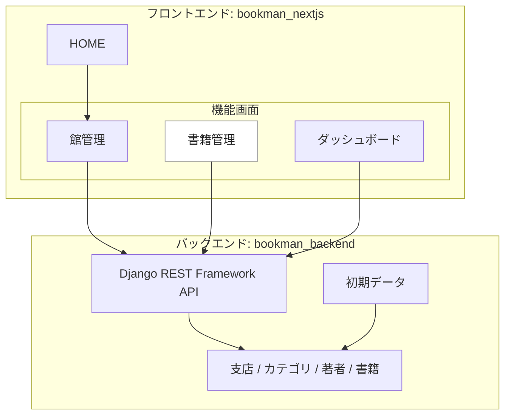

# Django-rest-frameworkとNextJSで図書管理システムを作ってみる

## はじめに
いままで作ってきたDjangoアプリケーションは、そのプロジェクトのなかにフロントエンドが含まれていた。今回はフロントエンドを Next.js（React）で作り、Django 側は Django REST Framework で API を提供する構成にする。

この記事は、最初に作った Bookman を、現在の Next.js / React / MUI の環境へ追随させた作業ログとして書き直したものだ。前半は `bookman_nextjs` のフロントエンド、後半はその API を支える `bookman_backend` のバックエンド、という順番にする。

実装リポジトリは、同じ親フォルダにある `bookman_nextjs` と `bookman_backend` という前提で進める。


:::note warn
基本に忠実にするためにすっぴんの React を使おうかとも思ったけど、ルーティングや画面単位の整理を考えると Next.js のほうが追いやすかった。仕事で触っている技術でもあり、App Router で画面を増やしていく流れが直感的だった。
:::

## 参考サイト
https://www.django-rest-framework.org/

https://nextjs.org/docs

https://react.dev/

https://mui.com/material-ui/

https://jestjs.io/

## GitHub で記事ごと管理する
今回の最新化では、[duri0214/bookman_nextjs#1](https://github.com/duri0214/bookman_nextjs/issues/1) を起点にしてフロントエンド更新を進めた。機能内容は基本的に変えず、依存関係、実行環境、画面構成、記事管理の流れを現在の状態に合わせて整理している。

記事の管理原稿も GitHub に置き、実装の作業履歴と記事更新の履歴を追えるようにする。Qiita に直接書き足していくと、時間が空いたときに「どの実装変更を受けて、どこを書き換えたのか」が分からなくなる。だから、記事もコードと同じように Issue、branch、PR の流れに乗せる。

- 記事管理原稿: https://github.com/duri0214/portfolio/blob/master/docs/qiita/bookman_drf_nextjs.md

この記事では、現在のフロントエンド構成を上段にまとめる。バックエンド側は次回以降に改修するため、今回は書き直さず、記事の最下段に旧メモとして残す。



フロントエンドは App Router 前提で整理し、バックエンド未起動時の表示確認には開発用モックデータも使えるようにした。

## Frontend part
### リポジトリ構成
`bookman_nextjs` は `bookman_backend` と同じ親フォルダに置く。

```text
dev/
  portfolio/
  bookman_backend/
  bookman_nextjs/
```

`bookman_nextjs` からは、同じ親フォルダにある `portfolio/.codex` を Codex 運用ルールとスキルの管理元として参照する。フロントエンド固有の Next.js ルールは `bookman_nextjs` 側に置き、共通運用は `portfolio` に寄せる。

- 実装: https://github.com/duri0214/bookman_nextjs

### create app
GitHub に `bookman_nextjs` リポジトリを作って clone し、Next.js アプリを作る。

```console:console
npx create-next-app@latest .
```

選択は、TypeScript / ESLint / `src/` directory / App Router を使う。Tailwind CSS は使わない。import alias は `@/*` のままにする。

```text
Would you like to use TypeScript? Yes
Would you like to use ESLint? Yes
Would you like to use Tailwind CSS? No
Would you like to use `src/` directory? Yes
Would you like to use App Router? Yes
Would you like to customize the default import alias (@/*)? No
```

### Node.js と npm
Next.js 16 を使うため、Node.js は `20.9.0` 以上が必要になる。この記事ではコマンドを npm に統一する。

```console:console
node --version
npm --version
```

Windows で Node.js を1種類だけ使うなら LTS 版を入れる。通常はこちらで十分だ。

```console:console
winget install OpenJS.NodeJS.LTS
```

プロジェクトごとに Node.js を切り替えたい場合だけ `nvm-windows` を使う。

```console:console
winget install CoreyButler.NVMforWindows
nvm install 24.18.0
nvm use 24.18.0
node --version
npm --version
```

:::note
`nvm-windows` は Python でいう `pyenv` に近い。npm は Python でいう `pip` に近い。Node.js 本体のバージョンを切り替えるのが `nvm-windows`、パッケージを入れるのが npm、という整理で考える。
:::

### package.json
`package.json` は全文をそのまま上書きするのではなく、`create-next-app` が生成した内容をベースに差分を確認しながら更新する。Node.js のバージョン指定、format/test 系の scripts、Jest・Prettier・MUI・axios などの依存関係を追加し、Next.js 16 に合わせて関連パッケージのバージョンを更新した。

下は最終形の要点だけを抜粋している。実際に反映するときは、既存の `package.json` と見比べて、必要なキーを追加・更新する。ここに出していない MUI 関連、Testing Library、型定義などの devDependencies もあるので、実際の全体は `bookman_nextjs` の `package.json` を見る。

https://github.com/duri0214/bookman_nextjs/blob/main/package.json

```json:package.json
{
  "name": "bookman_nextjs",
  "version": "0.1.0",
  "private": true,
  "engines": {
    "node": ">=20.9.0",
    "npm": ">=10"
  },
  "scripts": {
    "dev": "next dev",
    "build": "next build",
    "start": "next start",
    "lint": "eslint .",
    "format": "prettier --write .",
    "test": "jest",
    "test:watch": "jest --watch"
  },
  "dependencies": {
    "axios": "1.18.1",
    "next": "16.2.10",
    "react": "19.2.7",
    "react-dom": "19.2.7"
  },
  "devDependencies": {
    "@mui/material": "9.2.0",
    "@mui/x-data-grid": "9.9.0",
    "eslint": "9.39.5",
    "eslint-config-next": "16.2.10",
    "jest": "30.4.2",
    "prettier": "3.9.5",
    "typescript": "5.9.3"
  },
  "overrides": {
    "nanoid": "3.3.11",
    "postcss": "8.5.10"
  }
}
```

Next.js 16 では `next lint` がなくなっているので、lint は ESLint CLI を直接呼ぶ。設定ファイルの `eslint.config.mjs` は、`bookman_nextjs` のプロジェクトルート、つまり `package.json` と同じ階層に置く。

```js:eslint.config.mjs
import { defineConfig, globalIgnores } from 'eslint/config'
import nextVitals from 'eslint-config-next/core-web-vitals'
import nextTs from 'eslint-config-next/typescript'

const eslintConfig = defineConfig([
  nextVitals,
  nextTs,
  globalIgnores(['.next/**', 'out/**', 'build/**', 'next-env.d.ts']),
])

export default eslintConfig
```

### Jest
Next.js の設定を読み込むために `next/jest` を使う。設定ファイルの `jest.config.ts` は、`bookman_nextjs` のプロジェクトルート、つまり `package.json` と同じ階層に置く。App Router の route group へ移したあとも `@/app/book/...` のような import を維持するため、Jest 側にも alias を足した。

```ts:jest.config.ts
import type { Config } from 'jest'
import nextJest from 'next/jest.js'

const createJestConfig = nextJest({
  dir: './',
})

const config: Config = {
  coverageProvider: 'v8',
  moduleNameMapper: {
    '^@/app/book/(.*)$': '<rootDir>/src/app/(bookman)/book/$1',
    '^@/app/branch/(.*)$': '<rootDir>/src/app/(bookman)/branch/$1',
    '^@/app/dashboard/(.*)$': '<rootDir>/src/app/(bookman)/dashboard/$1',
    '^@/(.*)$': '<rootDir>/src/$1',
  },
  testEnvironment: 'jsdom',
}

export default createJestConfig(config)
```

テストには「入力 / 処理 / 期待値」のシナリオを残す。期間が空いたとき、何を守るテストなのかを読み返しやすくするためだ。

### HOMEページ
`create-next-app` の初期画面は、Bookman の画面としては意味が薄い。HOME は図書館システムの入口として作り直した。

- 図書カード風の `LibraryCard` コンポーネントを作る
- 図書カードの表面は8行、将来の裏面は11行として定数化する
- 「図書館を管理」は `/branch` へリンクする
- 「本をかりる」は未実装なので disabled にする
- Next.js の開発用インジケーターは開発時だけのものとして扱う

```tsx:src/app/page.tsx
import Link from 'next/link'
import LibraryCard from '@/components/LibraryCard'
import styles from './page.module.css'

export default function Home() {
  return (
    <main className={styles.main}>
      <section className={styles.hero} aria-labelledby='home-title'>
        <div className={styles.cardStage} aria-hidden='true'>
          <LibraryCard animated />
        </div>

        <div className={styles.content}>
          <p className={styles.kicker}>Bookman</p>
          <h1 id='home-title'>図書館業務を、すっきり管理。</h1>
          <p className={styles.lead}>
            蔵書、館、貸出の導線をひとつにまとめた図書館管理システムです。
          </p>

          <div className={styles.actions} aria-label='主要機能'>
            <Link className={styles.primaryAction} href='/branch'>
              図書館を管理
            </Link>
            <button className={styles.secondaryAction} type='button' disabled>
              本をかりる
              <span>未実装</span>
            </button>
          </div>
        </div>
      </section>
    </main>
  )
}
```

ソースコード:
https://github.com/duri0214/bookman_nextjs/blob/main/src/app/page.tsx

### MUI と Bootstrap の使い分け
普段メインで触っている `portfolio` は Django 標準の画面が中心なので、Bootstrap を使うことが多い。フォーム、一覧、ボタン、グリッドを素早く整えるなら Bootstrap で十分に進められる。

ただ、Next.js と Django REST Framework の組み合わせは、`portfolio` の Django テンプレートへ組み込めるものではない。だから Bookman はリポジトリを分けて、フロントエンドを `bookman_nextjs`、バックエンドを `bookman_backend` として作っている。

Bookman 側では、ダッシュボード、DataGrid、Dialog、Alert、Drawer のような操作画面を React コンポーネントとして組み立てるために MUI を使った。仕事で触っていた経験があり、テンプレートから状態付き UI へ進めやすかったのも理由だ。ただし、単純な Django 画面なら Bootstrap へ寄せる判断も普通にありだと思う。

当時レイアウトの参考にしたビジュアル:
https://mui.com/material-ui/getting-started/templates/dashboard/

:::note
上のリンクは見た目の参考として残している。現在の `bookman_nextjs` では MUI `9.2.0` 系に更新しているので、依存関係は現在の `package.json` に合わせる。
:::

### App Router のレイアウト
`/dashboard`、`/branch`、`/book` は URL を変えずに、route group の `src/app/(bookman)` 配下へ移した。App Router では、フォルダ名を `()` で囲むと URL には出ないグルーピング用フォルダとして扱える。つまりファイル上は `src/app/(bookman)/branch/page.tsx` に置いていても、プログラムのルーティング上は `/branch` として扱われる。これで各画面の `layout.tsx` 重複をやめて、共通レイアウトを1か所で持てる。

```text
src/app/
  page.tsx
  (bookman)/
    layout.tsx
    dashboard/page.tsx
    branch/page.tsx
    book/page.tsx
```

```tsx:src/app/(bookman)/layout.tsx
import { ReactNode } from 'react'
import { CommonLayout } from '@/components/nav/CommonLayout'

const routeTitles = {
  '/dashboard': 'Dashboard',
  '/branch': '館管理',
  '/book': '書籍管理',
} as const

export default function BookmanLayout({ children }: Readonly<{ children: ReactNode }>) {
  return <CommonLayout routeTitles={routeTitles}>{children}</CommonLayout>
}
```

ナビゲーションは `a href` ではなく Next.js の `Link` を使う。アプリ内の画面遷移なら、ページ全体を読み直す通常リンクではなく、Next.js のクライアントサイド遷移やプリフェッチに乗せたほうが App Router の作法に合う。

```tsx:src/components/nav/listItems.tsx
import Link from 'next/link'

<ListItemButton component={Link} href='/branch'>
  <ListItemText primary='館管理' />
</ListItemButton>

<ListItemButton component={Link} href='/book'>
  <ListItemText primary='書籍管理' />
</ListItemButton>
```

ソースコード:
https://github.com/duri0214/bookman_nextjs/tree/main/src/app/%28bookman%29

### API クライアントと環境変数
バックエンド API の base URL は `BOOKMAN_API_BASE_URL` で切り替える。未指定ならローカルの Django API を使う。

```env:.env.example
BOOKMAN_API_BASE_URL=http://127.0.0.1:8000/bookman/api
USE_MOCK_DATA=false
```

```ts:src/helpers/apiClient.ts
const DEFAULT_BOOKMAN_API_BASE_URL = 'http://127.0.0.1:8000/bookman/api'

export const BOOKMAN_API_ENDPOINTS = {
  branches: 'branches/',
  books: 'books/',
  booksCreate: 'books/create/',
  authors: 'authors/',
  categories: 'categories/',
} as const

export type BookmanApiEndpoint = keyof typeof BOOKMAN_API_ENDPOINTS

const trimTrailingSlash = (value: string): string => value.replace(/\/+$/, '')
const trimLeadingSlash = (value: string): string => value.replace(/^\/+/, '')

export const getBookmanApiBaseUrl = (): string =>
  trimTrailingSlash(process.env.BOOKMAN_API_BASE_URL || DEFAULT_BOOKMAN_API_BASE_URL)

export const getBookmanApiUrl = (endpoint: BookmanApiEndpoint): string =>
  `${getBookmanApiBaseUrl()}/${trimLeadingSlash(BOOKMAN_API_ENDPOINTS[endpoint])}`
```

ここで `NEXT_PUBLIC_` は付けない。`BOOKMAN_API_BASE_URL` は Server Component や Route Handler 側だけで読む値なので、ブラウザへ公開する必要がない。

### 一覧取得は Server Component 側に寄せる
`/branch` と `/book` の初期データ取得は Server Component 側へ寄せた。クライアント側の `useEffect` で初回ロードするより、ページ単位でデータ、エラー、モック利用状態をまとめて渡せるからだ。

`/branch` は支店一覧を取得して表示用の形へ変換する。

```ts:src/app/(bookman)/branch/_components/listData.ts
import { Branch, IBranchRaw } from '@/resource/branch'
import { getBookmanApiUrl } from '@/helpers/apiClient'

const USE_MOCK_DATA = process.env.USE_MOCK_DATA === 'true'

interface BranchListData {
  branches: Branch[]
  errorMessage: string | null
  isMockData: boolean
}

const loadBranchList = async (apiUrl: string): Promise<IBranchRaw[]> => {
  const response = await fetch(apiUrl, { method: 'GET', cache: 'no-store' })
  if (!response.ok) {
    throw new Error(`Failed to fetch data: ${response.statusText}`)
  }
  return response.json()
}

export const getBranchListData = async (): Promise<BranchListData> => {
  try {
    const responseData = await loadBranchList(getBookmanApiUrl('branches'))
    return {
      branches: convertBranchData(responseData),
      errorMessage: null,
      isMockData: false,
    }
  } catch (e) {
    if (USE_MOCK_DATA) {
      return {
        branches: convertBranchData(MOCK_BRANCHES),
        errorMessage: null,
        isMockData: true,
      }
    }

    return {
      branches: [],
      errorMessage:
        '支店データの取得に失敗しました。バックエンドを起動してから再読み込みしてください。',
      isMockData: false,
    }
  }
}
```

`/book` は `books`、`categories`、`authors` を並列で取得し、ID の配列を表示名へ変換する。

```ts:src/app/(bookman)/book/_components/listData.ts
const convertBookData = (
  books: IBookRaw[],
  categories: ICategory[],
  authors: IAuthor[],
): Book[] => {
  const categoriesById = new Map(categories.map((category) => [category.id, category]))
  const authorsById = new Map(authors.map((author) => [author.id, author]))

  return books.map((result: IBookRaw) => ({
    id: result.id,
    category: categoriesById.get(result.category) ?? null,
    name: result.name,
    authors: result.authors
      .map((authorId) => authorsById.get(authorId)?.name ?? `#${authorId}`)
      .join(', '),
    leadText: result.lead_text,
    publicationDate: result.publication_date,
  }))
}

export const getBookListData = async (): Promise<BookListData> => {
  try {
    const [books, categories, authors] = await Promise.all([
      loadBookmanData<IBookRaw[]>(getBookmanApiUrl('books')),
      loadBookmanData<ICategory[]>(getBookmanApiUrl('categories')),
      loadBookmanData<IAuthor[]>(getBookmanApiUrl('authors')),
    ])

    return {
      books: convertBookData(books, categories, authors),
      errorMessage: null,
      isMockData: false,
    }
  } catch (e) {
    // error または mock の表示へ落とす
  }
}
```

ソースコード:
https://github.com/duri0214/bookman_nextjs/blob/main/src/app/%28bookman%29/branch/_components/listData.ts

https://github.com/duri0214/bookman_nextjs/blob/main/src/app/%28bookman%29/book/_components/listData.ts

### モックデータとエラー表示
バックエンドが起動していない状態で `/branch` や `/book` を見ると、通常は画面上にデータ取得エラーを表示する。

フロントエンド単体で一覧画面を確認したい場合は、開発用のモックデータへ切り替える。

```console:console
copy .env.example .env.local
```

```env:.env.local
BOOKMAN_API_BASE_URL=http://127.0.0.1:8000/bookman/api
USE_MOCK_DATA=true
```

この状態では `/branch` と `/book` の一覧表示はモックデータで確認できる。ただし登録処理は Next.js の `/api/bookman/branches` と `/api/bookman/books` 経由でバックエンド API に POST するため、バックエンド未起動時は登録失敗になる。

画面側では、取得失敗は warning Alert、モック表示は info Alert として分ける。

### 支店管理
支店管理は、一覧表示と登録ダイアログを持つ。登録処理は最初 `console.log` 止まりだったが、現在は Next.js の Route Handler 経由で Django API に POST する。

```ts:src/resource/branch.ts
export interface IBranchRaw {
  id: number
  name: string
  address: string
  phone: string
  remark: string
}

export interface Branch {
  id: number
  name: string
  address: string
  phone: string
  remark: string
}

export interface IBranchRequest {
  name: string
  address: string
  phone: string
  remark: string
}
```

```ts:src/app/(bookman)/branch/_components/useCreateDialog.ts
const CREATE_BRANCH_API_PATH = '/api/bookman/branches'

const onCreate = async () => {
  setIsCreating(true)
  setCreateErrorMessage(null)

  try {
    const response = await fetch(CREATE_BRANCH_API_PATH, {
      method: 'POST',
      headers: {
        'Content-Type': 'application/json',
      },
      body: JSON.stringify(formValues),
    })

    if (!response.ok) {
      throw new Error('Failed to create branch')
    }

    onCloseDialog()
    router.refresh()
  } catch {
    setCreateErrorMessage(
      '支店データの登録に失敗しました。入力内容とバックエンドの状態を確認してください。',
    )
  } finally {
    setIsCreating(false)
  }
}
```

登録中は入力とボタンを無効化し、失敗時はダイアログ上にエラーを出す。成功したら `router.refresh()` で Server Component 側の一覧を再取得する。

ソースコード:
https://github.com/duri0214/bookman_nextjs/tree/main/src/app/%28bookman%29/branch

### 書籍管理
書籍管理も、一覧表示と登録ダイアログを持つ。バックエンドの `BookSerializer` は `category` と `authors` をIDで受けるので、フロントエンドも登録時には文字列入力を数値へ変換して payload を作る。

```ts:src/resource/book.ts
export interface IBookRaw {
  id: number
  name: string
  thumbnail: string | null
  category: number
  authors: number[]
  lead_text: string
  amount: number
  isbn: string
  publication_date: string
}

export interface IBookRequest {
  category: number
  name: string
  authors: number[]
  lead_text: string
  amount: number
  isbn: string
  publication_date: string
}
```

```ts:src/app/(bookman)/book/_components/useCreateDialog.ts
const CREATE_BOOK_API_PATH = '/api/bookman/books'

const toNumber = (value: string | undefined): number => Number(value ?? 0)

const toAuthorIds = (value: string | undefined): number[] =>
  (value ?? '')
    .split(',')
    .map((authorId) => Number(authorId.trim()))
    .filter((authorId) => Number.isInteger(authorId) && authorId > 0)

const buildBookRequest = (formValues: Partial<IBookFormValues>): IBookRequest => ({
  category: toNumber(formValues.category),
  name: formValues.name ?? '',
  authors: toAuthorIds(formValues.authors),
  lead_text: formValues.lead_text ?? '',
  amount: toNumber(formValues.amount),
  isbn: formValues.isbn ?? '',
  publication_date: formValues.publication_date ?? '',
})
```

ソースコード:
https://github.com/duri0214/bookman_nextjs/tree/main/src/app/%28bookman%29/book

### Route Handler で登録を中継する
登録処理はブラウザから直接 Django API に POST せず、Next.js の Route Handler を挟む。

```ts:src/app/api/bookman/books/route.ts
export async function POST(request: Request) {
  try {
    const requestBody = (await request.json()) as Partial<IBookRequest>
    const response = await fetch(getBookmanApiUrl('booksCreate'), {
      method: 'POST',
      headers: {
        'Content-Type': 'application/json',
      },
      body: JSON.stringify(requestBody),
      cache: 'no-store',
    })

    const responseText = await response.text()
    const responseBody = parseResponseBody(responseText)

    return Response.json(responseBody, { status: response.status })
  } catch {
    return Response.json({ message: '書籍データの登録に失敗しました。' }, { status: 500 })
  }
}
```

支店登録も同じ考え方で `/api/bookman/branches` からバックエンドの `branches/` へ POST する。

ソースコード:
https://github.com/duri0214/bookman_nextjs/tree/main/src/app/api/bookman

### 起動手順
Bookman はフロントエンドとバックエンドを別ターミナルで起動して動かす。

```console:console（ターミナル1: Django側サーバー起動）
cd ../bookman_backend
.\venv311\Scripts\Activate.ps1
python manage.py runserver 127.0.0.1:8000
```

```console:console（ターミナル2: Next.js側サーバー起動）
cd ../bookman_nextjs
npm run dev
```

`npm run dev` は開発用サーバーなので、開発中だけ表示される UI や挙動がある。本番相当で確認したい場合は、ビルドしてから起動する。

```console:console
npm run build
npm run start
```

コードを変更した後は、もう一度 `npm run build` してから `npm run start` する。

### 検証コマンド
フロントエンド側は、変更後に以下を確認する。

```console:console
npm test
npm run lint
npm run build
```

依存関係の脆弱性も見る場合は `npm audit` を実行する。

```console:console
npm audit
```

バックエンド側のテストは `bookman_backend` で実行する。

```console:console
cd ../bookman_backend
.\venv311\Scripts\Activate.ps1
python manage.py test
```

### AI に任せるときの注意
今回のように記事と実装の両方がある場合、AI には「README と矛盾しないように」だけでは足りない。

- 今回の最新化の起点になったIssueと関連PRの履歴を確認すること
- 上段をフロントエンド、下段をバックエンドに分けること
- ソースコードを全文掲載せず、必要なところだけ抜粋すること
- バックエンドは次回改修対象なので、今回は書き換えず最下段に残すこと
- バックエンド未起動時の一覧表示と登録処理の違いを説明すること
- MUI と Bootstrap の使い分けも説明すること

このあたりを明示すると、記事更新のズレを減らしやすい。

## Backend part（次回以降の改修対象）
以下は、最初に Bookman の Django REST Framework API を作ったときのメモ。バックエンドは次回以降に改修するため、今回は内容を大きく書き換えずに最下段へ移す。

## Django part
### create root directory
```console:console
mkdir bookman_backend
cd bookman_backend
```

### venv
```console:console
python -m venv venv311
```

### create project
- 公式の `Requirements` をもとにインストール
```console:console
pip install django
pip install djangorestframework
pip install django-filter
pip install markdown
pip install pillow

django-admin startproject config .
```

### create app
:::note warn
ケバブケースで startapp はできない　←めっちゃハマった
e.g. bookman-api
:::
```console:console
python manage.py startapp bookman
```
```diff_python:bookman_backend/config/settings.py
INSTALLED_APPS = [
    'django.contrib.admin',
    'django.contrib.auth',
    'django.contrib.contenttypes',
    'django.contrib.sessions',
    'django.contrib.messages',
    'django.contrib.staticfiles',
+   'rest_framework',
+   'bookman',
]
+REST_FRAMEWORK = {
+   'DEFAULT_PERMISSION_CLASSES': [
+       'rest_framework.permissions.AllowAny',
+   ]
+}
    :
-LANGUAGE_CODE = 'en-us'
+LANGUAGE_CODE = 'ja'
-TIME_ZONE = 'UTC'
+TIME_ZONE = 'Asia/Tokyo'
    :
```
:::note
`DEFAULT_PERMISSION_CLASSES` は「誰にアクセスを許可するか」を指定する。
- 今回は `get` しかない、かつ、取り回しの良さで `AllowAny` だが、これだと誰でも追加したり削除したりできるので `post` リクエストなどがある場合は `IsAuthenticatedOrReadOnly` に変えるとよい。すると、`get, head, options` リクエストは誰にでも許可されるが、それ以外の `post, delete` などのリクエストは認証済みのユーザにしか許可されなくなる。

- https://www.django-rest-framework.org/api-guide/permissions/
:::

### 確認
```console:console
python manage.py runserver
```


### 非公開情報を.envに移す（GitGuardian対策）
<details><summary>old</summary>


```diff_python:bookman_backend/config/settings.py
from pathlib import Path
+ import environ

# Build paths inside the project like this: BASE_DIR / 'subdir'.
BASE_DIR = Path(__file__).resolve(strict=True).parent.parent

+ # read at .env
+ env = environ.Env(DEBUG=(bool, False))
+ environ.Env.read_env(Path(BASE_DIR, '.env'))
+ DEBUG = env('DEBUG')  # read DEBUG at .env
+ SECRET_KEY = env('SECRET_KEY')  # read SECRET_KEY at .env

# Quick-start development settings - unsuitable for production
# See https://docs.djangoproject.com/en/3.1/howto/deployment/checklist/

- # SECURITY WARNING: keep the secret key used in production secret!
- SECRET_KEY = 'djaXXXXX'

- # SECURITY WARNING: don't run with debug turned on in production!
- DEBUG = True
    :
```
</details>

`.env` ファイルに `api_key` を移すためには、環境変数を読み込む設定が必要です。一般的には、Pythonの `dotenv` パッケージを使うことで `.env` ファイルから簡単に環境変数を読み込むことができます。

以下に、`.env` ファイルの設定と、コードの変更手順を示します。

#### 1. `.env` ファイルの作成
プロジェクトのルートに `.env` ファイルを作成し、次のように環境変数を設定します。

```env:bookman_backend/.env
SECRET_KEY=djaXXXXX
DEBUG=True
DB_ENGINE=django.db.backends.mysql
DB_NAME=bookman_db
DB_USER=python
DB_PASSWORD=python123
```

#### 2. dotenv パッケージのインストール
dotenv パッケージが必要です。以下のコマンドでインストールします。

```console:console
pip install python-dotenv
```

#### 3. コードの変更
コード内で dotenv をインポートして、.env ファイルから環境変数を読み込むようにします。

:::note warn
load_dotenv()がデフォルトで検索するパスは現在の作業ディレクトリなの？

ChatGPT:
はい、load_dotenv() はデフォルトで現在の作業ディレクトリ（カレントディレクトリ）にある .env ファイルを検索します。

もし現在の作業ディレクトリ以外の場所にある .env ファイルを読み込みたい場合は、load_dotenv() にファイルのパスを指定できます。

Djangoの場合は `load_dotenv(BASE_DIR / ".env")` になる

- [hotfix: load_dotenv()がデフォルトで検索するパスは現在の作業ディレクトリだった！？](https://github.com/duri0214/portfolio/pull/187/files)
:::


```py:estate.py の変更
import os
from dotenv import load_dotenv

# .env ファイルを読み込む
load_dotenv(BASE_DIR / ".env")

@dataclass
class EstateService:
    url: str
    api_key: str = os.getenv("API_KEY")  # 環境変数からAPIキーを読み込み

    def post_estate_info(self, latitude: float, longitude: float):
            :
        return response.json()

# 使用例
if __name__ == "__main__":
    service = EstateService(
        url="https://ty66xxxxate-info"
    )

```
:::note
load_dotenv()がないとos.getenvって使えないの？

os.getenv() は load_dotenv() がなくとも動作しますが、Pythonはデフォルトでは.envファイルを対象にしません。代わりに環境変数を使用します。ですので、.envファイルから環境変数を読み込むためには、load_dotenv()を呼び出す必要があります。
つまり、os.getenv()はシステム環境変数から値を取得します。一方、load_dotenv()は.envファイルの中の環境変数をロードしてシステム環境変数に追加します。したがって、os.getenv()を使用して.envファイルから環境変数を読み込む際には、先にload_dotenv()を呼び出す必要があります。
:::
:::note alert
ここでいったん pycharm を再起動したり、コンソールの再起動をしないと引きずってえんえんとハマることになる
:::

## MySQL
```console:console
pip install mysqlclient
```
```diff_python:bookman_backend/config/settings.py
DATABASES = {
    'default': {
-       'ENGINE': 'django.db.backends.sqlite3',
-       'NAME': BASE_DIR / 'db.sqlite3',
+       'ENGINE': env('DB_ENGINE'),
+       'NAME': env('DB_NAME'),
+       'USER': env('DB_USER'),
+       'PASSWORD': env('DB_PASSWORD'),
    }
}
    :
```

### mysqlにrootで入る
```console:console
mysql -u root -p
```
### create database
```console:console
mysql> CREATE DATABASE bookman_db DEFAULT CHARACTER SET utf8mb4;
       Query OK, 1 row affected (0.01 sec)
```
### create user
```console:console
mysql> CREATE USER 'python'@'localhost' IDENTIFIED BY 'python123';
```
### create grant
```console:console
mysql> grant CREATE, DROP, SELECT, UPDATE, INSERT, DELETE, ALTER, REFERENCES, INDEX on bookman_db.* to python@localhost;
```

### mysqlを出る
```console:console
mysql> exit
```
```console:console（作ったユーザで入れるか確認）
mysql -u python -p
```
```console:console
mysql> exit
```

```python:bookman_backend/bookman/views.py
from django.http import HttpResponse


def index(request):
    return HttpResponse("Hello, world.")
```
```python:bookman_backend/bookman/urls.py（新規）
from django.urls import path
from . import views

urlpatterns = [
    path('', views.index, name='index'),
]
```
```diff_python:bookman_backend/config/urls.py
"""config URL Configuration

The `urlpatterns` list routes URLs to views. For more information please see:
    https://docs.djangoproject.com/en/4.1/topics/http/urls/
Examples:
Function views
    1. Add an import:  from my_app import views
    2. Add a URL to urlpatterns:  path('', views.home, name='home')
Class-based views
    1. Add an import:  from other_app.views import Home
    2. Add a URL to urlpatterns:  path('', Home.as_view(), name='home')
Including another URLconf
    1. Import the include() function: from django.urls import include, path
    2. Add a URL to urlpatterns:  path('blog/', include('blog.urls'))
"""
from django.contrib import admin
-from django.urls import path
+from django.urls import path, include

urlpatterns = [
    path('admin/', admin.site.urls),
+   path('bookman/', include('bookman.urls')),
]
```
```console:console
python manage.py runserver
```

※http://127.0.0.1:8000/ は `404` になっていることを確認する
※サーバーは `ctrl + c` で落としておく

## .gitignore
- gitignoreは、gitignore.ioのdjango用のものと migrationsフォルダを指定する

https://www.toptal.com/developers/gitignore/api/django

```bookman_backend/.gitignore
/bookman/migrations/
    :
（最下行に追加: gitignore.ioのdjango用のもの）
```

## DBeaver
### インストール方法
[（初心者向け）DBeaverのインストール方法](https://masafumi-blog.com/dbeaver-install)

## 図書館業務をイメージしまくれ！


### 要件メモ
- 図書館の業務だって考え始めると試験に出るぐらいに難しいんだよ
https://www.fe-siken.com/kakomon/01_aki/pm03.html

- ひとりのユーザが同じ本を2冊以上借りることはできない
https://detail.chiebukuro.yahoo.co.jp/qa/question_detail/q1377006708

- 図書館の支店マスタで取り扱う情報はとりあえず4つ（休館日とかは機能が大きいから気が向いたら）
https://www.lib.city.shibuya.tokyo.jp/?page_id=166
    - 名称:	笹塚図書館
    - 所在地:	〒151-0073 渋谷区笹塚1-47-1 メルクマール京王笹塚4階
    - 電話:	03-3460-6784
    - 備考:	鉄筋コンクリート造 地上21階地下2階の4階部分 440㎡ 57席


### 業務フロー
- 書籍管理
    - （全支店）の（書籍名称）を合計すると（本の所蔵数）冊ある
    - （支店名）に（書籍名称）が（本の所蔵数）冊ある
    - （支店名）から（支店名）に本を移動する
- 利用者への貸出業務
    - （支店名）の（書籍名称）を利用者に貸し出す
    - （支店名）が（書籍名称）の返却を受け付ける

### 機能メモ
- 設定
    - 仕様
        - 検索条件を保存、読み込みできる
        - 権限によって表示されるレコードが変化
        - JSONで読み書き
    - ボタン
        - 保存
        - 読み込み

## Django part
### django-cors-headers
```console:console
pip install django-cors-headers
```
```diff_python:bookman_backend/config/settings.py
INSTALLED_APPS = [
      :
+   'corsheaders',
]
  :
MIDDLEWARE = [
+   'corsheaders.middleware.CorsMiddleware',
+   'django.middleware.common.CommonMiddleware',
    'django.middleware.security.SecurityMiddleware',
    'django.contrib.sessions.middleware.SessionMiddleware',
    'django.middleware.common.CommonMiddleware',
    'django.middleware.csrf.CsrfViewMiddleware',
    'django.contrib.auth.middleware.AuthenticationMiddleware',
    'django.contrib.messages.middleware.MessageMiddleware',
    'django.middleware.clickjacking.XFrameOptionsMiddleware',
]
+CORS_ORIGIN_WHITELIST = (
+   'http://localhost:3000',
+)
```

### model.py
```python:bookman_backend/bookman/models.py
from django.contrib.auth.models import User
from django.db import models


class Branch(models.Model):
    """
    図書館支店マスタ
    """
    name = models.CharField(max_length=255, unique=True)
    address = models.CharField(max_length=255)
    phone = models.CharField(max_length=20)
    remark = models.CharField(max_length=255)
    created_at = models.DateField(auto_now_add=True)
    updated_at = models.DateField(auto_now=True, null=True)

    class Meta:
        db_table = 'bookman_m_branch'

    def __str__(self):
        return self.name


class Category(models.Model):
    name = models.CharField('カテゴリ名', max_length=100, unique=True)
    color = models.CharField('色(16進数)', max_length=7, default='#000000')

    class Meta:
        db_table = 'bookman_m_category'

    def __str__(self):
        return self.name


class Author(models.Model):
    name = models.CharField('著者名', max_length=255, unique=True)

    def __str__(self):
        return self.name


class Book(models.Model):
    """
    書籍マスタ
    システムを使用するひとつの自治体が束ねる、n個の支店図書館すべてが所蔵する本
    """
    name = models.CharField('タイトル', max_length=255, unique=True)
    thumbnail = models.ImageField('サムネイル', blank=True, null=True)
    category = models.ForeignKey(Category, on_delete=models.PROTECT, verbose_name='カテゴリ')
    authors = models.ManyToManyField(Author, verbose_name='著者')
    lead_text = models.TextField('紹介文')
    amount = models.PositiveSmallIntegerField('数量')
    isbn = models.CharField('ISBNコード', max_length=20)
    publication_date = models.DateField('出版年月日')
    created_at = models.DateField('登録日', auto_now_add=True)
    updated_at = models.DateField('更新日', auto_now=True, null=True)

    def __str__(self):
        return self.name


class Assignment(models.Model):
    """
    システムを使用するひとつの自治体が束ねる、n個の支店図書館がそれぞれどの本をいくつ所蔵するか
    ある支店図書館にある本の数量合計が、Bookテーブルの amount と一致する
    """
    branch = models.ForeignKey('Branch', on_delete=models.CASCADE)
    book = models.ForeignKey('Book', on_delete=models.CASCADE)
    amount = models.PositiveSmallIntegerField()
    created_at = models.DateField(auto_now_add=True)
    updated_at = models.DateField(auto_now=True, null=True)

    def __str__(self):
        return f"{self.book.name}({self.amount}) {self.branch.name}"


class Lending(models.Model):
    """
    貸出日と created_at は同じになる
    返却が終わると active が 0 になる
    """
    return_date = models.DateField()
    book = models.ForeignKey('Book', on_delete=models.CASCADE)
    active = models.BooleanField(default=1)
    customer_user = models.ForeignKey(User, related_name='customer', on_delete=models.CASCADE)
    contact_user = models.ForeignKey(User, related_name='contact', on_delete=models.CASCADE)
    created_at = models.DateField(auto_now_add=True)
    updated_at = models.DateField(auto_now=True, null=True)
```

```console:console
python manage.py makemigrations bookman
python manage.py migrate
```

### superuserの作成
```console:console
python manage.py createsuperuser
  ユーザー名 (leave blank to use 'yoshi'):
  メールアドレス: yoshiXXXX@gmail.com
  Password:
  Password (again):
  このパスワードは ユーザー名 と似すぎています。
  Bypass password validation and create user anyway? [y/N]: y
  Superuser created successfully.
```

### データの投下
#### 図書館支店マスタ
https://www.lib.city.shibuya.tokyo.jp/?page_id=132
```json:bookman_backend/bookman/fixtures/m_branch-data.json
[
  {
    "model": "bookman.branch",
    "fields": {
      "name": "中央図書館",
      "address": "東京都渋谷区神宮前1-4-1",
      "phone": "03-3403-2591",
      "remark": "鉄筋コンクリート造 地下1階地上5階 4,450㎡（294席）",
      "created_at": "2022-12-03"
    }
  },
  {
    "model": "bookman.branch",
    "fields": {
      "name": "西原図書館",
      "address": "東京都渋谷区西原2-28-9",
      "phone": "03-3460-8535",
      "remark": "鉄筋コンクリート造 地下1階地上3階の2・3階部分 631㎡（61席）",
      "created_at": "2022-12-03"
    }
  },
  {
    "model": "bookman.branch",
    "fields": {
      "name": "白根図書 サービススポット",
      "address": "東京都渋谷区東4-9-1",
      "phone": "03-3486-2820",
      "remark": "鉄筋コンクリート造 地下2階地上2階 1,731㎡（0席）",
      "created_at": "2022-12-03"
    }
  },
  {
    "model": "bookman.branch",
    "fields": {
      "name": "富ヶ谷図書館",
      "address": "東京都渋谷区上原1-46-2",
      "phone": "03-3468-9020",
      "remark": "鉄筋コンクリート造 地上2階建ての1階の一部 510㎡（43席）",
      "created_at": "2022-12-03"
    }
  },
  {
    "model": "bookman.branch",
    "fields": {
      "name": "笹塚図書館",
      "address": "東京都渋谷区笹塚1-47-1　メルクマール京王笹塚4階",
      "phone": "03-3460-6784",
      "remark": "鉄筋コンクリート造 地上21階地下2階の4階部分 440㎡（57席）",
      "created_at": "2022-12-03"
    }
  },
  {
    "model": "bookman.branch",
    "fields": {
      "name": "本町図書館",
      "address": "東京都渋谷区本町1-33-5",
      "phone": "03-5371-4833",
      "remark": "鉄筋コンクリート造 地下1階地上3階 1,400㎡（97席）",
      "created_at": "2022-12-03"
    }
  },
  {
    "model": "bookman.branch",
    "fields": {
      "name": "こもれび大和田図書館",
      "address": "東京都渋谷区桜丘町23-21 文化総合ｾﾝﾀｰ大和田2階",
      "phone": "03-3464-4780",
      "remark": "鉄筋コンクリート造 地上12階地下1階の2階部分 608㎡（64席）",
      "created_at": "2022-12-03"
    }
  },
  {
    "model": "bookman.branch",
    "fields": {
      "name": "臨川みんなの図書館",
      "address": "東京都渋谷区広尾1-9-17",
      "phone": "03-5793-9500",
      "remark": "鉄筋コンクリート造 地上3階建ての1・2階部分 688㎡（29席）",
      "created_at": "2022-12-03"
    }
  },
  {
    "model": "bookman.branch",
    "fields": {
      "name": "代々木図書館",
      "address": "東京都渋谷区代々木3-51-8",
      "phone": "03-3370-7566",
      "remark": "鉄筋コンクリート造 地上4階建て区民施設の4階 320㎡（24席）",
      "created_at": "2022-12-03"
    }
  },
  {
    "model": "bookman.branch",
    "fields": {
      "name": "笹塚こども図書館",
      "address": "東京都渋谷区笹塚3-3-1",
      "phone": "03-3378-1983",
      "remark": "鉄筋コンクリート造 地上4階の2階部分 361㎡（28席）",
      "created_at": "2022-12-03"
    }
  }
]
```
#### 本カテゴリーマスタ
```json:bookman_backend/bookman/fixtures/m_category-data.json
[
  {
    "model": "bookman.category",
    "fields": {
      "name": "ひと",
      "color": "#ff7f7f"
    }
  },
  {
    "model": "bookman.category",
    "fields": {
      "name": "地名",
      "color": "#ff7fbf"
    }
  },
  {
    "model": "bookman.category",
    "fields": {
      "name": "行事",
      "color": "#ff7fff"
    }
  },
  {
    "model": "bookman.category",
    "fields": {
      "name": "食べ物",
      "color": "#bf7fff"
    }
  },
  {
    "model": "bookman.category",
    "fields": {
      "name": "その他",
      "color": "#c0c0c0"
    }
  }
]
```
#### 著者データ
```json:bookman_backend/bookman/fixtures/author-data.json
[
  {
    "model": "bookman.author",
    "fields": {
      "name": "国松俊英"
    }
  },
  {
    "model": "bookman.author",
    "fields": {
      "name": "熊谷聡"
    }
  }
]
```
#### 本データ
https://www.iwasakishoten.co.jp/search/s12761.html

[many to many field の fixture の作り方](https://qiita.com/shun198/items/29b5c253be6f802403cd#many-to-many-field%E3%81%AE%E6%99%82)

::: note
pk 必須（pk書かないと中間テーブルのほうで勝手に、存在しない番号で採番される）
:::

```json:bookman_backend/bookman/fixtures/book-data.json
[
  {
    "model": "bookman.book",
    "pk": 1,
    "fields": {
      "name": "地名のひみつパート2",
      "category": 2,
      "authors": [1, 2],
      "lead_text": "海外、国内の地名の由来をゆかいなイラストとともに、歴史的背景をまじえて解説。短いお話とコラムで構成しています。",
      "amount": "100",
      "isbn": "9784265039500",
      "publication_date": "2002-04-10",
      "created_at": "2022-12-03"
    }
  },
  {
    "model": "bookman.book",
    "pk": 2,
    "fields": {
      "name": "人名のひみつパート2",
      "category": 1,
      "authors": [1, 2],
      "lead_text": "「名字はこうしてできた」「家紋ってなに？」などのお話と１００以上の名字の由来をゆかいなイラストとともに紹介しています。",
      "amount": "100",
      "isbn": "9784265039494",
      "publication_date": "2002-03-11",
      "created_at": "2022-12-03"
    }
  },
  {
    "model": "bookman.book",
    "pk": 3,
    "fields": {
      "name": "行事の名前のひみつ",
      "category": 3,
      "authors": [1, 2],
      "lead_text": "お正月、節分、バレンタインデー、七夕やクリスマスなど、身近な年中行事の由来を、短いお話とコラムで紹介します。",
      "amount": "100",
      "isbn": "9784265039487",
      "publication_date": "2002-02-11",
      "created_at": "2022-12-03"
    }
  },
  {
    "model": "bookman.book",
    "pk": 4,
    "fields": {
      "name": "たべものの名前のひみつ",
      "category": 4,
      "authors": [1, 2],
      "lead_text": "たべものの名前の由来や歴史などを楽しく紹介。短いお話の中に、約１００の食べ物が登場。この１冊できみも食べ物の名前博士。",
      "amount": "100",
      "isbn": "9784265039470",
      "publication_date": "2001-12-10",
      "created_at": "2022-12-03"
    }
  },
  {
    "model": "bookman.book",
    "pk": 5,
    "fields": {
      "name": "のりものの名前のひみつ",
      "category": 5,
      "authors": [1, 2],
      "lead_text": "車はどのように発明されたか？「ジャンボジェット機」の意味は？など、のりものの歴史と名前の由来がよくわかる本。",
      "amount": "100",
      "isbn": "9784265039463",
      "publication_date": "2001-10-10",
      "created_at": "2022-12-03"
    }
  },
  {
    "model": "bookman.book",
    "pk": 6,
    "fields": {
      "name": "道具の名前のなぞ",
      "category": 5,
      "authors": [1, 2],
      "lead_text": "文房具や学校で使う道具，家の中での器具類など，ふだん身近に接している道具の誕生の歴史と名前のいわれをわかりやすく紹介。",
      "amount": "100",
      "isbn": "9784265039456",
      "publication_date": "2000-03-30",
      "created_at": "2022-12-03"
    }
  },
  {
    "model": "bookman.book",
    "pk": 7,
    "fields": {
      "name": "スポーツの名前のなぞ",
      "category": 5,
      "authors": [1, 2],
      "lead_text": "野球，サッカーなど，いろいろなスポーツの起源と名前のいわれをイラスト入りでやさしく解説。これできみはスポーツの名前博士！",
      "amount": "100",
      "isbn": "9784265039449",
      "publication_date": "2000-03-10",
      "created_at": "2022-12-03"
    }
  },
  {
    "model": "bookman.book",
    "pk": 8,
    "fields": {
      "name": "生きものの名前のなぞ",
      "category": 5,
      "authors": [1, 2],
      "lead_text": "身近な動物や植物の名前の由来をわかりやすく紹介。ねこやねずみ，カエルなどの名前がどこからきたのかを楽しいイラストで説明。",
      "amount": "100",
      "isbn": "9784265039432",
      "publication_date": "2000-02-10",
      "created_at": "2022-12-03"
    }
  },
  {
    "model": "bookman.book",
    "pk": 9,
    "fields": {
      "name": "地名のひみつ",
      "category": 2,
      "authors": [1, 2],
      "lead_text": "日本の代表的な地名，町村合併によってできたユニークな地名，都道府県名，山や川の名前の由来などを豊富なイラストで解説。",
      "amount": "100",
      "isbn": "9784265039425",
      "publication_date": "1999-12-30",
      "created_at": "2022-12-03"
    }
  },
  {
    "model": "bookman.book",
    "pk": 10,
    "fields": {
      "name": "人名のひみつ",
      "category": 1,
      "authors": [1, 2],
      "lead_text": "日本で一番多い名字は？人の名字約２００の由来をゆかいなイラストでわかりやすく解説。歴史上の人物や珍しい名前の由来も紹介。",
      "amount": "100",
      "isbn": "9784265039418",
      "publication_date": "1999-11-11",
      "created_at": "2022-12-03"
    }
  }
]
```

```console:console
python manage.py loaddata bookman/fixtures/book-data.json
python manage.py loaddata bookman/fixtures/m_branch-data.json
python manage.py loaddata bookman/fixtures/m_category-data.json
python manage.py loaddata bookman/fixtures/author-data.json
```

### serializers.py
```python:bookman_backend/bookman/serializers.py（新規）
from rest_framework import serializers
from bookman.models import Branch, Book, Category, Author


class CategorySerializer(serializers.ModelSerializer):
    class Meta:
        model = Category
        fields = ['id', 'name', 'color']


class AuthorSerializer(serializers.ModelSerializer):
    class Meta:
        model = Author
        fields = ['id', 'name']


class BranchSerializer(serializers.ModelSerializer):
    class Meta:
        model = Branch
        fields = ['id', 'name', 'address', 'phone', 'remark']


class BookSerializer(serializers.ModelSerializer):
    category = serializers.PrimaryKeyRelatedField(queryset=Category.objects.all())
    authors = serializers.PrimaryKeyRelatedField(queryset=Author.objects.all(), many=True)

    class Meta:
        model = Book
        fields = ['id',
                  'name',
                  'category',
                  'thumbnail',
                  'authors',
                  'lead_text',
                  'amount',
                  'isbn',
                  'publication_date'
                  ]
```
```python:bookman_backend/bookman/views.py（全消しして上書き）
from rest_framework import generics
from .models import Book, Category, Branch, Author
from .serializers import CategorySerializer, BookSerializer, BranchSerializer, AuthorSerializer


class BranchList(generics.ListAPIView):
    queryset = Branch.objects.all().order_by('id')
    serializer_class = BranchSerializer


class BranchCreate(generics.CreateAPIView):
    serializer_class = BranchSerializer


class AuthorList(generics.ListAPIView):
    queryset = Author.objects.all()
    serializer_class = AuthorSerializer


class CategoryList(generics.ListAPIView):
    queryset = Category.objects.all()
    serializer_class = CategorySerializer


class BookList(generics.ListAPIView):
    queryset = Book.objects.all().order_by('category')
    serializer_class = BookSerializer


class BookCreate(generics.CreateAPIView):
    serializer_class = BookSerializer


class BookDetail(generics.RetrieveAPIView):
    queryset = Book.objects.all()
    serializer_class = BookSerializer
```
```python:bookman_backend/bookman/urls.py（全消しして上書き）
from django.urls import path, include
from . import views

urlpatterns = [
   path('api-auth/', include('rest_framework.urls')),
   path('api/branches/', views.BranchList.as_view(), name='branch_list'),
   path('api/branches/create/', views.BranchCreate.as_view(), name='branch_create'),
   path('api/books/', views.BookList.as_view(), name='book_list'),
   path('api/books/create/', views.BookCreate.as_view(), name='book_create'),
   path('api/books/<int:pk>/', views.BookDetail.as_view(), name='book_detail'),
   path('api/authors/', views.AuthorList.as_view(), name='author_list'),
   path('api/categories/', views.CategoryList.as_view(), name='category_list'),
]
```

#### 入れ子のシリアライザについて
https://www.django-rest-framework.org/api-guide/relations/#nested-relationships

こういうのを出したいときがあるだろう。レコードの内側に入れ子にモデルがくっついてくるやつ

```python:TrackSerializerが子だ。AlbumSerializerがtracksで受けている
class TrackSerializer(serializers.ModelSerializer):
    class Meta:
        model = Track
        fields = ['order', 'title', 'duration']

class AlbumSerializer(serializers.ModelSerializer):
    tracks = TrackSerializer(many=True, read_only=True)

    class Meta:
        model = Album
        fields = ['album_name', 'artist', 'tracks']
```
```python:tracksでループ回せるようになったね！
>>> album = Album.objects.create(album_name="The Grey Album", artist='Danger Mouse')
>>> Track.objects.create(album=album, order=1, title='Public Service Announcement', duration=245)
<Track: Track object>
>>> Track.objects.create(album=album, order=2, title='What More Can I Say', duration=264)
<Track: Track object>
>>> Track.objects.create(album=album, order=3, title='Encore', duration=159)
<Track: Track object>
>>> serializer = AlbumSerializer(instance=album)
>>> serializer.data
{
    'album_name': 'The Grey Album',
    'artist': 'Danger Mouse',
    'tracks': [
        {'order': 1, 'title': 'Public Service Announcement', 'duration': 245},
        {'order': 2, 'title': 'What More Can I Say', 'duration': 264},
        {'order': 3, 'title': 'Encore', 'duration': 159},
        ...
    ],
}
```

### djangoのrest-clientで確認
https://www.django-rest-framework.org/api-guide/relations/#primarykeyrelatedfield
FK項目（カテゴリー、著者）が日本語の状態で選べることを確認する


:::note
PrimaryKeyRelatedField は、Django REST Framework のフィールドの一つで、特に ForeignKey または ManyToManyField などのリレーションフィールドに対して便利なフィールドです。
また、このフィールドはモデルの作成や更新操作を行うAPIで非常に便利です。たとえば、上記の BookSerializer の例では、ユーザーが新しいBookオブジェクトを作成する際に、category と authors フィールドのIDを用いて指定することができます。これにより、関連エンティティの詳細を直接提供することなく、あるいは新しくエンティティを作ることなく、既存の関連エンティティを関連付けることが可能となります。
以下に、PrimaryKeyRelatedField の基本的な使用例を示します
```
class BookSerializer(serializers.ModelSerializer):
    category = serializers.PrimaryKeyRelatedField(queryset=Category.objects.all())
    authors = serializers.PrimaryKeyRelatedField(queryset=Author.objects.all(), many=True)
    class Meta:
        model = Book
        fields = ['name', 'category', 'authors', 'lead_text', 'amount', 'isbn', 'publication_date']
```
:::


## 次回以降 TODO
- [ ] ひとりのユーザが同じ本を2冊以上借りることはできない
- [ ] 休館日設定画面とかは機能が大きいから気が向いたら
- [ ] 書籍管理（自治体∋支店）
  - （全支店）の（書籍名称）の合計を算出（自治体としての本の所蔵数）
  - （支店名）に（書籍名称）が（支店図書館の所蔵数）冊ある
  - （支店名）から（支店名）に本を移動する（支店図書館の所蔵数増減）
- [ ] 利用者への貸出
  - （支店名）の（書籍名称）を利用者に貸し出す
  - （支店名）が（書籍名称）の返却を受け付ける

- [ ] 設定
    - 仕様
        - 検索条件を保存、読み込みできる
        - 権限によって表示されるレコードが変化
        - JSONで読み書き
    - [ ] 保存
    - [ ] 読み込み


:::note
### 業務フロー
- 書籍管理
    - （全支店）の（書籍名称）を合計すると（本の所蔵数）冊ある
    - （支店名）に（書籍名称）が（本の所蔵数）冊ある
    - （支店名）から（支店名）に本を移動する
- 利用者への貸出業務
    - （支店名）の（書籍名称）を利用者に貸し出す
    - （支店名）が（書籍名称）の返却を受け付ける

### 機能メモ
- 設定
    - 仕様
        - 検索条件を保存、読み込みできる
        - 権限によって表示されるレコードが変化
        - JSONで読み書き
    - ボタン
        - 保存
        - 読み込み
:::
