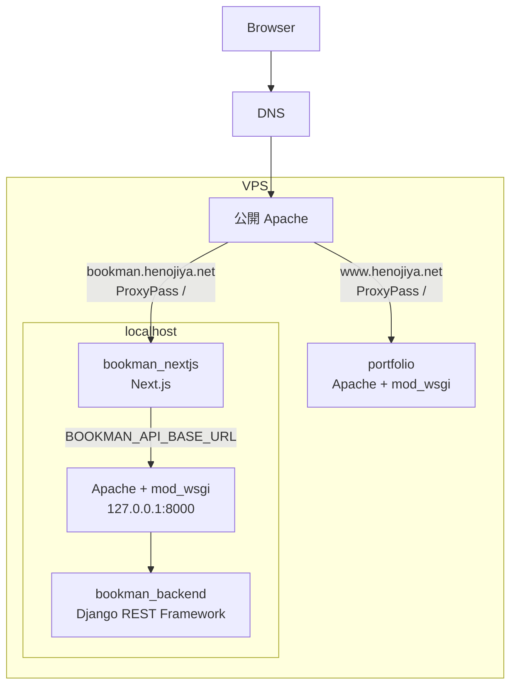

# 図書管理システムをサブドメインで本番公開する

## はじめに

この記事では、既存の VPS で `www.henojiya.net` が動いている状態から、`bookman.henojiya.net` のように別サブドメインを追加して複数のアプリケーションを公開する流れを整理する。

Bookman は、frontend の `bookman_nextjs` と backend の `bookman_backend` に分かれている。
portfolio のように Apache + mod_wsgi だけで画面まで返す構成ではなく、Bookman は Next.js が画面を返し、Apache + mod_wsgi 上の Django REST Framework が API を返す。

そのため、DNS / 公開 Apache / portfolio / Bookman frontend / Bookman backend の責務を分けて考える。

| 対象 | 責務 |
| --- | --- |
| DNS | `www.henojiya.net` と `bookman.henojiya.net` を同じ VPS に到達させる |
| 公開 Apache | `Host` を見て、`www.henojiya.net` は portfolio、`bookman.henojiya.net` は Bookman frontend へ振り分ける |
| portfolio | Apache + mod_wsgi で `www.henojiya.net` の画面を返す |
| Bookman frontend | Next.js で `bookman.henojiya.net` の画面を返し、サーバー側で Bookman backend の DRF API と通信する |
| Bookman backend | Apache + mod_wsgi で `/bookman/api/` 配下の DRF API を localhost 向けに返す |

Bookman のアプリケーション実装メモはこちら。

https://qiita.com/YoshitakaOkada/items/570c025cf235062649c8

VPS、Ubuntu、Apache、MySQL、Django の一般セットアップはこちら。

https://qiita.com/YoshitakaOkada/items/d1e14776040e64cd1434

## 前提

この記事では次の状態から始める。

- `henojiya.net` はお名前.com で管理している
- DNS はさくらインターネットの `ns1.dns.ne.jp` / `ns2.dns.ne.jp` を使っている
- VPS のグローバルIPは `153.126.200.229`
- portfolio `www.henojiya.net` は同じ VPS で公開済み
- Bookman は同じ VPS 上に2つ目の独自 Web アプリケーションとして配置する

frontend のリポジトリはこちら。

https://github.com/duri0214/bookman_nextjs

backend のリポジトリはこちら。

https://github.com/duri0214/bookman_backend

実際のドメインやIPは自分の環境に合わせて読み替える。

## 全体像

`www.henojiya.net` と `bookman.henojiya.net` は、どちらも同じ VPS へ到達する。
同じIPに届いたあと、どのアプリケーションへ振り分けるかは Apache の `VirtualHost` で決める。



DNS は `www.henojiya.net` と `bookman.henojiya.net` を同じ VPS に到達させるところまでを担当する。
公開 Apache は、届いたリクエストの `Host` を見て、`www.henojiya.net` なら portfolio、`bookman.henojiya.net` なら Bookman frontend へ流す。
portfolio は Apache + mod_wsgi で画面まで返す。
Bookman frontend は Next.js で画面を返し、必要に応じて Next.js の API Route から `BOOKMAN_API_BASE_URL` 配下の Bookman backend へ接続する。
Bookman backend API は外部のエンドポイントとしては公開せず、Next.js のサーバー側から `http://127.0.0.1:8000/bookman/api` に接続する。
この `127.0.0.1:8000` は Bookman backend 用の Apache + mod_wsgi チャンネルで、インターネット側には開かない。
この形にすると、Bookman として外部から見える入口は `bookman.henojiya.net` の Apache `VirtualHost` だけになる。
Django REST Framework API をインターネットから直接触らせないため、公開面が小さくなり、不要な API 露出や CORS / CSRF まわりのリスクを抑えやすい。

## ネームサーバーを設定

ここでやることは、お名前.com で管理している `henojiya.net` と、さくらのVPSで発行されたグローバルIP `153.126.200.229` をひもづけることだ。
1つ目の独自Webアプリケーションを `www.henojiya.net`、2つ目以降の独自Webアプリケーションを `bookman.henojiya.net` として、どちらも同じVPSへ向ける。

名前解決の流れは、ざっくり次のようになる。

1. ブラウザが `bookman.henojiya.net` にアクセスしようとする
2. DNS の仕組みで、`henojiya.net` は `ns1.dns.ne.jp` / `ns2.dns.ne.jp` に聞けばよいと分かる
3. `ns1.dns.ne.jp` / `ns2.dns.ne.jp` に問い合わせる
4. `bookman.henojiya.net` は `153.126.200.229` だと分かる
5. ブラウザが `153.126.200.229` の VPS に接続する

設定は2つ。

### さくらのVPS側の設定

1つ目は、お名前.com 側で `henojiya.net` の問い合わせ先を `ns1.dns.ne.jp` / `ns2.dns.ne.jp` にすること。
`ns1.dns.ne.jp` / `ns2.dns.ne.jp` は、さくらインターネットが用意している DNS サーバーだ。

2つ目は、さくらのVPS側で DNS レコードを設定し、`www` と `bookman` をVPSのIPへ向けること。

DNS レコードの設定画面では、次のように `@` や `www`、`bookman` が並ぶ。


この画面の読み方は次の通り。

- `@` は `henojiya.net` そのものを表す
- `@` は A レコードで VPS のIPへ向ける
- `www` や `bookman` は CNAME で `@` を見るようにしておく
- その結果、`www.henojiya.net` や `bookman.henojiya.net` は `henojiya.net` と同じVPSへ向く

| 種別 | 管理画面で入力する名前 | 値 | 意味 |
|---|---|---|---|
| A | `@` | `153.126.200.229` | `henojiya.net` を VPS のIPへ向ける |
| CNAME | `www` | `@` | `www.henojiya.net` を `henojiya.net` と同じ向き先にする |
| CNAME | `bookman` | `@` | `bookman.henojiya.net` を `henojiya.net` と同じ向き先にする |

ここまでの DNS 設定でできるのは、`www.henojiya.net` や `bookman.henojiya.net` を同じ VPS に到達させるところまで。
同じIPに届いたあと、どの名前をどのアプリやディレクトリに割り当てるかは Apache の `VirtualHost` で設定する。

この画面では「エントリー名」に完全なドメイン名ではなく、サブドメインだけを入力する。
A レコードでも CNAME レコードでも、左側に入れる `@` / `www` / `bookman` はこの「エントリー名」だ。

### さくらのVPS側で設定した DNS の疎通確認

DNS の反映には数分から数時間かかることがある。
この確認は、VPS に入らず PC の PowerShell から実行する。
外から `www.henojiya.net` や `bookman.henojiya.net` がどう見えているかを確認してから、Apache や certbot の設定に進む。
出力は環境によって「サーバー」や「権限のない回答」の表示が変わるため、ここでは見るべき行だけを抜粋する。

```bash:console
# henojiya.net の問い合わせ先が ns1.dns.ne.jp / ns2.dns.ne.jp になっていることを確認
PS C:\Users\yoshi> nslookup -type=NS henojiya.net
henojiya.net nameserver = ns1.dns.ne.jp
henojiya.net nameserver = ns2.dns.ne.jp

# CNAME を確認する
PS C:\Users\yoshi> nslookup -type=CNAME www.henojiya.net
www.henojiya.net canonical name = henojiya.net

# bookman も同じ向き先を見ることを確認
PS C:\Users\yoshi> nslookup -type=CNAME bookman.henojiya.net
bookman.henojiya.net canonical name = henojiya.net
```

PowerShell の `nslookup` では「権限のない回答」と表示されることがあるが、これはエラーではない。
`nameserver`、`canonical name` の行が期待通りなら OK。

DNS の期待値:

- `henojiya.net` の `nameserver` が `ns1.dns.ne.jp` / `ns2.dns.ne.jp` になっている
- `www.henojiya.net` の CNAME が `henojiya.net` を返す
- `bookman.henojiya.net` の CNAME も `henojiya.net` を返す

### curl で疎通確認

```bash:console
# www は HTTPS で正常応答する
PS C:\Users\yoshi> curl.exe -I https://www.henojiya.net
HTTP/1.1 200 OK
Server: Apache
Strict-Transport-Security: max-age=31536000; includeSubDomains; preload
Content-Type: text/html; charset=utf-8

# bookman は DNS 上は同じVPSに向くが、HTTPS の受け口をまだ用意していないと失敗する
PS C:\Users\yoshi> curl.exe -I https://bookman.henojiya.net
curl: (60) schannel: SNI or certificate check failed: SEC_E_WRONG_PRINCIPAL (0x80090322) - 対象のプリンシパル名が間違っています。
```

curl の期待値:

- `www.henojiya.net` は HTTPS で正常応答する
- `bookman.henojiya.net` は DNS では同じ VPS に届くが、Apache の VirtualHost と証明書をまだ用意していない場合は HTTPS では証明書エラーになる

### トラブルシューティング

うまくいかない場合の切り分け。

- `curl.exe` の結果が想定と違う場合: DNS キャッシュまたは TTL の反映待ち
- `www.henojiya.net` の HTTPS が返らない場合: VPS 側のパケットフィルタ、UFW、Apache の `VirtualHost`、証明書設定を確認
- `bookman.henojiya.net` の HTTPS が証明書エラーになる場合: DNS ではなく、`bookman.henojiya.net` 用の Apache `VirtualHost` と証明書が未設定の状態

## バーチャルホスト

ここでは Apache 側で、ドメイン名ごとの受け口を `VirtualHost` として定義する。
DNS 側で `www.henojiya.net` や `bookman.henojiya.net` がこのサーバーのグローバルIPを向くようにしたあと、この設定の `ServerName` と一致していれば Apache が該当サイトとして処理できる。

`000-default.conf` の中に複数の `<VirtualHost *:80>` があっても、Apache はリクエストの `Host` と `ServerName` を見て使うブロックを選ぶ。
そのため、`www.henojiya.net` 側が `DocumentRoot` で portfolio を返し、`bookman.henojiya.net` 側が `ProxyPass /` で Next.js へ流しても衝突しない。

portfolio は Apache + mod_wsgi で画面まで返す一方、Bookman は画面を Next.js に任せ、backend API だけを localhost 側の Apache + mod_wsgi に載せる。
やっていることは、`www` と `bookman` というホスト名の違いで同じIPに届いた通信を別のアプリケーションへ振り分けることだ。
たとえば Next.js を `127.0.0.1:3000` で待ち受けるなら、Apache 側は `bookman.henojiya.net` へのアクセスを Next.js へ流す。

backend API は `127.0.0.1:8000` だけで待ち受けるため、先に Apache が localhost の 8000 番ポートでも待ち受けるようにする。
`/etc/apache2/ports.conf` は Apache インストール時点で存在する既存ファイルなので、新規作成せずに `Listen 127.0.0.1:8000` だけ追記する。

```bash:console
$ sudo vi /etc/apache2/ports.conf
```

```diff:/etc/apache2/ports.conf
Listen 80
+ Listen 127.0.0.1:8000
```

```bash:console
$ sudo vi /etc/apache2/sites-available/000-default.conf
```

既存の `000-default.conf` には `www.henojiya.net` 用の `<VirtualHost *:80>` がある。
portfolio の WSGI / static / media 設定は、この `www.henojiya.net` の `VirtualHost` 内に入れておく。
`WSGIScriptAlias /` を `VirtualHost` の外に置くと、Bookman 用の `ProxyPass /` と衝突しやすくなる。
`WSGISocketPrefix` は Apache 全体の設定なので、`VirtualHost` の外に置いたままにする。
その下に Bookman frontend 用の `<VirtualHost *:80>` ブロックと、Bookman backend 用の localhost 専用 `<VirtualHost 127.0.0.1:8000>` ブロックを追記する。

```diff:/etc/apache2/sites-available/000-default.conf
WSGISocketPrefix /var/run/wsgi

<VirtualHost *:80>
    ServerName www.henojiya.net
    DocumentRoot /var/www/html
    WSGIScriptAlias / /var/www/html/portfolio/config/wsgi.py
    WSGIDaemonProcess wsgi_app python-home=/var/www/html/portfolio/venv python-path=/var/www/html/portfolio
    WSGIProcessGroup wsgi_app
    WSGIApplicationGroup %{GLOBAL}
    Alias /static/ /var/www/html/portfolio/static/
    <Directory /var/www/html/portfolio/static>
        Require all granted
        Options -Indexes
    </Directory>
    Alias /media/ /var/www/html/portfolio/media/
    <Directory /var/www/html/portfolio/media>
        Require all granted
        Options -Indexes
    </Directory>
    <Directory /var/www/html/portfolio/config>
        <Files wsgi.py>
            Require all granted
        </Files>
    </Directory>
</VirtualHost>

+ <VirtualHost *:80>
+     ServerName bookman.henojiya.net
+     ProxyPreserveHost On
+     ProxyPass / http://127.0.0.1:3000/
+     ProxyPassReverse / http://127.0.0.1:3000/
+ </VirtualHost>
+ <VirtualHost 127.0.0.1:8000>
+     ServerName 127.0.0.1
+     WSGIDaemonProcess bookman_backend python-home=/var/www/html/bookman_backend/venv python-path=/var/www/html/bookman_backend
+     WSGIProcessGroup bookman_backend
+     WSGIScriptAlias / /var/www/html/bookman_backend/config/wsgi.py
+     <Directory /var/www/html/bookman_backend/config>
+         <Files wsgi.py>
+             Require all granted
+         </Files>
+     </Directory>
+ </VirtualHost>
```

backend API のエンドポイントは外部公開しない。
外向きの Apache `VirtualHost` には backend API 向けの `ProxyPass` / `ProxyPassReverse` を書かず、Next.js だけが BFF を通して localhost の Apache + mod_wsgi に接続する。

`ProxyPass` は `bookman.henojiya.net` に届いたリクエストを Next.js へ転送する設定で、`ProxyPassReverse` は Next.js から返るリダイレクトなどのレスポンスヘッダを外向きのURLに補正する設定だ。
どちらも同じ転送先を書くので似て見えるが、入口の転送と戻りの補正で役割が違う。

`ProxyPass` / `ProxyPassReverse` を使うため、Apache の proxy 関連モジュールを有効化する。

```bash:console
$ sudo a2enmod proxy
$ sudo a2enmod proxy_http
$ sudo apache2ctl configtest
$ sudo systemctl restart apache2
```

各コマンドの意味は次の通り。

- `a2enmod proxy`: Apache の proxy モジュールを有効化する
- `a2enmod proxy_http`: HTTP 向けの proxy 転送を有効化する
- `apache2ctl configtest`: Apache 設定の構文エラーを確認する
- `systemctl restart apache2`: Apache を再起動して設定を反映する

## Bookman backend を配置する

Bookman backend の `bookman_backend` は Django REST Framework API を返す。
この記事では、API の URL は `/bookman/api/` 配下に置く。

portfolio と同じように、本番サーバーでは `/var/www/html/` 配下に `bookman_backend/` と `bookman_nextjs/` を clone する。

```bash:console
$ cd /var/www/html
$ git clone https://github.com/duri0214/bookman_backend.git
```

ローカル開発では `~/dev/` 配下に置いていても、本番サーバーでは `portfolio` と同じ階層の `/var/www/html/` 配下に `bookman_backend` を配置する想定だ。
backend 側は、通常の Django アプリケーションとして `.env`、venv、migration、static の設定を整える。
venv は portfolio のものを共有せず、`bookman_backend` の中に別途作る。
前の「バーチャルホスト」で追加した Apache 設定の `python-home=/var/www/html/bookman_backend/venv` は、この venv を指している。

```bash:console
$ cd /var/www/html/bookman_backend
$ python3 -m venv venv
$ source venv/bin/activate
$ python -m pip install --upgrade pip setuptools wheel
$ python -m pip install -r requirements.txt
$ python manage.py check
```

既存の venv が壊れている場合や、Python のバージョンを変えた場合は作り直す。

```bash:console
$ cd /var/www/html/bookman_backend
$ deactivate 2>/dev/null || true
$ rm -rf venv
$ python3 -m venv venv
$ source venv/bin/activate
$ python -m pip install --upgrade pip setuptools wheel
$ python -m pip install -r requirements.txt
$ python manage.py check
```

次に、Bookman backend 用の MySQL データベースと権限を用意する。
基本は Ubuntu セットアップ記事の「データベースとユーザーの作成」と同じで、DB 名だけ `bookman_db` に読み替える。
VPS 上の Django から接続するため、ユーザーは `python`@`127.0.0.1` にそろえる。

```bash:console
$ sudo mysql
```

```sql
CREATE DATABASE IF NOT EXISTS bookman_db DEFAULT CHARACTER SET utf8mb4;
CREATE USER IF NOT EXISTS 'python'@'127.0.0.1' IDENTIFIED BY '自分の .env に書いた DB_PASSWORD';
GRANT ALL PRIVILEGES ON bookman_db.* TO 'python'@'127.0.0.1';
FLUSH PRIVILEGES;
SHOW GRANTS FOR 'python'@'127.0.0.1';
EXIT;
```

`CREATE USER` で指定するパスワードは、Bookman backend の `.env` に書く DB パスワードと合わせる。
すでに `python`@`127.0.0.1` が存在する場合は、既存ユーザーを使い、`bookman_db.*` への `GRANT` を追加する。
権限が不足していると、API 確認時に `Access denied for user 'python'@'127.0.0.1' to database 'bookman_db'` のような `OperationalError` になる。

DB 権限を用意したら、README の本番メンテナンス手順と同じように Django 側の確認と migration を実行する。
`check` で Django 設定の問題を先に見てから、`migrate` で `bookman_db` にテーブルを作る。

```bash:console
$ cd /var/www/html/bookman_backend
$ source venv/bin/activate
$ python manage.py check
$ python manage.py migrate
```

`migrate` が `Access denied for user 'python'@'127.0.0.1' to database 'bookman_db'` で失敗する場合は、MySQL 側の `GRANT ALL PRIVILEGES ON bookman_db.*` が足りていない。
`Table ... doesn't exist` が出る場合は、migration がまだ完了していないか、接続先 DB 名が `.env` と MySQL 側でずれている。

次に、画面確認用の初期データを fixture で投入する。依存順の管理は backend リポジトリのスクリプトに集約している。

```bash:console
$ chmod +x scripts/import_data.sh
$ ./scripts/import_data.sh
```

Bookman backend も portfolio と同じく Apache + mod_wsgi に載せる。
ただし、portfolio とはチャンネルを分け、前の「バーチャルホスト」で設定した localhost の `127.0.0.1:8000` だけで待ち受ける Apache 設定に載せる。
Next.js の BFF から見える API URL は固定しておく。

前の「バーチャルホスト」で追加した `VirtualHost` は `127.0.0.1:8000` だけで待ち受けるため、外部から直接は到達できない。
Next.js の BFF が同じサーバー内から `http://127.0.0.1:8000/bookman/api` に接続し、そこから mod_wsgi 経由で Bookman backend の Django REST Framework が動く。

`mod_wsgi` を使うため、Apache の wsgi モジュールを有効化して設定を反映する。

```bash:console
$ sudo a2enmod wsgi
$ sudo apache2ctl configtest
$ sudo systemctl restart apache2
```

### curl で backend の疎通を確認する

Apache 再起動後、VPS 上で localhost の backend API に接続できるか確認する。
この確認は外部公開の確認ではなく、Next.js の BFF から見える `127.0.0.1:8000` の受け口の確認だ。

```bash:console
$ curl -m 5 -v http://127.0.0.1:8000/bookman/api/branches/
*   Trying 127.0.0.1:8000...
* Connected to 127.0.0.1 (127.0.0.1) port 8000
> GET /bookman/api/branches/ HTTP/1.1
> Host: 127.0.0.1:8000
< HTTP/1.1 200 OK
< Content-Type: application/json
[]
```

`Connected to 127.0.0.1 port 8000` が出れば、Apache は `127.0.0.1:8000` で待ち受けている。
`200 OK` と JSON が返れば、Apache + mod_wsgi + Django + DB 接続まで通っている。
`[]` は branch データがまだ空という意味なので、疎通確認としては OK。
そのかわりに `500 Internal Server Error` が返る場合は、Apache の受け口ではなく Django 側まで処理が進んだうえでエラーになっている。
この場合は `.env`、DB 接続、migration、Django のログを確認する。

```bash:console
$ sudo tail -n 100 /var/log/apache2/error.log
$ cd /var/www/html/bookman_backend
$ source venv/bin/activate
$ python manage.py check
$ python manage.py migrate
```

ローカル開発では次のようにしていた。

```env:.env.local
BOOKMAN_API_BASE_URL=http://127.0.0.1:8000/bookman/api
```

Bookman の frontend は、Next.js のバックエンド（BFF）が Django REST Framework API と通信する方針にしている。
backend API を外部公開しないなら、ローカル開発で `.env.local` に書いていた `BOOKMAN_API_BASE_URL` は、本番の `.env.production` でも同じ値を使い回せる。
この場合、外向きの Apache `VirtualHost` には backend 用の `ProxyPass` / `ProxyPassReverse` は書かない。

## Bookman frontend を配置する

portfolio 側では、Django アプリケーションを Apache + mod_wsgi に載せているため、アプリケーション単体に再起動の仕組みを用意しなくてよかった。
Apache を再起動すれば、Apache が `WSGIScriptAlias` で `config/wsgi.py` を読み込み、mod_wsgi 経由で Django を動かしてくれるのだ。

一方、Bookman frontend は build したあと、Apache の設定反映に伴う再起動にあわせて Next.js のサーバーを起動する必要がある。
Apache は `ProxyPass` で `bookman.henojiya.net` へのリクエストを `127.0.0.1:3000` の Next.js へつなぐだけなので、Next.js のサーバーが止まっていると画面を返せない。
この Next.js の起動管理に使うのが systemd で、ここでは `bookman-nextjs.service` を作る。

Bookman frontend の `bookman_nextjs` は、portfolio と同じ `/var/www/html/` 配下に clone した Next.js アプリケーションだ。
これを build して、Next.js を起動できる状態にする。
外部から見える入口は `bookman.henojiya.net` の Apache `VirtualHost` だが、そこから先は Apache が localhost の Next.js へつなぐ。
そのため、Next.js は `127.0.0.1:3000` で待ち受ける。

Node.js と npm の確認・インストールは初回セットアップ時だけ行う。本番反映時は `npm ci`、build、systemd サービス再起動を行う。

```bash:console
$ which npm
$ node -v
$ npm -v
```

未インストールの場合は、Node.js 22.x を入れる。
NodeSource の APT リポジトリを追加してから `nodejs` を入れると、npm も一緒に入る。

```bash:console
$ sudo apt update
$ sudo apt install -y ca-certificates curl gnupg
$ curl -fsSL https://deb.nodesource.com/setup_22.x | sudo -E bash -
$ sudo apt install -y nodejs
$ node -v
v22.x.x
$ npm -v
10.x.x
$ which npm
/usr/bin/npm
```

```bash:console
$ cd /var/www/html
$ git clone https://github.com/duri0214/bookman_nextjs.git
$ cd /var/www/html/bookman_nextjs
$ npm ci
$ npm run build
```

次に、Next.js の起動管理として systemd のサービスを登録する。

```bash:console
$ sudo vi /etc/systemd/system/bookman-nextjs.service
```

```ini:/etc/systemd/system/bookman-nextjs.service
[Unit]
Description=Bookman Next.js frontend
After=network.target

[Service]
Type=simple
User=ubuntu
WorkingDirectory=/var/www/html/bookman_nextjs
Environment=NODE_ENV=production
Environment=HOSTNAME=127.0.0.1
Environment=PORT=3000
ExecStart=/usr/bin/npm run start
Restart=always
RestartSec=5

[Install]
WantedBy=multi-user.target
```

`User=ubuntu` は、実際に `/var/www/html/bookman_nextjs` を配置・更新するユーザーに合わせる。
`ExecStart` の `/usr/bin/npm` は `which npm` で確認し、違う場所にある場合はそのパスに置き換える。
ここでは Apache の `ProxyPass` が `http://127.0.0.1:3000/` を向いているため、Next.js 側も同じポートで起動する。

```bash:console
$ sudo systemctl daemon-reload
$ sudo systemctl enable --now bookman-nextjs
$ sudo systemctl status bookman-nextjs
```

`Active: active (running)` になっていれば、Next.js のサービスは起動している。
続けて、サーバー内から Next.js へ直接 `curl` し、frontend が `127.0.0.1:3000` で応答していることを確認する。

```bash:console
$ curl -I http://127.0.0.1:3000
HTTP/1.1 200 OK
X-Powered-By: Next.js
Content-Type: text/html; charset=utf-8
```

ここで `HTTP/1.1 200 OK` が返れば、Apache を経由する前の frontend 単体の疎通確認はできている。
このあと Apache の `ProxyPass` 経由で `bookman.henojiya.net` から同じ Next.js へ到達できるかを確認する。

`bookman_nextjs` を pull して更新したときは、`npm ci`、`npm run build` のあとにサービスを再起動する。

```bash:console
$ sudo systemctl restart bookman-nextjs
```

## HTTPS 化する

DNS で `bookman.henojiya.net` が同じ VPS へ到達し、Apache の HTTP VirtualHost が有効になったら、certbot で証明書を取得する。
同じサーバーで portfolio などの HTTPS 化をすでに済ませている場合は、Certbot のアカウント登録やメールアドレス入力は済んでいるため、対話入力が省略されることがある。
その場合も、`bookman.henojiya.net` 用の証明書が `/etc/letsencrypt/live/bookman.henojiya.net/` に作成されていれば問題ない。

```bash:console
# 証明書を取得する
$ sudo certbot --apache -d bookman.henojiya.net

# メールアドレスの入力
Enter email address (used for urgent renewal and security notices)
 (Enter 'c' to cancel): your.name@example.com

# 規約同意
Please read the Terms of Service at
https://letsencrypt.org/documents/LE-SA-v1.6-August-18-2025.pdf. You must agree
in order to register with the ACME server. Do you agree?
- - - - - - - - - - - - - - - - - - - - - - - - - - - - - - - - - - - - - - - -
(Y)es/(N)o: Y

# 任意のアンケート。不要なら N
Would you be willing to share your email address with the Electronic Frontier Foundation
so they can send you EFF news, campaigns, and ways to support digital freedom?
- - - - - - - - - - - - - - - - - - - - - - - - - - - - - - - - - - - - - - - -
(Y)es/(N)o: N

# 以降は発行から Apache への反映までの要約
Account registered.
Requesting a certificate for bookman.henojiya.net

Successfully received certificate.
Certificate is saved at: /etc/letsencrypt/live/bookman.henojiya.net/fullchain.pem
Key is saved at:         /etc/letsencrypt/live/bookman.henojiya.net/privkey.pem
These files will be updated when the certificate renews.
Certbot has set up a scheduled task to automatically renew this certificate in the background.

Deploying certificate
Successfully deployed certificate for bookman.henojiya.net to /etc/apache2/sites-available/000-default-le-ssl.conf
Congratulations! You have successfully enabled HTTPS on https://bookman.henojiya.net
```

証明書の配置先も確認しておく。

```bash:console
$ sudo certbot certificates
$ sudo ls /etc/letsencrypt/live/bookman.henojiya.net
README  cert.pem  chain.pem  fullchain.pem  privkey.pem
```

証明書取得後は、HTTPS 側の `VirtualHost *:443` にも `ProxyPass` / `ProxyPassReverse` が入っていることを確認する。
すでに既存サイトの HTTPS 設定がある場合は、その `<VirtualHost *:443>` を消さない。
ここでは portfolio 用の `www.henojiya.net` 設定は残したまま、Bookman 用の `<VirtualHost *:443>` を別ブロックとして追記する。
作業前に現行ファイルを `cp` で退避しておく。
また、HTTPS 用ファイルの中に `<VirtualHost *:80>` が追加されている場合は、ここでは使わない。

```bash:console
$ sudo cp /etc/apache2/sites-available/000-default-le-ssl.conf /etc/apache2/sites-available/000-default-le-ssl.conf.bak
$ sudo vi /etc/apache2/sites-available/000-default-le-ssl.conf
```

```diff:/etc/apache2/sites-available/000-default-le-ssl.conf
<IfModule mod_ssl.c>
<VirtualHost *:443>
    ServerName www.henojiya.net
    # 既存の portfolio 用 HTTPS 設定は残す
</VirtualHost>

+<VirtualHost *:443>
+    ServerName bookman.henojiya.net
+    ProxyPreserveHost On
+    ProxyPass / http://127.0.0.1:3000/
+    ProxyPassReverse / http://127.0.0.1:3000/
+
+    SSLCertificateFile /etc/letsencrypt/live/bookman.henojiya.net/fullchain.pem
+    SSLCertificateKeyFile /etc/letsencrypt/live/bookman.henojiya.net/privkey.pem
+    Include /etc/letsencrypt/options-ssl-apache.conf
+
+    Header always set Strict-Transport-Security "max-age=31536000; includeSubDomains; preload"
+    Header always set X-Content-Type-Options "nosniff"
+</VirtualHost>
</IfModule>
```

反映前に構文チェックを通す。

```bash:console
$ sudo apache2ctl configtest
$ sudo systemctl reload apache2
```

## 確認する

まずサーバー上で HTTPS の入口を確認する。

```bash:console
$ curl -I https://bookman.henojiya.net
HTTP/1.1 200 OK
Server: Apache
Content-Type: text/html; charset=utf-8
```

次にブラウザで `https://bookman.henojiya.net` を開き、Bookman の HOME が表示されることを確認する。

frontend と backend の接続確認は、画面から行う。

- `https://bookman.henojiya.net/branch` や `https://bookman.henojiya.net/book` で一覧が表示される
- 一覧が表示されれば、Next.js のサーバー側から Django REST Framework API へ接続できている

もし画面は表示されるが一覧だけ失敗する場合、DNS ではなく `BOOKMAN_API_BASE_URL`、Django 側の URL、Next.js の Route Handler、localhost 側の Apache + mod_wsgi 設定を確認する。

## まとめ

サブドメインを追加しても、DNS がやることは `bookman.henojiya.net` を同じ VPS へ届けるところまでだ。
同じIPへ届いたあと、Bookman に振り分けるのは Apache の `VirtualHost`。
Next.js は画面を返し、Next.js の BFF が localhost の Apache + mod_wsgi 経由で Bookman backend の Django REST Framework API と通信する。

この責務を分けておくと、`www.henojiya.net` の既存 Django サイトと、`bookman.henojiya.net` の Next.js + Django REST Framework アプリを同じ VPS 上で共存させやすい。
