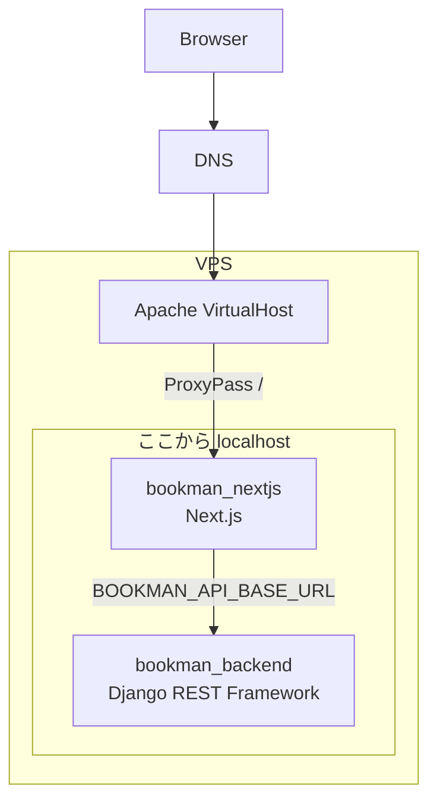

# 図書管理システムをサブドメインで本番公開する

## はじめに

この記事では、既存の VPS で `www.henojiya.net` が動いている状態から、`bookman.henojiya.net` のように別サブドメインを追加して複数のアプリケーションを公開する流れを整理する。

Bookman は、frontend の `bookman_nextjs` と backend の `bookman_backend` に分かれている。
portfolio のように Apache + mod_wsgi だけで画面まで返す構成ではなく、Next.js が画面を返し、Django REST Framework が API を返す。

そのため、DNS / Apache / Next.js / Django REST Framework の責務を分けて考える。

- DNS: `bookman.henojiya.net` を既存 VPS に到達させる
- Apache: `bookman.henojiya.net` に届いた HTTP/HTTPS リクエストを Next.js に振り分ける
- Next.js: Bookman の画面を返し、サーバー側で Django REST Framework API と通信する
- Django REST Framework: localhost 上で `/bookman/api/` 配下の API を返す

Bookman のアプリケーション実装メモはこちら。

- [Django-rest-frameworkとNextJSで図書管理システムを作ってみる](https://qiita.com/YoshitakaOkada/items/570c025cf235062649c8)

VPS、Ubuntu、Apache、MySQL、Django の一般セットアップはこちら。

- [CentOSが終わるのでUbuntu24.04に移行する。Python3.12とDjango4とMySQL8のセットアップメモ2026](https://qiita.com/YoshitakaOkada/items/d1e14776040e64cd1434)

## 前提

この記事では次の状態から始める。

- `henojiya.net` はお名前.com で管理している
- DNS はさくらインターネットの `ns1.dns.ne.jp` / `ns2.dns.ne.jp` を使っている
- VPS のグローバルIPは `153.126.200.229`
- 既存サイト `www.henojiya.net` は同じ VPS で公開済み
- Bookman は同じ VPS 上に2つ目の独自 Web アプリケーションとして配置する
- frontend は [`bookman_nextjs`](https://github.com/duri0214/bookman_nextjs)
- backend は [`bookman_backend`](https://github.com/duri0214/bookman_backend)

実際のドメインやIPは自分の環境に合わせて読み替える。

## 全体像

`www.henojiya.net` と `bookman.henojiya.net` は、どちらも同じ VPS へ到達する。
同じIPに届いたあと、どのアプリケーションへ振り分けるかは Apache の `VirtualHost` で決める。



DNS は `bookman.henojiya.net` を同じ VPS に到達させるところまでを担当する。
Apache は、届いたリクエストの `Host` が `bookman.henojiya.net` なら Bookman frontend へ流す。
frontend は画面を返し、必要に応じて Next.js の API Route から `BOOKMAN_API_BASE_URL` 配下の Django REST Framework API へ接続する。
backend API は外部のエンドポイントとしては公開せず、Next.js のサーバー側から `http://127.0.0.1:8000/bookman/api` に接続する。
この形にすると、外部から見える入口は `bookman.henojiya.net` の Apache `VirtualHost` だけになる。
Django REST Framework API をインターネットから直接触らせないため、公開面が小さくなり、不要な API 露出や CORS / CSRF まわりのリスクを抑えやすい。

## バーチャルホスト

ここでは Apache 側で、ドメイン名ごとの受け口を `VirtualHost` として定義する。
DNS 側で `www.henojiya.net` や `bookman.henojiya.net` がこのサーバーのグローバルIPを向くようにしたあと、この設定の `ServerName` と一致していれば Apache が該当サイトとして処理できる。

DNS は `www.henojiya.net` や `bookman.henojiya.net` を同じ VPS のIPへ届けるところまでを担当する。
この記事では、1つ目の独自Webアプリケーションを `www.henojiya.net`、2つ目以降の独自Webアプリケーションを `bookman.henojiya.net` で公開するケースとして考える。
同じIPへ届いたアクセスを、`www.henojiya.net` なら既存サイト、`bookman.henojiya.net` なら Bookman、というように分けるのが Apache の `VirtualHost` だ。

既存サイトが Django + mod_wsgi で動いている場合でも、Bookman 側の画面は Next.js へつなぐ（リバースプロキシする）。
やっていることは、`www` と `bookman` というホスト名の違いで同じIPに届いた通信を別のアプリケーションへ振り分けることだ。
たとえば Next.js を `127.0.0.1:3000`、Django REST Framework API を `127.0.0.1:8000` で待ち受けるなら、Apache 側は `bookman.henojiya.net` へのアクセスを Next.js へ流す。

```bash:console
$ sudo vi /etc/apache2/sites-available/bookman.conf
```

```conf:/etc/apache2/sites-available/bookman.conf
<VirtualHost *:80>
    ServerName bookman.henojiya.net

    ProxyPreserveHost On
    ProxyPass / http://127.0.0.1:3000/
    ProxyPassReverse / http://127.0.0.1:3000/
</VirtualHost>
```

backend API は Apache から直接外へ出さない。
Next.js のサーバー側が `BOOKMAN_API_BASE_URL=http://127.0.0.1:8000/bookman/api` を使って Django REST Framework に接続する。

`ProxyPass` / `ProxyPassReverse` を使うため、Apache の proxy 関連モジュールを有効化する。

```bash:console
$ sudo a2enmod proxy
$ sudo a2enmod proxy_http
$ sudo a2ensite bookman
$ sudo apache2ctl configtest
$ sudo systemctl restart apache2
```

## ネームサーバーを設定

ここでやることは、お名前.com で管理している `henojiya.net` と、さくらのVPSで発行されたグローバルIP `153.126.200.229` をひもづけることだ。
1つ目の独自Webアプリケーションを `www.henojiya.net`、2つ目以降の独自Webアプリケーションを `bookman.henojiya.net` として、どちらも同じVPSへ向ける。

名前解決の流れは、ざっくり次のようになる。

1. ブラウザが `bookman.henojiya.net` にアクセスしようとする
2. DNS の仕組みで、`henojiya.net` は `ns1.dns.ne.jp` / `ns2.dns.ne.jp` に聞けばよいと分かる
3. `ns1.dns.ne.jp` / `ns2.dns.ne.jp` に問い合わせる
4. `bookman.henojiya.net` は `153.126.200.229` だと分かる
5. ブラウザが `153.126.200.229` の VPS に接続する

設定は2つ。

1つ目は、お名前.com 側で `henojiya.net` の問い合わせ先を `ns1.dns.ne.jp` / `ns2.dns.ne.jp` にすること。
`ns1.dns.ne.jp` / `ns2.dns.ne.jp` は、さくらインターネットが用意している DNS サーバーだ。

2つ目は、さくらのVPS側で DNS レコードを設定し、`www` と `bookman` をVPSのIPへ向けること。

DNS レコードの設定画面では、次のように `@` や `bookman`、`www` が並ぶ。


この画面の読み方は次の通り。

- `@` は `henojiya.net` そのものを表す
- `bookman` は、2つ目の独自Webアプリケーション用の `bookman.henojiya.net` を表す
- `@` は A レコードで VPS のIPへ向ける
- `www` や `bookman` は CNAME で `@` を見るようにしておく
- その結果、`www.henojiya.net` や `bookman.henojiya.net` は `henojiya.net` と同じVPSへ向く

| 種別 | 管理画面で入力する名前 | 値 | 意味 |
|---|---|---|---|
| A | `@` | `153.126.200.229` | `henojiya.net` を VPS のIPへ向ける |
| CNAME | `www` | `@` | `www.henojiya.net` を `henojiya.net` と同じ向き先にする |
| CNAME | `bookman` | `@` | `bookman.henojiya.net` を `henojiya.net` と同じ向き先にする |

ここまでの DNS 設定でできるのは、`www.henojiya.net` や `bookman.henojiya.net` を同じ VPS に到達させるところまで。
同じIPに届いたあと、どの名前をどのアプリやディレクトリに割り当てるかは Apache の `VirtualHost` で設定する。

この画面では「エントリー名」に `bookman.henojiya.net` ではなく `bookman` だけを入力する。
A レコードでも CNAME レコードでも、左側に入れる `@` / `www` / `bookman` はこの「エントリー名」だ。

DNS の反映には数分から数時間かかることがある。
この確認は、VPS に入らず PC の PowerShell から実行する。
外から `www.henojiya.net` や `bookman.henojiya.net` がどう見えているかを確認してから、Apache や certbot の設定に進む。
出力は環境によって「サーバー」や「権限のない回答」の表示が変わるため、ここでは見るべき行だけを抜粋する。

```bash:console
# henojiya.net の問い合わせ先が ns1.dns.ne.jp / ns2.dns.ne.jp になっていることを確認
PS C:\Users\yoshi> nslookup -type=NS henojiya.net
henojiya.net nameserver = ns1.dns.ne.jp
henojiya.net nameserver = ns2.dns.ne.jp

# CNAME を確認する
PS C:\Users\yoshi> nslookup -type=CNAME www.henojiya.net
www.henojiya.net canonical name = henojiya.net

# bookman も同じ向き先を見ることを確認
PS C:\Users\yoshi> nslookup -type=CNAME bookman.henojiya.net
bookman.henojiya.net canonical name = henojiya.net
```

PowerShell の `nslookup` では「権限のない回答」と表示されることがあるが、これはエラーではない。
`nameserver`、`canonical name` の行が期待通りなら OK。

期待値:

- `henojiya.net` の `nameserver` が `ns1.dns.ne.jp` / `ns2.dns.ne.jp` になっている
- `www.henojiya.net` の CNAME が `henojiya.net` を返す
- `bookman.henojiya.net` の CNAME も `henojiya.net` を返す
- `www.henojiya.net` は HTTPS で正常応答する
- `bookman.henojiya.net` は DNS では同じ VPS に届くが、Apache の VirtualHost と証明書をまだ用意していない場合は HTTPS では証明書エラーになる

```bash:console
# www は HTTPS で正常応答する
PS C:\Users\yoshi> curl.exe -I https://www.henojiya.net
HTTP/1.1 200 OK
Server: Apache
Strict-Transport-Security: max-age=31536000; includeSubDomains; preload
Content-Type: text/html; charset=utf-8

# bookman は DNS 上は同じVPSに向くが、HTTPS の受け口をまだ用意していないと失敗する
PS C:\Users\yoshi> curl.exe -I https://bookman.henojiya.net
curl: (60) schannel: SNI or certificate check failed: SEC_E_WRONG_PRINCIPAL (0x80090322) - 対象のプリンシパル名が間違っています。
```

うまくいかない場合の切り分け。

- `curl.exe` の結果が想定と違う場合: DNS キャッシュまたは TTL の反映待ち
- `www.henojiya.net` の HTTPS が返らない場合: VPS 側のパケットフィルタ、UFW、Apache の `VirtualHost`、証明書設定を確認
- `bookman.henojiya.net` の HTTPS が証明書エラーになる場合: DNS ではなく、`bookman.henojiya.net` 用の Apache `VirtualHost` と証明書が未設定の状態

## backend を配置する

`bookman_backend` は Django REST Framework API を返す。
この記事では、API の URL は `/bookman/api/` 配下に置く。

```text
/var/www/html/
  portfolio/
  bookman_backend/
  bookman_nextjs/
```

ローカル開発では `~/dev/` 配下に置いていても、本番サーバーでは `portfolio` と同じ階層の `/var/www/html/` 配下に `bookman_backend` と `bookman_nextjs` を配置する想定だ。
サーバー上の配置は次のように確認できる。

```bash:console
$ cd /var/www/html
$ tree -L 1
```

backend 側は、通常の Django アプリケーションとして `.env`、venv、migration、static、Apache / mod_wsgi の設定を整える。
既存の Django サイトと同じ Apache プロセスに載せるか、別プロセスにするかはサーバーの構成次第だが、Bookman frontend から見える API URL は固定しておく。

ローカル開発では次のようにしていた。

```env:.env.local
BOOKMAN_API_BASE_URL=http://127.0.0.1:8000/bookman/api
```

本番では、Next.js のサーバー側から到達できる backend API の URL に変える。
同じサーバー内だけで閉じるなら、たとえば次のように考える。

```env:.env.production
BOOKMAN_API_BASE_URL=http://127.0.0.1:8000/bookman/api
```

Bookman の frontend は、Next.js のバックエンド（BFF）が Django REST Framework API と通信する方針にしている。
そのため、`BOOKMAN_API_BASE_URL` は Next.js のサーバー側で読む値として扱う。
backend API を外部公開しないなら、Apache 側に backend 用の `ProxyPass` は書かない。

## frontend を配置する

`bookman_nextjs` は Next.js のアプリケーションとして build して、`next start` で起動する。
Apache から Next.js へつなぐため、外部に直接公開せず、localhost の別ポートで待ち受ける。

```bash:console
$ cd /var/www/html/bookman_nextjs
$ npm ci
$ npm run build
$ PORT=3000 npm run start
```

この `npm run start` は、起動している間だけ Next.js を動かすコマンドだ。
本番では手動実行のままにせず、systemd などでサービス化して、Ubuntu の再起動後も自動で立ち上がるようにする。
`bookman_nextjs` を pull して更新したときは、`npm ci`、`npm run build` のあとに Next.js のサービスを再起動する。
ここでは Apache の `ProxyPass` が `http://127.0.0.1:3000/` を向いているため、Next.js 側も同じポートで起動する。

## HTTPS 化する

DNS で `bookman.henojiya.net` が同じ VPS へ到達し、Apache の HTTP VirtualHost が有効になったら、certbot で証明書を取得する。

```bash:console
$ sudo certbot --apache -d bookman.henojiya.net
```

証明書取得後は、HTTPS 側の `VirtualHost *:443` にも `ProxyPass` / `ProxyPassReverse` が入っていることを確認する。
certbot が生成した SSL 設定ファイルを確認し、HTTP 側と同じように Bookman の Next.js へ流す。

```conf:/etc/apache2/sites-available/bookman-le-ssl.conf
<IfModule mod_ssl.c>
<VirtualHost *:443>
    ServerName bookman.henojiya.net

    ProxyPreserveHost On
    ProxyPass / http://127.0.0.1:3000/
    ProxyPassReverse / http://127.0.0.1:3000/

    SSLCertificateFile /etc/letsencrypt/live/bookman.henojiya.net/fullchain.pem
    SSLCertificateKeyFile /etc/letsencrypt/live/bookman.henojiya.net/privkey.pem
    Include /etc/letsencrypt/options-ssl-apache.conf
</VirtualHost>
</IfModule>
```

反映前に構文チェックを通す。

```bash:console
$ sudo apache2ctl configtest
$ sudo systemctl reload apache2
```

## 確認する

まず PC の PowerShell から HTTPS の入口を確認する。

```bash:console
PS C:\Users\yoshi> curl.exe -I https://bookman.henojiya.net
HTTP/1.1 200 OK
Server: Apache
Content-Type: text/html; charset=utf-8
```

次にブラウザで `https://bookman.henojiya.net` を開き、Bookman の HOME が表示されることを確認する。

frontend と backend の接続確認は、画面から行う。

- `https://bookman.henojiya.net/branch` や `https://bookman.henojiya.net/book` で一覧が表示される
- 一覧が表示されれば、Next.js のサーバー側から Django REST Framework API へ接続できている

もし画面は表示されるが一覧だけ失敗する場合、DNS ではなく `BOOKMAN_API_BASE_URL`、Django 側の URL、Next.js の Route Handler、Django REST Framework の起動状態を確認する。

## まとめ

サブドメインを追加しても、DNS がやることは `bookman.henojiya.net` を同じ VPS へ届けるところまでだ。
同じIPへ届いたあと、Bookman に振り分けるのは Apache の `VirtualHost`。
Next.js は画面を返し、Next.js のサーバー側が Django REST Framework API と通信する。

この責務を分けておくと、`www.henojiya.net` の既存 Django サイトと、`bookman.henojiya.net` の Next.js + Django REST Framework アプリを同じ VPS 上で共存させやすい。
