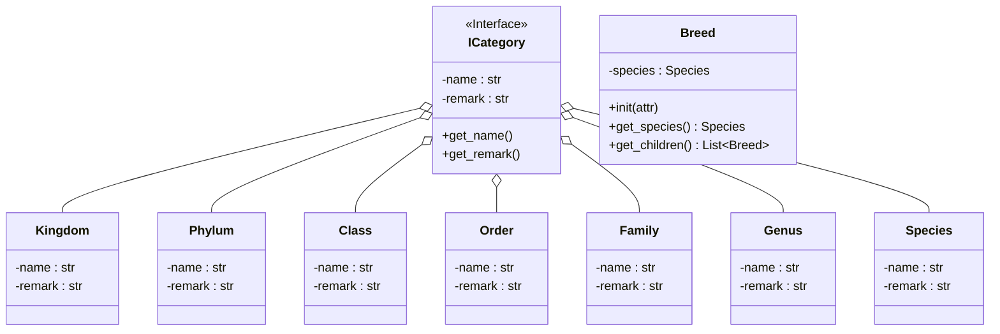

## Category
以下の順番で仕分けされる  
See Also: https://online-hoshujuku.info/english-classification#index_id1
- ドメイン(domain)
- 界(kingdom)
- 門(phylum)
- 綱(class)
- 目(order)
- 科(family)
- 属(genus)
- 種(species)

## Reference
See Also: [日本産ミミズ大図鑑](https://japanese-mimizu.jimdofree.com/%E3%83%9F%E3%83%9F%E3%82%BA%E3%81%AE%E5%88%86%E9%A1%9E/)  
See Also: [海外のニワトリ](https://en.wikipedia.org/w/index.php?title=Category:Chicken_breeds&from=B)

## Class
See Also: https://mermaid.js.org/syntax/classDiagram.html

