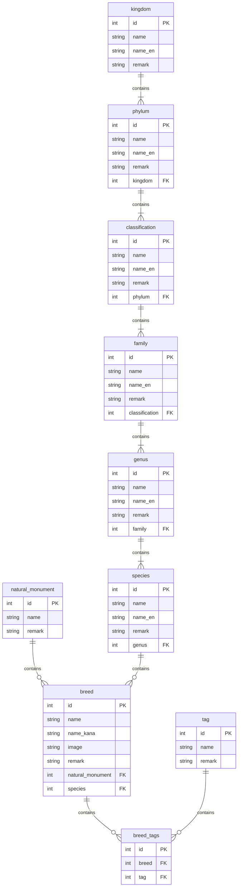

# Taxonomy

## Category
以下の順番で仕分けされる  
See Also: https://online-hoshujuku.info/english-classification#index_id1
- 界(kingdom)
- 門(phylum)
- 綱(classification)
- 科(family)
- 属(genus)
- 種(species)

## Purpose
Taxonomy アプリは、動物分類の候補を収集し、人が確認しながら体系化して表示するためのアプリとする。
既存のニワトリ・ミミズ分類だけでなく、蜂、メダカ、蚕、カブトムシ/クワガタ、家畜系などへ横展開できる状態を目指す。

## Data operation
初期データの追加は fixture ではなく、単発実行の Django 管理コマンドで行う。

- 既存の初期データと LLM 生成済み分類候補は、`python manage.py seed_taxonomy_data` でまとめて投入する。
- LLM で分類候補を一度だけ生成し、`taxonomy/management/commands/seed_taxonomy_animals.py` に構造化データとして Git 管理する。
- コマンドは再実行しても重複しない。
- 外部APIは実行時に参照しない。APIやLLMの出力は候補作成時の材料に留め、Git に焼いたデータを投入する。
- 候補データの確認状況は、現行モデルでは `remark` に `確認ステータス` として記録する。

## Seed data fields
LLM 生成候補は、既存モデルに合わせて以下の形式で固定する。

- 日本語名
- 英名または学名
- 界
- 門
- 綱
- 科
- 属
- 種
- 品種・系統・分類対象
- 備考
- 出典確認ステータス

## Candidate data sources
分類候補の確認元としては、GBIF、Catalogue of Life、iNaturalist などを候補にする。
ただし、Taxonomy アプリの表示はローカルDBの確認済みまたは確認予定データを使い、画面表示時に外部APIへ依存しない。

## Reference
See Also: [日本産ミミズ大図鑑](https://japanese-mimizu.jimdofree.com/%E3%83%9F%E3%83%9F%E3%82%BA%E3%81%AE%E5%88%86%E9%A1%9E/)  
See Also: [海外のニワトリ](https://en.wikipedia.org/w/index.php?title=Category:Chicken_breeds&from=B)

## Tables
実態としてはmodelクラスにもつので、ドメインクラスとしては表現されない  
See Also: https://mermaid.js.org/syntax/entityRelationshipDiagram.html

